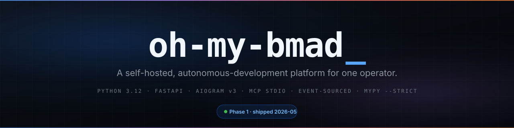
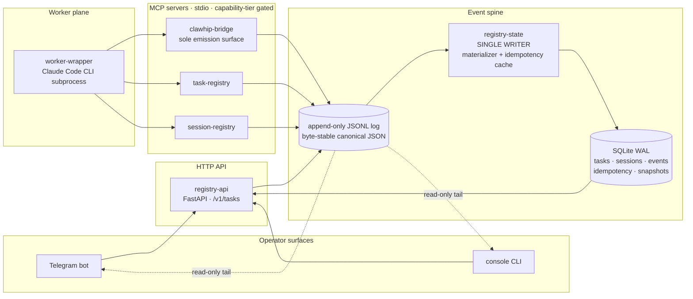

<h1 align="center">
  
</h1>

<p align="center">
  <i>Telegram and a console drive a Claude Code worker through a typed, event-sourced spine — so a single person can run an agent loop they can trust, observe, and recover.</i>
</p>

<p align="center">
  <a href="https://www.python.org/downloads/release/python-3120/"></a>
  <a href="https://docs.astral.sh/uv/"></a>
  <a href="https://fastapi.tiangolo.com/"></a>
  <a href="https://docs.aiogram.dev/"></a>
  <a href="https://modelcontextprotocol.io/"></a>
  <a href="https://mypy.readthedocs.io/"></a>
  <a href="./LICENSE"></a>
  <a href="_bmad-output/planning-artifacts/phase-17-epics.md"></a>
</p>

---

## What this is

A platform that turns Telegram and a local console into the control surfaces for a **Claude Code** worker. Commands you send become typed events on an append-only log. A **single-writer** materializer turns the log into queryable SQLite state. **Capability tiers** gate every privileged action; **operator approval events** gate the high-risk ones. Crash the process and it rebuilds itself from the log on next start.

It's deliberately **boring** infrastructure — Python 3.12, FastAPI, aiogram, SQLite WAL, Docker Compose, stdio MCP. The novelty is in how the boring pieces compose, not in any one piece.

> **Current repo state: Phase 17 open — destructive lifecycle apply readiness is being planned without implementing destructive apply.** Latest tagged release is `v1.3.0`; this checkout contains later Phase 10–17 work. See [`docs/index.md`](docs/index.md) for the master entry point.

## How it works (at a glance)



Three properties hold the whole thing together: **only one writer**, **only-ever-append**, and **the bytes on disk are byte-stable**. The rest of the rules in [`_bmad-output/project-context.md`](_bmad-output/project-context.md) exist to protect them.

## Engineering highlights

- **Event-sourced spine, byte-stable canonical JSON.** Two identical envelopes serialize to byte-identical output. Replay-determinism is a property of the encoder, not a hopeful claim. ([deep-dive →](docs/explanations/event-spine.md))
- **Single-writer invariant (FR26), statically enforced.** `services.<A>` cannot import `services.<B>`. `EventLogWriter` is the only opener-for-write on the log. A CI gate (`scripts/checks/check_imports.py`) rejects PRs that drift this boundary.
- **Idempotency by UUIDv7.** Every command threads the triggering UUIDv7 through a per-key `asyncio.Lock` → cachetools TTLCache → SQLite write-through with a 7-day retention contract. **100 concurrent retries for the same key invoke the factory exactly once.** ([deep-dive →](docs/explanations/idempotency-flow.md))
- **Crash-injection tested.** A real Docker stack gets shot at deterministic emission points; recovery is asserted to produce **byte-for-byte equivalent state**. Partial writes are detected and rejected by a poison-pill mechanism in the writer. ([deep-dive →](docs/explanations/recovery-and-crash-injection.md))
- **Capability tiers with mandatory deny-path tests.** Four tiers (read / bounded-write / repo-mutation / high-risk-with-approval). Three tests **mandatory per MCP tool boundary**: deny-path, default-deny, escalation. `@pytest.mark.security` is non-skippable. ([deep-dive →](docs/explanations/capability-tiers.md))
- **Multi-runtime workers.** Claude Code, Codex, and Gemini adapters behind a `RuntimeAdapter` protocol with per-task selection, fallback, and handoff. Worker pool auto-scaling (FC-P6-1).
- **MCP tooling fleet — 8 stdio servers.** git, github, verification, memory/wiki, artifact, browser, task-registry, session-registry — all behind tier-gated `build_server`, per-server env isolation, and scoped credentials.
- **HMAC approval signing with offline verification.** Operator decisions are HMAC-signed at emission; `just verify-approval` works offline. Key rotation with fingerprint tracking and `/key-status` surface.
- **Supply chain hardening.** SLSA L2 provenance, cosign keyless signing, CycloneDX SBOM, license-compatibility publish gate, `just verify-images` — all wired into the release pipeline.
- **Metrics subscriber with cardinality discipline.** Tail-loop subscriber exposes `/metrics` (FastAPI); 51 canonical timeseries baseline, cardinality-bounded regression test at 10K tasks, p95 <1ms.
- **`mypy --strict` everywhere, `ruff` for lint *and* format.** No half-on rule families. Per-file ignores live in `ruff.toml`, not sprinkled. Bandit-`S` rules gate the obvious vulnerability classes (eval, pickle, yaml.load, subprocess shell=True, weak hashes).
- **AI-agent rule digest as injected context.** [`_bmad-output/project-context.md`](_bmad-output/project-context.md) — 386 rules across 7 categories, hand-built with multi-agent review to capture the **load-bearing constraints that aren't obvious from the code alone**.
- **Upstream forks behind adapter shims.** `upstream/omc` + `upstream/clawhip` vendored at pinned SHAs; direct imports of vendored internals are rejected by static analysis. Contract tests gate semantic drift.
- **Three-layer secret hygiene.** Pre-commit scanner + structlog sanitizer wired *before* the renderer + `secret.accessed` audit events. F-string interpolation of tokens / request bodies / PII is a banned anti-pattern in code review. Per-server env scoping ensures each MCP child sees only its own vars.

## Tech stack

| Layer | Choice |
|---|---|
| Runtime | Python 3.12 · Node.js (only inside the Claude Code worker subprocess) |
| Build / workspace | `uv ≥ 0.5` (workspace, 24 members) · `just ≥ 1.14` (operator recipes) |
| HTTP API | FastAPI (only on `registry-api`) |
| Telegram | aiogram v3 (webhook + outer-middleware allowlist, [ADR-0001](docs/adr/0001-allowlist-middleware-auth.md)) |
| Console | typer CLI with full command parity |
| Storage | SQLite + WAL · `aiosqlite` · Alembic (additive-only within a major) |
| Event log | append-only JSONL, canonical JSON, `fdatasync` |
| MCP | stdio by default, Streamable HTTP where configured · 9 servers (`task-registry`, `session-registry`, `clawhip-bridge`, `git`, `github`, `verification`, `memory`, `artifact`, `browser`) |
| Worker | Multi-runtime: Claude Code, Codex, Gemini — supervised, auto-scaled |
| Observability | `/metrics` endpoint · trace_id propagation · structlog (JSON) + sanitizer |
| Tests | pytest · pytest-asyncio (strict) · hypothesis · crash-injection · mutation gate (cosmic-ray, 82%+) · 3200+ tests |
| Tooling | ruff (E F I UP B SIM N + S) · mypy `--strict` · pre-commit · pytest-randomly |
| Deploy | Docker Engine ≥ 24 · Docker Compose v2.24+ · SLSA L2 + cosign keyless signing |
| DR | Litestream WAL replication to S3/B2/R2/MinIO (opt-in) |

Exact versions live in `uv.lock`. Secrets are operator-provisioned via `.env` with per-server env isolation and scoped credentials.

## Quickstart

```sh
# Prereqs: Docker Engine ≥ 24, Docker Compose v2.24+, uv ≥ 0.5, just ≥ 1.14
#   brew install uv just                              # macOS
#   curl -LsSf https://astral.sh/uv/install.sh | sh   # Linux (uv)

git clone https://github.com/salacoste/oh-my-bmad && cd oh-my-bmad
uv sync --frozen --all-packages    # NOT --no-dev — strips test deps
uv run pre-commit install
just bootstrap-verify              # workspace imports must be green
cp .env.example .env
$EDITOR .env                       # secrets + tunnel choice
just dev                           # macOS overlay; Linux base compose
docker compose ps                  # core services should be Up/healthy within 60s
```

**Full deployment guides:** [VPS (Linux)](docs/deployment/vps.md) · [macOS host](docs/deployment/macos.md) · [Deployment entry point](docs/deployment-guide.md)

## How this project gets built — the BMad workflow

This codebase was produced by — and continues to follow — the **BMad** structured development workflow: a 4-phase lifecycle (analysis → planning → solutioning → implementation) where each phase has explicit inputs, outputs, and gates. Every artifact in [`_bmad-output/`](_bmad-output/) is a real document produced by a real skill in that workflow.

```
Phase 1 — Analysis           → product-brief / PRFAQ + research
Phase 2 — Planning           → PRD + UX design
Phase 3 — Solutioning        → architecture + epics & stories + test framework + CI
Phase 4 — Implementation     → sprint plan → (create-story → validate → atdd →
                                              dev-story → code-review → trace → nfr) ×N
                              → retrospective at every epic boundary
```

Phase 1 took **10 epics / 88 stories**, with retrospective + deferred-work governance at every epic boundary. The current repo has progressed through **17 phases** — event spine, multi-runtime workers, a 9-server MCP fleet, browser automation, supply-chain hardening, remote MCP transport, mTLS, historical replay, event-log lifecycle management, lifecycle-operation safety, docs/backlog reconciliation, archive-aware task history, and destructive lifecycle apply readiness planning — with zero open GATED deferred items. The full per-phase walkthrough, skill catalog, and "how a new feature enters the workflow" decision tree is documented separately:

➡️ **[`docs/bmad-workflow.md`](docs/bmad-workflow.md)** — the complete workflow this project follows.

If you're an AI agent picking up new work on this codebase, that file is the **process** companion to [`_bmad-output/project-context.md`](_bmad-output/project-context.md) (the **rules** digest) — read both before writing code.

## Documentation map

This repo documents itself in three layers, by audience.

### For AI agents (read first if you're an agent)

- 🤖 [`_bmad-output/project-context.md`](_bmad-output/project-context.md) — **the rule digest** (386 rules across 7 categories). Treat as injected context for the duration of your session.

### For humans

- 🧭 [`docs/index.md`](docs/index.md) — master entry point with reading-order recommendations per role.
- 🔄 [`docs/bmad-workflow.md`](docs/bmad-workflow.md) — the BMad workflow this project follows (process companion to the rule digest).
- 🗺️ [`docs/architecture.md`](docs/architecture.md) — runtime view + invariants + data flow.
- 🌳 [`docs/source-tree-analysis.md`](docs/source-tree-analysis.md) — annotated directory layout.
- 🧩 [`docs/component-inventory.md`](docs/component-inventory.md) — the 24 workspace members.
- 🔌 [`docs/api-contracts.md`](docs/api-contracts.md) — HTTP endpoints + MCP tools + Telegram surface.
- 📚 [`docs/data-models.md`](docs/data-models.md) — event envelope + payload catalog + DB schema.
- 🛠️ [`docs/development-guide.md`](docs/development-guide.md) · [`docs/deployment-guide.md`](docs/deployment-guide.md) · [`docs/operator-runbook.md`](docs/operator-runbook.md)

### Deep-dives on load-bearing concepts

- 🎯 [`docs/explanations/event-spine.md`](docs/explanations/event-spine.md) — envelope → writer → JSONL → materializer → SQLite.
- 🎯 [`docs/explanations/idempotency-flow.md`](docs/explanations/idempotency-flow.md) — UUIDv7 key journey + 7-day cache + 100× replay.
- 🎯 [`docs/explanations/recovery-and-crash-injection.md`](docs/explanations/recovery-and-crash-injection.md) — snapshot ↔ recovery cursor + poison-pill + NFR-R2.
- 🎯 [`docs/explanations/capability-tiers.md`](docs/explanations/capability-tiers.md) — 4-tier model + deny / default-deny / escalation contract.

### Planning artifacts (for the *why*)

- 📋 [`_bmad-output/planning-artifacts/`](_bmad-output/planning-artifacts/) — product-brief, PRD, full architecture decision document, epics + ship-blocker checklist.
- 📊 [`_bmad-output/implementation-artifacts/sprint-status.yaml`](_bmad-output/implementation-artifacts/sprint-status.yaml) — current state.
- 🗂️ [`docs/adr/`](docs/adr/) — accepted ADRs.

## What's interesting about this codebase

A few things worth a look even if you don't intend to run it:

- **The AI-agent rule digest** ([`_bmad-output/project-context.md`](_bmad-output/project-context.md)). A 7-category, 386-rule reference designed to be injected into the context window of a coding agent. Built collaboratively with multi-perspective review; explicitly distinguishes *enforced* rules (CI gates) from *discipline* rules.
- **The deep-dive explanations** ([`docs/explanations/`](docs/explanations/)). Each one walks a load-bearing concept (event spine, idempotency, recovery, capability tiers) end-to-end with Mermaid diagrams and source-grounded code samples.
- **The single-writer enforcement** (`scripts/checks/check_imports.py`). Service separability isn't a doc rule; it's a CI gate that statically rejects PRs that drift the boundary.
- **The crash-injection test tree** (`tests/crash-injection/`). Real Docker stack, deterministic kill points, byte-for-byte state equivalence as the assertion.

## Built with

[](https://docs.astral.sh/uv/)
[](https://fastapi.tiangolo.com/)
[](https://docs.aiogram.dev/)
[](https://docs.pydantic.dev/)
[](https://www.sqlalchemy.org/)
[](https://www.sqlite.org/)
[](https://www.structlog.org/)
[](https://hypothesis.readthedocs.io/)
[](https://docs.astral.sh/ruff/)
[](https://mypy.readthedocs.io/)
[](https://docs.claude.com/en/docs/claude-code/overview)

## License

[MIT](./LICENSE). Use freely; attribution welcome; no warranty.

## Status

**Current development state — Phase 17 open.** Latest tagged release: `v1.3.0`. Shipped phases in this checkout:

| Phase | Scope | Epics |
|---|---|---|
| 1 | Core platform — event spine, registry, Telegram, console, workers | 1–7.5 |
| 2 | Observability — supply chain, trace_id, metrics, HMAC approvals, budget enforcement, Litestream DR | 8–13 |
| 3 | MCP tooling fleet — git, github, verification, memory/wiki, artifact | 14–19 |
| 4 | Browser automation — Playwright MCP, screenshot, tab management | 20–22 |
| 5 | Multi-runtime — Codex, Gemini adapters, per-task selection, handoff | 26–29 |
| 6 | Server execution pool — Postgres, state machine, multi-worker | 30–34 |
| 7 | Reliability hardening — heartbeat detection, structured output, env isolation | 35–40 |
| 8 | Platform hardening & debt closure — zero open deferred items | 41–45 |
| 9 | Operational excellence — PR drafts, runbooks, stale TODO cleanup | 46–48 |
| 10 | Remote MCP transport — Streamable HTTP + bearer auth | 50–55 |
| 11 | mTLS — internal Docker-network TLS profile and CA tooling | 56–59 |
| 12 | Historical event replay — replay engine, validation, snapshots, task history | 60–63 |
| 13 | Event log lifecycle — archive manifest, hot+archive replay, package streaming | 64–68 |
| 14 | Event log lifecycle operations — ADR-0025, non-destructive dry-run, hot-only task-history boundary | 69–73 |
| 15 | Lifecycle documentation reconciliation and backlog triage | 74–75 |
| 16 | Archive-aware task history — read-only hot+archive history query | 76–80 |
| 17 | Destructive lifecycle apply readiness — planning/safety contract only, no destructive implementation | 81–85 |

Phase 16 is shipped; Phase 17 is open as planning/readiness only. Destructive lifecycle apply is still unimplemented, and object-storage lifecycle jobs plus scheduled retention remain future work. Zero open GATED deferred items.

Issues and discussion welcome — security reports per [`SECURITY.md`](./SECURITY.md).
