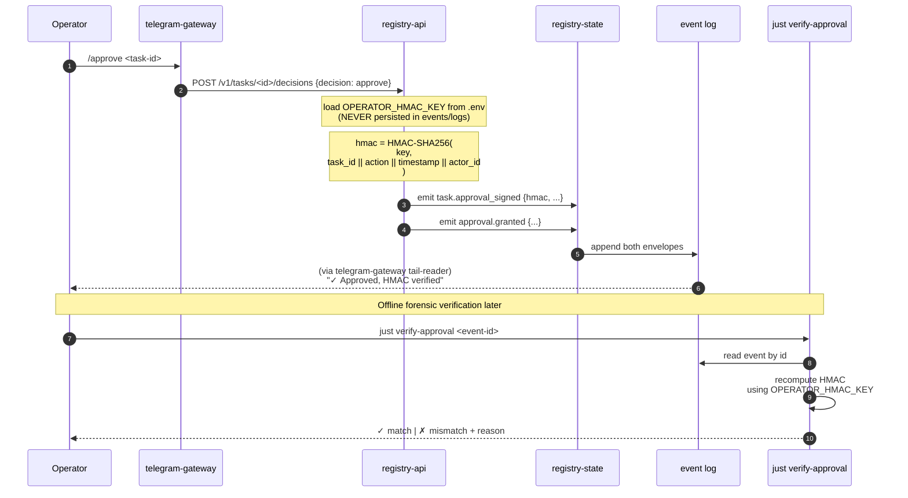
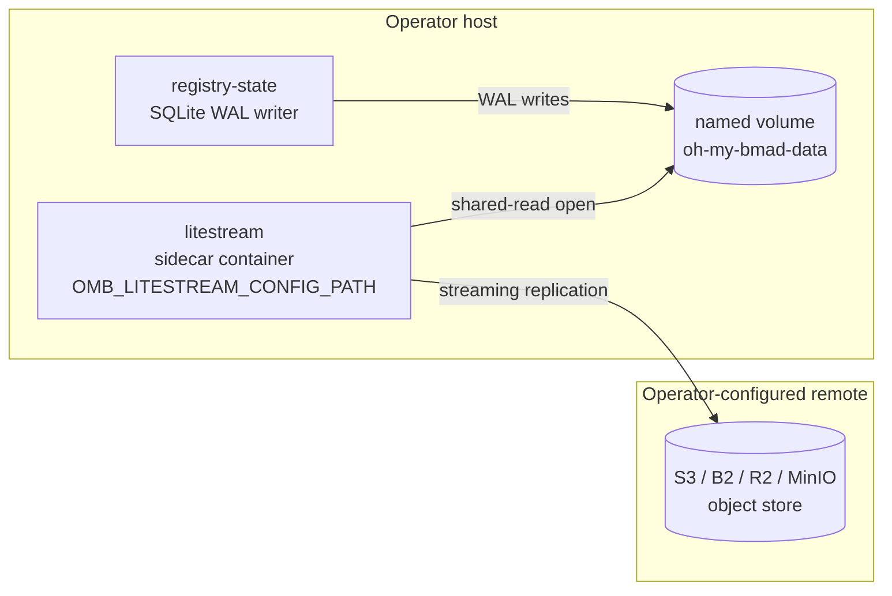

---
stepsCompleted:
  - step-01-init
  - step-02-context
  - step-03-starter
  - step-04-decisions
  - step-05-patterns
  - step-06-structure
  - step-07-validation
  - step-08-complete
lastStep: 8
status: 'complete'
completedAt: '2026-04-21'
inputDocuments:
  - _bmad-output/planning-artifacts/prd.md
  - _bmad-output/planning-artifacts/product-brief.md
  - plan_draft.md
workflowType: 'architecture'
project_name: 'oh-my-bmad'
user_name: 'R2d2'
date: '2026-04-21'
---

# Architecture Decision Document

_This document builds collaboratively through step-by-step discovery. Sections are appended as we work through each architectural decision together._

## Project Context Analysis

### Requirements Overview

**Functional Requirements (56 across 7 capability areas):** task lifecycle management, Telegram + Console control surfaces with full parity, typed event system, persistence with restart recovery, runtime execution with swap-capable worker + orchestrator, tiered policy + security + auditability, Docker-deployable operations.

**Non-Functional Requirements (38 across 6 categories):** Performance (sub-second registry replay and operator latency), Reliability (100% restart recoverability, zero tasks lost, CI-verified crash-injection test), Security (secret hygiene, capability-tier enforcement, fuzz-tested command injection prevention, license scan), Observability (typed events only, no stdout parsing, structured JSON logs, reasoning breadcrumb sanitization), Maintainability (pluggable worker/orchestrator via env var, additive-only schema evolution, upstream fork boundary), Data-Volume Scalability (<10 GB footprint for 6 months, snapshot-bounded replay time).

### Scale & Complexity

- **Complexity:** high — event-sourced distributed system with pluggable runtime, multi-surface control, policy tiers, and upstream-fork integration boundary.
- **Primary domain:** infrastructure platform / backend service stack. Python 3.12 + FastAPI for platform-owned services; Node.js inside the Claude Code worker wrapper; upstream-fork languages for OMC and `clawhip`.
- **Phase 1 architectural components (preliminary inventory, ~11):**
  1. **Registry API service (1a)** — HTTP application API surface; serves FR4/FR5/FR6/FR8 read paths and FR1/FR7 command ingestion. Stateless container; delegates all persistence to 1b.
  2. **Registry state service (1b)** — event-log subscriber + state materializer + SQLite store; single writer (FR26); owns snapshots (FR25 / NFR-P3); owns idempotency cache (FR28); emits `service.crashed` / recovery events (FR24a).
  3. **Telegram bot** (async `aiogram` v3 app).
  4. **Console CLI** (local binary).
  5. **OMC orchestrator adapter** + OMC process (upstream fork behind adapter shim).
  6. **Claude Code worker wrapper** + Claude Code CLI process.
  7. **`clawhip` event bus daemon** + **`clawhip-bridge` MCP server** (upstream fork behind adapter shim).
  8. **Three MCP servers** co-located with registry: `task-registry`, `session-registry`, `clawhip-bridge` (the bridge is already counted in component 7; `task-registry` and `session-registry` are distinct processes).
  9. **Shared event-log store** — append-only JSONL (per-day) + periodic SQLite snapshot materialization.
  10. **Shared artifact store** — filesystem under `/var/lib/oh-my-bmad/artifacts/{task-id}/`.
  11. **Cross-cutting hygiene utilities** — secret-scanner, log-sanitizer, pre-commit-hook, license-scan runner.

### Technical Constraints & Dependencies

- **Locked (cannot re-litigate):** Python 3.12 + FastAPI; `aiogram` v3; SQLite WAL + append-only JSONL for event log; single-target deployment (VPS *or* macOS); stdio transport for MCP in Phase 1; Docker-compose-only installer; upstream forks via adapter shims.
- **Open for Architecture to resolve:** final registry storage choice (SQLite default; alternatives on the table); event serialization (JSON default); MCP transport path for Phase 6 remote workers; inter-service networking details (docker-network trust boundary in Phase 1; no mTLS).
- **External dependencies:** Anthropic Claude API via Claude Code CLI, Telegram Bot API, GitHub REST API, Docker Engine ≥ 24, Docker Compose v2, Git CLI.
- **Upstream fork dependencies:** OMC ([Yeachan-Heo/oh-my-claudecode](https://github.com/Yeachan-Heo/oh-my-claudecode)), `clawhip` ([Yeachan-Heo/clawhip](https://github.com/Yeachan-Heo/clawhip)); Phase 4+ adds `browser-harness`; Phase 5+ adds OMX + `claw-code`.

### Cross-Cutting Concerns

- **Event schema governance** — versioned, additive-only; central registry of `(event_type, schema_version)` pairs; migrator path for breaking changes.
- **Immutable event envelope at every service boundary** — every typed event is wrapped in an immutable envelope: `{event_id (UUIDv7), schema_version, type, emitted_at_monotonic, actor, payload, parent_event_id?, trace_id?}`. Once emitted into the event log, the envelope is never mutated — not by the registry materializer, not by the `clawhip` bridge, not by sinks. Guarantees atomic visibility semantics for the S-2 mid-flight separability test; prevents partial-write corruption during hand-off. The `trace_id?` field is reserved now but unused until Phase 2.
- **Secret hygiene** — three-layer enforcement (scanner at pre-commit, sanitizer at runtime log/event emission, `secret.accessed` audit events).
- **Capability-tier enforcement** — applied at every MCP surface boundary; consistent across `task-registry`, `session-registry`, `clawhip-bridge`.
- **Idempotency key propagation** — UUIDv7 client-generated keys from bot/console through application API to registry; 7-day dedupe cache.
- **Shutdown / recovery ordering** — registry snapshot before terminal stop; workers release locks on SIGTERM; all services emit a terminal lifecycle event.
- **Structured logs vs. typed events** — separate streams with different persistence semantics; architecture must prevent conflation.
- **Upstream-fork pinning** — version-locked with adapter-contract integration tests; CI fails on semantic drift.
- **Metrics + distributed tracing — known Phase 2 gap.** Phase 1 ships structured JSON logs (NFR-O2), typed events (NFR-O1), `/ping` health (FR17), and event-stream observability (NFR-O3). It does **not** ship metrics collectors (Prometheus-style gauges/counters) or distributed traces (OpenTelemetry spans across services). This is an explicit Phase 2 gap, not an oversight; architecture decisions in Phase 1 should leave clean insertion points (standard log format, `trace_id` field reserved in the event envelope) but not implement the collectors.

## Starter Template Evaluation

### Primary Technology Domain

Infrastructure platform / multi-service Python monorepo with Node.js inside the worker component and upstream-fork integrations. No GUI in Phase 1 → no frontend starter needed.

### Starter Options Considered

| Candidate | Rejection reason |
|---|---|
| `tiangolo/full-stack-fastapi-template` | Brings React + Postgres + Celery + Traefik — wrong footprint for an event-sourced single-operator platform. |
| `cookiecutter-django`, `cookiecutter-pypackage` | Wrong framework / wrong artifact type. |
| `awesome-compose` FastAPI samples | Too minimal; no multi-service orchestration, no MCP. |
| T3, RedwoodJS, etc. | Wrong language (Python locked). |
| Official Anthropic MCP Python SDK | Library, not project starter; used inside the three MCP server components. |
| Claude Code SDK | Library dependency; used inside worker wrapper. |
| `aiogram` v3 project template | Applies to one component only. |

**Conclusion: no monolithic starter matches this architecture.**

### Selected Approach: Per-Component Bootstrap in a `uv` Workspace Monorepo

**Rationale:** The project's component inventory (~11 components), locked tech choices (FastAPI, `aiogram`, SQLite, MCP stdio), and upstream-fork integration boundary are incompatible with any ready-made multi-service Python starter. A manually scaffolded `uv` workspace monorepo is the honest answer. Five sequenced scaffold stories lay down the structure; every subsequent story fills in one or more components.

### Scaffold Epic — 5-Story Decomposition

Each story fits the ≤1-operator-day rule (NFR-M6). Story 1 must produce something `uv sync` can prove works before stories 2–5 scale the pattern.

1. **Monorepo proof.** Create `uv` workspace root + one sample service (`services/registry-api/`) + one shared package (`packages/events/`) with minimal hello-world content. Acceptance: `uv sync` succeeds; `uv run python -c "from events import __version__; print(__version__)"` runs inside the workspace. **Also delivers the top-level README required by NFR-M7** (see "Top-level README" below). Cites FR46.
2. **Remaining service + MCP scaffolds.** Replicate the proven pattern across the other 5 services and 3 MCP servers; add the remaining 2 shared packages. Acceptance: `uv sync --all-packages` succeeds; all 12 `pyproject.toml` files resolve.
3. **Upstream vendoring.** Copy OMC + `clawhip` into `upstream/` per the vendored-with-sync approach; create `VENDORED.md` and `just sync-upstream` recipe. Acceptance: both upstreams present with recorded SHAs; sync recipe runnable.
4. **Compose + env + justfile.** Write `docker-compose.yml`, `docker-compose.macos.yml`, `.env.example`, `justfile` with `dev`, `test`, `lint`, `scenarios` recipes. Acceptance: `docker compose config` validates; `just test` runs (no tests yet, exits 0).
5. **Test tree + CI skeleton.** Create `tests/{separability,crash-injection,idempotency,integration}/` with one placeholder pytest file each (all marked `@pytest.mark.skip`). Acceptance: `pytest` discovers all 4 trees; CI workflow runs `uv sync && ruff check && pytest`.

### Architectural Decisions Established by the Scaffold

**Language & Runtime:** Python 3.12 (platform-owned), pinned Node.js LTS (worker wrapper's Claude Code CLI).

**Package Management:** `uv` workspace; `uv.lock` committed; `uv sync --frozen --all-packages` in Docker build.

**Build Tooling:** Per-service Dockerfile; multi-stage build (`uv sync` → slim runtime stage); `docker-compose.yml` + `docker-compose.macos.yml` overlay for the two deployment targets. Base image choice (`python:3.12-slim-bookworm` vs. `python:3.12-alpine`) is open for Step 4.

**Testing Framework:** `pytest` + `pytest-asyncio` + `hypothesis` (fuzz). Test trees under `tests/`: `separability/` (S-1, S-2, S-3), `crash-injection/` (NFR-R2 harness), `idempotency/` (100× replay), `integration/`.

**Linting / Formatting / Typing:** `ruff` (linter + formatter — single tool; replaces `black`, `isort`, `flake8`); `mypy --strict` on platform-owned packages; adapters for upstream forks exempt from strictness at the shim boundary. A custom `ruff` rule enforces NFR-O1 / FR18b (reject `subprocess.check_output().decode()`-style stdout parsing in `services/**` and `mcp-servers/**`).

**Code Organization:** **Ports-and-adapters (hexagonal) pattern** per service: clean separation of domain (`events/`, registry logic) from adapters (HTTP, MCP, SQLite, Telegram). This is what makes the three separability tests (S-1/S-2/S-3) implementable without retrofit.

**Shared Event Envelope:** in `packages/events/`. Every service imports it; no service defines its own. Enforces the immutable-envelope cross-cutting concern.

**Development Experience:** `docker compose watch` for fast iteration; `uvicorn --reload` inside dev compose; `just` recipes (`just dev`, `just test`, `just lint`, `just scenarios`); VS Code workspace config committed with Python interpreter per folder.

**Upstream Fork Integration — Vendored-with-Sync.** Upstream forks (OMC, `clawhip`) are copied into `upstream/omc/` and `upstream/clawhip/` as plain subdirectories tracked in-tree. A `VENDORED.md` manifest records each upstream's commit SHA and source URL. A `just sync-upstream <name>` recipe performs the monthly (or ad-hoc) re-sync: fetch the upstream repo, update the subdirectory contents to the chosen commit, update `VENDORED.md`, run the adapter-contract integration test suite (NFR-M2), commit if green. **Rationale:** git submodules introduce clone / rebuild / CI friction that is not worth it for a solo operator; vendoring keeps the working tree self-contained and the re-sync step explicit.

**Top-Level README (delivered in scaffold story #1, satisfying NFR-M7):**

- (a) 10-line quickstart (copy-paste-runnable).
- (b) Directory-structure explainer that names each top-level folder:
  - `services/` — deployable backend processes.
  - `mcp-servers/` — MCP servers exposing tool/resource contracts to agents (distinct from `services/` because they have an MCP protocol surface, not an HTTP surface).
  - `packages/` — shared libraries imported by multiple services.
  - `upstream/` — vendored upstream-fork source trees, synced via `just sync-upstream`.
  - `tests/` — separability + crash-injection + idempotency + integration test trees.
  - `docs/` — operator documentation.
- (c) Deployment checklist for VPS and macOS targets.
- (d) Backup/restore procedure for the event log + registry data volume.
- (e) Schema-migrator runbook.

Required by NFR-M7; must land with scaffold story #1, not deferred to a later story.

### Repo Layout

```
oh-my-bmad/
├── docker-compose.yml
├── docker-compose.macos.yml
├── .env.example
├── pyproject.toml                    # uv workspace root
├── uv.lock
├── justfile
├── README.md                         # lands in scaffold story #1
├── VENDORED.md                       # upstream commit SHAs
├── services/
│   ├── registry-api/                 # Component 1a
│   ├── registry-state/               # Component 1b
│   ├── telegram-gateway/             # Component 3
│   ├── console-cli/                  # Component 4
│   ├── orchestrator-adapter/         # Component 5 (wraps OMC)
│   └── worker-wrapper/               # Component 6 (wraps Claude Code CLI)
├── mcp-servers/
│   ├── task-registry/                # Component 8a
│   ├── session-registry/             # Component 8b
│   └── clawhip-bridge/               # Component 7+8c
├── packages/                         # shared libraries
│   ├── events/                       # event envelope + schema registry
│   ├── secret-hygiene/               # scanner, sanitizer, license-scan
│   └── idempotency/                  # UUIDv7 key + dedupe cache
├── upstream/                         # vendored subtrees, synced via `just sync-upstream`
│   ├── omc/
│   └── clawhip/
├── tests/
│   ├── separability/                 # S-1, S-2, S-3 CI tests
│   ├── crash-injection/              # NFR-R2 synthetic crash harness
│   ├── idempotency/                  # 100× replay test
│   └── integration/
└── docs/
```

**Version pinning:** Specific version numbers for FastAPI, `aiogram`, `uv`, `pytest`, `ruff`, `mypy`, Python, Node.js are NOT pinned in this architecture doc; they are pinned in `pyproject.toml` / `uv.lock` at scaffold story #1 and updated only via the NFR-M2 behavioral-contract gate.

**Note:** Project initialization using this scaffold is the first implementation epic (stories 1–5 above).

## Core Architectural Decisions

### Decision Priority Analysis

**Critical (block implementation):** data-modeling library, migration tool choice, FastAPI security middleware shape, secret-injection pattern, CI workflow trigger, image publishing target.

**Important (shape architecture):** base image choice, `/docs` auto-doc exposure in prod, error-envelope format, CI job matrix, log level defaults, tunnel choice for webhook ingress.

**Deferred (post-MVP):** frontend/dashboard, metrics/traces infra, multi-host networking, mTLS, Redis/external cache, horizontal scaling, bundled reverse proxy.

### Category 1 — Data Architecture

| Decision | Status | Choice / rationale |
|---|---|---|
| Registry storage engine | **[LOCKED]** (PRD §Infrastructure) | SQLite with WAL mode; upgrade path to Postgres via SQLAlchemy in Phase 6. |
| Event-log format | **[LOCKED]** (PRD) | Append-only JSONL per day, rolled into SQLite snapshot table on periodic snapshot. |
| Artifact storage | **[LOCKED]** (PRD) | Filesystem under `/var/lib/oh-my-bmad/artifacts/{task-id}/`. |
| Data validation library | **[DECIDE NOW]** | **Pydantic v2.** Fast, mature, integrates with FastAPI natively; used for event envelopes, registry DTOs, and FastAPI request/response models. Alternatives (`msgspec`, `dataclasses-json`) give up FastAPI integration. |
| ORM | **[DECIDE NOW]** | **SQLAlchemy 2.x (async)** — boring-tech bet with a clean future path to Postgres in Phase 6. Raw `aiosqlite` is simpler but loses the Postgres bridge. |
| DB schema migrations (registry tables) | **[DECIDE NOW]** | **Alembic.** Standard choice with SQLAlchemy; single `alembic/` directory in `services/registry-state/`. |
| Event-schema migrations | **[LOCKED]** (FR22 + NFR-M3) | Custom migrator container (`docker compose run --rm migrator <from>-to-<to>`); separate from Alembic because it evolves the event log, not DB tables. |
| Idempotency cache | **[DECIDE NOW]** | In-process `cachetools.TTLCache` backed by a SQLite `idempotency_cache` table for durability across restarts. 7-day TTL. No Redis. |
| Caching strategy | **[DEFER]** | None in Phase 1 beyond the idempotency cache. |

### Category 2 — Authentication & Security

| Decision | Status | Choice / rationale |
|---|---|---|
| Authentication method (Telegram bot) | **[LOCKED]** (FR11) | Allowlisted Telegram user-id check on every incoming message. No user accounts, no OAuth, no session tokens. |
| Authentication method (Console CLI) | **[DECIDE NOW]** | **SSH-level trust.** The console binary runs on the host (or via `docker compose exec`). Local OS user = platform user. No separate auth. Rationale: solo operator; credential management inside the console would be security theater. |
| Authorization model | **[LOCKED]** (FR37, FR38) | Capability tiers 0–3, enforced at every MCP server boundary and at the HTTP API. |
| FastAPI security middleware | **[DECIDE NOW]** | Three middlewares, ordered: **(1) request-id + idempotency-key extractor** (reads `Idempotency-Key` header, generates UUIDv7 if absent, attaches to request state); **(2) log-sanitizer wrapper** (intercepts log records, redacts secret patterns before emission — NFR-S1); **(3) rate limiter** on the Telegram webhook endpoint only (token-bucket, 10 req/s burst 20). Internal HTTP API is unlimited per NFR-S7. |
| TLS inside docker network | **[LOCKED]** (NFR-S7) | None in Phase 1; docker-compose network is the trust boundary. |
| TLS on external ingress — tunnel-first | **[DECIDE NOW]** | **No reverse proxy or LetsEncrypt handling bundled with the platform in Phase 1.** The Telegram webhook needs HTTPS; the operator chooses from three documented options (in `.env.example` + README): **(a)** Cloudflare Tunnel — free, zero-config, recommended default; **(b)** ngrok — free tier sufficient for solo-operator use; **(c)** bring-your-own reverse proxy (nginx, Caddy, Traefik — operator's responsibility). The platform container set does not include a reverse proxy. Rationale: avoid cert-management and sixth-container complexity for Phase 1; add a bundled proxy only when Phase 2+ multi-endpoint needs justify it. |
| Secret injection | **[DECIDE NOW]** | **12-factor: env vars + `.env` file**, loaded via `pydantic-settings` (Pydantic v2's BaseSettings). `.env.example` committed; `.env` gitignored. Rotation: edit `.env`, `docker compose up -d` reloads (FR48). |
| At-rest encryption | **[DEFER]** | None in Phase 1 — single-operator trust model. Full-disk encryption is the operator's OS responsibility. |
| Audit logging | **[LOCKED]** (NFR-S3, FR42) | Typed events: `secret.accessed`, `approval.granted`, `approval.rejected`, `tier3.action_attempted`, `tier3.action_performed`. Queryable from registry. |

### Category 3 — API & Communication Patterns

| Decision | Status | Choice / rationale |
|---|---|---|
| Application API style | **[LOCKED]** (PRD) | REST-ish HTTP+JSON; versioned `/v1/`; additive-only until v2. |
| API docs | **[DECIDE NOW]** | FastAPI auto-generates OpenAPI at `/v1/openapi.json` + Swagger UI at `/v1/docs`. **Exposed in dev; disabled in prod** (gated by `ENV=production` env var). |
| Error envelope format | **[DECIDE NOW]** | **RFC 7807 (`application/problem+json`)** for HTTP errors; typed events for internal errors. Library: `fastapi-problem-details` or custom exception handler. Example: `{"type": "/errors/idempotency-collision", "title": "Duplicate idempotency key", "status": 409, "detail": "...", "instance": "/v1/tasks", "task_id": "t-7f2a"}`. |
| Request/response validation | **[DECIDE NOW]** | Pydantic v2 models — validated on both ingress and egress; dumps to JSON with stable ordering (canonical form for event envelope). |
| Rate limiting | **[DECIDE NOW]** | Only on Telegram webhook endpoint (see Category 2). Internal API un-rate-limited in Phase 1. |
| Inter-service communication | **[DECIDE NOW]** | Matrix (locks all inter-component contracts now):<br>• **Bot → Registry API:** HTTP/JSON (`POST /v1/tasks`, `GET /v1/tasks/{id}`, `POST /v1/tasks/{id}/decisions`).<br>• **Console → Registry API:** HTTP/JSON (same surface — parity per FR12).<br>• **Registry API → Registry State:** event emission via `clawhip-bridge` MCP client — Registry API does not directly write Registry State tables; it emits a command event and reads materialized state via a read-only SQLite connection.<br>• **Workers (OMC, Claude Code worker) → Registry State:** event emission only via `clawhip-bridge`; never direct DB.<br>• **Orchestrator → Worker:** typed events on the event bus; Worker subscribes via MCP.<br>• **Registry State → Event log:** direct filesystem append (Registry State *is* the single writer to the log).<br>• **`clawhip` daemon → Telegram sink:** HTTP outbound to Telegram Bot API. |
| Request-id / trace-id propagation | **[DECIDE NOW]** | Every HTTP request gets an `X-Request-ID` header (UUIDv7, generated if absent); written into a `request_id` field on every emitted event + every log line. `trace_id` field reserved in event envelope (per Cross-Cutting Concerns) but not propagated across services in Phase 1 (Phase 2 gap). |

### Category 4 — Frontend Architecture

**[DEFER — N/A in Phase 1].** No GUI. UX surface is Telegram + CLI text. Web dashboard is Phase 7. No state management, no component architecture, no routing decisions needed now.

### Category 5 — Infrastructure & Deployment

| Decision | Status | Choice / rationale |
|---|---|---|
| Hosting | **[LOCKED]** (PRD) | Docker Compose on VPS or local macOS; single-target (no split in Phase 1). |
| Base image | **[DECIDE NOW]** | **`python:3.12-slim-bookworm`** — not Alpine. Rationale: Python + `uv` + `aiosqlite` + `aiohttp` all need manylinux wheels; Alpine's musl forces `uv` to fall back to sdist compilation. Image-size savings don't beat build-time cost. Multi-stage build keeps the final runtime image ~150 MB. Node.js worker wrapper uses `node:lts-bookworm-slim`. |
| Dockerfile structure | **[DECIDE NOW]** | Multi-stage: stage 1 `uv sync --frozen --no-dev --all-packages` into `/opt/venv`; stage 2 slim runtime with `/opt/venv` copied in + service entrypoint. Shared `Dockerfile.base` template; per-service-directory `Dockerfile` overrides entrypoint only. |
| CI/CD platform | **[DECIDE NOW]** | **GitHub Actions.** Single `.github/workflows/ci.yml`: `uv sync --frozen` → `ruff check` → `ruff format --check` → `mypy --strict packages/ services/registry-*` (upstream adapters exempt) → `pytest -m "not slow"` on every PR. Separate `.github/workflows/release.yml` on git tag: build + publish multi-arch Docker images to GHCR. |
| Image registry | **[DECIDE NOW]** | **GHCR** (`ghcr.io/<owner>/oh-my-bmad-<service>:<version>`). Free for public/personal-project scale; tightly integrated with GitHub Actions. |
| Environment configuration | **[LOCKED]** (FR48, §Installation) | `.env` file per host; env vars injected at container start; `.env.example` committed. |
| Logging strategy | **[LOCKED]** (NFR-O2) | Structured JSON on stdout from every service; docker's default json-file log driver captures. No log aggregation infra in Phase 1. |
| Monitoring | **[DEFER to Phase 2]** | Known gap (§Cross-Cutting Concerns). `/ping` is the Phase 1 health signal. |
| Scaling | **[LOCKED]** (NFR-SC3) | No horizontal scaling in Phase 1; single-task per worker; multi-task parallelism = Phase 6. |
| Backup strategy | **[DECIDE NOW]** | `just backup` recipe: `docker compose down`, `tar -czf oh-my-bmad-backup-$(date +%F).tgz /var/lib/oh-my-bmad`, `docker compose up -d`. Restore: reverse. Documented in README (NFR-M7). Operator's cadence is their call; recommended daily. |

### Decision Impact Analysis

**Implementation sequence implied by these decisions:**

1. **Scaffold story #1** (from Step 3) — workspace root + 1 service + 1 package + README.
2. **Scaffold stories #2–5** — remaining services, vendored upstreams, compose, test tree.
3. **`packages/events/`** — event envelope model (Pydantic v2), schema registry, serializer, `trace_id` field reserved. Blocking dependency for everything else.
4. **`services/registry-state/`** — SQLite schema (Alembic initial migration), event-log writer, snapshot logic, idempotency cache, single-writer enforcement, materializer reading from event log.
5. **`services/registry-api/`** — FastAPI app, Pydantic request/response models, three middlewares (request-id + idempotency, log sanitizer, webhook rate limiter), RFC 7807 errors, `/v1/openapi.json` gated by `ENV`.
6. **`mcp-servers/clawhip-bridge/`** — append-only event emission surface; MCP stdio server.
7. **`services/telegram-gateway/` + `services/console-cli/`** in parallel — surface parity (same application API).
8. **`services/worker-wrapper/`** — Claude Code CLI wrapper; emits typed events; obeys capability tiers; implements FR29 reconnection.
9. **`services/orchestrator-adapter/`** — OMC adapter shim; pass-through until OMC is vendored.
10. **`mcp-servers/task-registry/` + `mcp-servers/session-registry/`** — read-only MCP surfaces over registry state.
11. **CI pipeline wiring + GHCR publishing + backup recipe.**
12. **Test-infra buildout:** separability tests (S-1, S-2, S-3) + crash-injection harness + idempotency replay + write-interrupt harness + **log-capture harness** (pytest fixture that wraps the platform's JSON-log emitter; every integration test exercising a secret-handling path asserts captured log records contain only whitelisted patterns and never raw secret values — companion to the pre-commit secret-scanner; scanner catches hardcoded leaks at commit time, log-capture catches runtime sanitizer-middleware bugs before they pollute test state) — all mandatory before MVP ship.

**Cross-component dependencies that matter:**

- `packages/events/` blocks every service and MCP server.
- `services/registry-state/` must exist before any other service can emit or read.
- `mcp-servers/clawhip-bridge/` must exist before workers or orchestrator can emit.
- Scaffold story #1 blocks everything; stories #2–5 block implementation stories.
- Telegram gateway and console CLI are parallelizable after Registry API exists.
- Worker wrapper blocks Journey 1 end-to-end test (MVP gate).

## Implementation Patterns & Consistency Rules

The platform will be built by AI agents (likely the operator's own Claude Code runs). Every pattern below is a decision the agents would otherwise make ad-hoc — and inconsistently across stories. These rules turn implicit choices into explicit law.

### Pattern Categories Defined

**Critical conflict points identified:** 7 categories, ~25 concrete rules. Each rule is enforceable in CI or at code review.

### Naming Patterns

**Python code (PEP 8 strict):**
- Modules: `snake_case.py` (e.g., `event_envelope.py`, `idempotency_cache.py`).
- Classes: `PascalCase` (e.g., `EventEnvelope`, `TaskRegistry`, `ClawhipBridge`).
- Functions / methods / variables: `snake_case` (e.g., `emit_event`, `task_id`, `event_log_path`).
- Constants / module-level config: `UPPER_SNAKE_CASE` (e.g., `SNAPSHOT_INTERVAL_SECONDS`, `MAX_EVENTS_BEFORE_SNAPSHOT`).
- Private members: single leading underscore (`_internal_helper`). Dunder names reserved for protocol methods only.
- Type aliases: `PascalCase` (`TaskId = str`, `EventPayload = dict[str, Any]`).

**Database (SQLite, SQLAlchemy 2.x defaults):**
- Table names: `snake_case` plural (`tasks`, `sessions`, `events`, `idempotency_cache`).
- Column names: `snake_case` (`task_id`, `created_at`, `schema_version`).
- Foreign keys: `<target_table_singular>_id` (`task_id`, `session_id`) — no `fk_` prefix.
- Indexes: `ix_<table>_<columns>` (`ix_events_task_id_emitted_at`).
- Alembic migration files: `<YYYY-MM-DD>_<short_slug>.py` (`2026-04-22_initial_schema.py`).

**IDs and keys:**
- Task IDs: `t-<uuidv7>` (e.g., `t-0192a1b5-c2f4-7e8d-b5a7-9c4d1f3e6b88`).
- Session IDs: `s-<uuidv7>`.
- Event IDs: `e-<uuidv7>`.
- Idempotency keys: raw UUIDv7 (no prefix — supplied by client).
- Request IDs: raw UUIDv7 (`X-Request-ID` header).
- Why UUIDv7 everywhere: time-ordered sort; safe for event-log replay; no k-sortable extras required.

**HTTP API (REST-ish):**
- Endpoints: plural nouns (`/v1/tasks`, `/v1/sessions`, `/v1/events`). Single-resource paths: `/v1/tasks/{id}`.
- Sub-resources: `/v1/tasks/{id}/events`, `/v1/tasks/{id}/decisions`, `/v1/tasks/{id}/logs/digest`.
- Path parameters: `{name}` curly-brace form (FastAPI default), `snake_case`.
- Query parameters: `snake_case` (`?since=<ts>&limit=50`).
- Headers: Hyphenated Title-Case (`X-Request-ID`, `Idempotency-Key`, `X-Schema-Version`).
- Status codes: standard REST — `200` OK, `201` Created (task creation), `202` Accepted (decision accepted, async), `204` No Content (stop/retry), `400` Bad Request (validation), `404` Not Found, `409` Conflict (idempotency collision returning prior result), `422` Unprocessable Entity (Pydantic validation fail), `500` Server Error.

**Docker / Compose:**
- Service names in `docker-compose.yml`: `kebab-case` (`registry-api`, `registry-state`, `telegram-gateway`, `clawhip-daemon`).
- Image names: `ghcr.io/<owner>/oh-my-bmad-<service-kebab-case>:<version>`.
- Network name: `oh-my-bmad` (lowercase single token).
- Volume names: `oh-my-bmad-<purpose>` (`oh-my-bmad-registry-data`, `oh-my-bmad-artifacts`).
- Environment variables: `UPPER_SNAKE_CASE`, prefixed by component where ambiguous (`TELEGRAM_BOT_TOKEN`, `ANTHROPIC_API_KEY`, `REGISTRY_DB_PATH`, `CLAWHIP_SOCKET_PATH`).

**Events (`domain.action`, past tense):**
- Format: `<domain>.<subdomain>?.<action>` with dots, lowercase, underscores inside tokens.
- Past tense only (events describe what happened). `task.created`, `task.awaiting_approval`, `task.execution.resumed`, `session.started`, `approval.granted`, `secret.accessed`, `event.unknown_schema`.
- Never imperative (`create_task`), never present continuous (`task.executing` — use `task.execution.started` instead), never questions.
- New event types require adding to the central schema registry in `packages/events/schema_registry.py` — unregistered event emission is both a PR-time CI failure (via `scripts/check_event_registry.py`) and a runtime error (NFR-O5 / FR21).

### Structure Patterns

**Project organization:**
- Ports-and-adapters per service: `services/<name>/src/<name>/{domain,adapters,app}/`. `domain/` holds business logic with no IO dependencies; `adapters/` holds all IO (HTTP, SQLite, MCP, Telegram); `app/` composes the two.
- Shared logic lives in `packages/*` (never in a specific service).
- **No cross-service imports.** `services/registry-api/src/registry_api/` must not import from `services/registry-state/src/registry_state/`. Share via a package in `packages/` or via event/HTTP contracts.
- `mcp-servers/*` may import from `packages/*` only.
- `packages/*` may import from other packages but never from `services/*` or `mcp-servers/*`.
- **Enforced by CI:** a `scripts/check_imports.py` runs `pydeps` + custom checker on every PR; violations fail the build.

**Test layout:**
- Fast unit tests: co-located with the module using pytest's `test_*.py` naming — `services/registry-api/src/registry_api/domain/events.py` → `services/registry-api/src/registry_api/domain/test_events.py`. Run by default.
- Integration / separability / crash-injection / idempotency tests: top-level `tests/{integration,separability,crash-injection,idempotency}/` — they span services.
- Test markers: `@pytest.mark.slow`, `@pytest.mark.separability`, `@pytest.mark.crash`, `@pytest.mark.idempotency`, `@pytest.mark.integration`. CI PR-level runs exclude `slow`; full CI on merge runs everything.
- Fixtures in `tests/conftest.py` at top level + per-tree `conftest.py` for tree-specific fixtures. Deterministic UUIDv7 injection + clock control fixtures are top-level.

**File organization:**
- Configuration files: top-level only (`pyproject.toml`, `docker-compose.yml`, `docker-compose.macos.yml`, `.env.example`, `justfile`, `ruff.toml`, `mypy.ini`).
- Documentation: top-level `README.md`; deeper docs in `docs/`. Never inside `src/`.
- Scripts: `scripts/` for operator-runnable utilities (migrator, import-check, event-registry check, backup); never checked into `services/*/src/`.
- Secrets: only in `.env` (gitignored). No secret files under version control ever — enforced by pre-commit secret-scanner.

### Format Patterns

**JSON (events + API):**
- Field names: `snake_case` throughout (consistent with Python). No `camelCase`.
- Encoding: UTF-8; no BOM; canonical form for event envelopes (sorted keys, no whitespace — `json.dumps(obj, sort_keys=True, separators=(",", ":"))`).
- Timestamps: ISO 8601 UTC with `Z` suffix (`2026-04-21T10:30:00.123Z`). Millisecond precision; monotonic timestamps (for event ordering) use integer nanoseconds-since-boot in a separate field (`emitted_at_monotonic_ns`).
- Durations: float seconds in API responses (`duration_seconds: 2.73`); integer milliseconds in internal events (`duration_ms: 2730`). Consistent within a single boundary.
- Booleans: `true` / `false` only — never `0` / `1`, never string `"true"`.
- Null handling: missing optional field = omit; present-but-unset = explicit `null`. Pydantic defaults drive which is which.
- Arrays: plural name (`events`, `blockers`); single-item objects are not wrapped in a list.

**HTTP error envelope (RFC 7807):**

```json
{
  "type": "/errors/<slug>",
  "title": "<short human-readable>",
  "status": 409,
  "detail": "<longer explanation>",
  "instance": "/v1/tasks",
  "extensions": {
    "task_id": "t-0192a1b5-...",
    "idempotency_key": "..."
  }
}
```

`extensions` holds all platform-specific fields; never flatten custom fields into the top level (keeps RFC 7807 compliance).

**Event envelope (strict schema — every field is mandatory; already defined in §Cross-Cutting Concerns):**

```json
{
  "event_id": "e-0192...",
  "schema_version": "1.0.0",
  "type": "task.execution.resumed",
  "emitted_at": "2026-04-21T03:02:17.412Z",
  "emitted_at_monotonic_ns": 1234567890000,
  "actor": {"kind": "worker", "id": "w-0192..."},
  "payload": { ... type-specific ... },
  "parent_event_id": "e-0191..." ,
  "trace_id": null,
  "request_id": "..."
}
```

Enforced via Pydantic v2 model in `packages/events/envelope.py`. No other event-envelope shape may be constructed; all event emission flows through this model.

### Communication Patterns

**Inter-service protocol matrix — already defined** in §Core Architectural Decisions — Category 3. Reference, do not duplicate.

**Async conventions:**
- All IO is async (`async def`); services use `asyncio` + `uvicorn` for FastAPI, `asyncpg`-style patterns for SQLAlchemy async.
- Never mix sync and async IO in the same call stack. If a library is sync-only, wrap with `asyncio.to_thread()` at the adapter boundary.
- Timeouts: every outbound HTTP call has an explicit `timeout=` (no infinite waits). Default 10 s; override as needed with a comment explaining why.
- Cancellation: services propagate `asyncio.CancelledError` correctly; no `except Exception: pass` patterns.

**Logging:**
- Library: `structlog` (structured JSON output; `ProcessorFormatter` with JSON renderer).
- Levels: `ERROR` (Sev1 — paging condition), `WARNING` (recoverable anomaly worth noting), `INFO` (lifecycle events, correlation IDs), `DEBUG` (development tracing, off in prod). `TRACE` not used.
- Every log record MUST include: `request_id`, `service`, `level`, `timestamp`, `event` (short label), and domain-specific fields via `structlog.contextvars.bind_contextvars`.
- Log sanitizer middleware strips any field matching secret-pattern regex before emission.
- Raw terminal output (`print`) is forbidden outside `services/console-cli/` — which is explicitly a CLI and legitimately prints.

### Process Patterns

**Error handling:**
- Fail fast at the boundary; raise typed exceptions (`IdempotencyCollision`, `EventSchemaUnknown`, `CapabilityDenied`, `BudgetExceeded`, `WorktreeLockHeld`). Define in `packages/events/errors.py`.
- Map to HTTP via a FastAPI exception handler that produces RFC 7807 responses.
- Never catch `Exception` without re-raising or converting to a typed error. **Bare `except:` (or `except Exception:` without re-raise) masks the actual error, breaks observability, and makes debugging impossible — every failure becomes a silent no-op.** The correct pattern is `except SpecificError as exc: raise TypedError(...) from exc` or `except Exception: log.exception(...); raise`. Bare `except:` is a CI lint failure.
- Retries: exponential backoff with jitter (`tenacity` library); max 3 attempts for external APIs (Telegram, Anthropic, GitHub); per-call override via decorator. No retries inside business logic — always at the adapter boundary.

**Idempotency:**
- Every state-mutating endpoint (`POST /v1/tasks`, `POST /v1/tasks/{id}/decisions`) requires an `Idempotency-Key` header (UUIDv7, client-generated). Missing → server generates one and echoes back, but clients must generate their own for true idempotency.
- Dedupe window: 7 days (from Step 4).
- On collision: return stored prior response body with the stored status code — never re-execute.

**Validation:**
- Every HTTP ingress uses a Pydantic v2 model; no hand-rolled `if field is None: ...` checks in handlers.
- Every event emission uses the envelope model; no `dict(...)` construction of events.
- CLI input (from `console-cli`) passes through the same Pydantic models as HTTP ingress.

**Concurrency:**
- Single active task per worker (NFR-SC3). Enforce via worktree lock acquisition before task execution starts.
- Registry State has a single writer process (FR26). Enforced at service startup — second instance aborts.
- No thread-based parallelism in services; everything is async.

### Enforcement Guidelines

**CI gates that fail the build:**

- `ruff check` — strict linting; enforces PEP 8 naming above and the custom `no-stdout-parse` rule.
- `ruff format --check` — formatter stamp; no style debates.
- `mypy --strict` on `packages/**` and `services/registry-*`; relaxed (`--ignore-errors`) at adapter shim boundaries for upstream forks.
- `scripts/check_imports.py` — fails on cross-service imports or other violations of the package-graph rules.
- `scripts/check_event_registry.py` — lightweight AST-based check that walks all `.py` files under `services/**` and `mcp-servers/**`, finds every call site that constructs an `EventEnvelope` or calls `clawhip.emit(...)`, extracts the `type=` argument as a string literal, and verifies the value is present in `packages/events/schema_registry.py`. Non-literal `type=` values (e.g., variable-supplied) are flagged with a warning that requires a `# noqa: EVT001 <reason>` comment. Catches ~95% of unregistered-event bugs at PR time; the runtime `event.unknown_schema` emission remains the final safety net.
- Pre-commit secret-scanner — blocks commits that contain secret-pattern strings in file content.
- Separability, crash-injection, idempotency, log-capture test suites — run on merge.

**All AI agents implementing this platform MUST:**

- Use the event-envelope Pydantic model (never hand-construct a dict).
- Pass inputs through Pydantic models (never use `request.json()` + manual key access).
- **When adding a new event type, register it in `packages/events/schema_registry.py` in the same commit as the first emission site.** Failure fails `check_event_registry.py` at PR time and `event.unknown_schema` at runtime — both detection layers will catch it, but the PR gate is faster feedback.
- Use `structlog.contextvars.bind_contextvars` for request-scoped log context, never global state.
- Write tests colocated with the module or in the canonical `tests/` tree — never scatter test files outside these locations.
- Follow the naming rules above; variant names require a PR-level exception documented in `docs/exceptions.md`.

**Pattern enforcement review process:**
- Violations caught in CI: automatic block.
- Violations caught in code review: `ruff: rule-<N>` comment and fix before merge.
- New pattern needed: amendment PR against this section; discussion in PR description.
- Existing pattern obsolete: same amendment process; never silently drop.

### Pattern Examples

**Good (correctly named, validated, logged):**

```python
# services/registry-api/src/registry_api/adapters/http.py
from registry_api.domain.events import TaskCreated
from events.envelope import EventEnvelope
from events.errors import IdempotencyCollision
import structlog

log = structlog.get_logger()

@router.post("/v1/tasks", status_code=201, response_model=TaskCreatedResponse)
async def create_task(
    body: CreateTaskRequest,
    idempotency_key: Annotated[str, Header(alias="Idempotency-Key")],
    request_id: Annotated[str, Header(alias="X-Request-ID")],
) -> TaskCreatedResponse:
    structlog.contextvars.bind_contextvars(
        request_id=request_id,
        idempotency_key=idempotency_key,
    )
    try:
        envelope = EventEnvelope.create(
            type="task.created",
            actor={"kind": "operator", "id": body.submitted_by},
            payload=TaskCreated(task_id=..., ...).model_dump(),
        )
        await registry.emit(envelope)
    except IdempotencyCollision as exc:
        return exc.prior_response
    log.info("task.created", task_id=envelope.payload["task_id"])
    return TaskCreatedResponse(task_id=envelope.payload["task_id"])
```

**Anti-patterns (will fail CI or code review):**

```python
# ❌ Hand-constructed event (no envelope model)
await clawhip.emit({"type": "taskCreated", "data": {...}})   # camelCase + no envelope

# ❌ Raw stdout parsing
output = subprocess.check_output(["claude-code", "..."]).decode()
if "error" in output:                                         # forbidden by NFR-O1

# ❌ Bare except
try: ...
except: pass                                                  # ruff: E722

# ❌ Cross-service import
from registry_state.domain.snapshot import Snapshot          # violates import graph

# ❌ Mixing async and sync IO
def create_task(...):
    result = requests.post(...)                               # sync in async codebase

# ❌ Unregistered event type
await emit_event(type="some.new.event", payload={...})        # not in schema registry

# ❌ Logging a secret
log.info("auth ok", api_key=settings.anthropic_api_key)       # log-capture harness will catch
```

## Project Structure & Boundaries

### Complete Project Directory Structure

```
oh-my-bmad/
├── README.md                              # NFR-M7: quickstart, dir guide, deploy checklist, backup, migrator runbook
├── LICENSE
├── VENDORED.md                            # upstream commit SHAs + source URLs
├── pyproject.toml                         # uv workspace root
├── uv.lock
├── ruff.toml
├── mypy.ini
├── justfile                               # dev/test/lint/scenarios/sync-upstream/backup
├── .env.example                           # every required env var documented
├── .gitignore                             # .env, __pycache__, dist/, .pytest_cache, /var/
├── .pre-commit-config.yaml                # secret-scanner + ruff + import-check
├── docker-compose.yml                     # VPS baseline
├── docker-compose.macos.yml               # macOS overlay (paths, tunnel config)
├── Dockerfile.base                        # shared multi-stage Python base
├── .github/
│   └── workflows/
│       ├── ci.yml                         # PR gate: sync, ruff, mypy, pytest, import/event/single-writer checks, contract tests
│       ├── release.yml                    # tag-triggered GHCR multi-arch build
│       └── nightly.yml                    # full slow matrix (separability, crash-injection, idempotency replay)
├── docs/
│   ├── operator-runbook.md                # paging conditions, recovery procedures
│   ├── schema-evolution.md                # how to add an event type / ship a migrator
│   ├── deployment/
│   │   ├── vps.md
│   │   └── macos.md
│   ├── exceptions.md                      # documented naming-rule exceptions
│   ├── backup-restore.md                  # event log + registry backup procedure (NFR-M7)
│   └── architecture.md                    # symlink → _bmad-output/planning-artifacts/architecture.md
├── scripts/
│   ├── check_imports.py                   # cross-service import-graph CI check
│   ├── check_event_registry.py            # AST check for unregistered event emissions
│   ├── check_single_writer.py             # AST check that only registry-state mutates SQLite/event log
│   ├── migrator/                          # event-log schema migrator (one-shot container)
│   │   ├── Dockerfile
│   │   └── src/migrator/__main__.py
│   └── bootstrap-dev.sh                   # setup dev tools + pre-commit hooks
├── packages/                              # shared libraries
│   ├── events/
│   │   ├── pyproject.toml
│   │   └── src/events/
│   │       ├── __init__.py
│   │       ├── envelope.py                # Pydantic EventEnvelope model  (HIGH-RISK — see below)
│   │       ├── schema_registry.py         # central (event_type, schema_version) table
│   │       ├── errors.py                  # typed exception hierarchy
│   │       ├── canonical.py               # JSON canonical serializer
│   │       ├── ids.py                     # UUIDv7 + prefixed-id utilities
│   │       └── clock.py                   # injectable clock (test fixture seam)
│   ├── secret_hygiene/
│   │   ├── pyproject.toml
│   │   └── src/secret_hygiene/
│   │       ├── scanner.py                 # pattern-based secret detector
│   │       ├── sanitizer.py               # structlog processor for log redaction
│   │       ├── license_scan.py            # scancode-toolkit / ORT wrapper (FR40)
│   │       └── precommit_hook.py          # pre-commit hook entrypoint
│   └── idempotency/
│       ├── pyproject.toml
│       └── src/idempotency/
│           ├── key.py                     # UUIDv7 key generation + validation
│           └── cache.py                   # TTLCache + SQLite durability
├── services/
│   ├── registry-api/                      # Component 1a (FR4, FR5, FR6, FR8 reads + FR1, FR7 commands)
│   │   ├── pyproject.toml
│   │   ├── Dockerfile
│   │   └── src/registry_api/
│   │       ├── __init__.py
│   │       ├── app/
│   │       │   ├── main.py                # FastAPI app factory, uvicorn entrypoint
│   │       │   ├── config.py              # pydantic-settings
│   │       │   └── wiring.py              # ports-and-adapters composition
│   │       ├── domain/                    # pure business logic, no IO
│   │       │   ├── tasks.py               # task state projection, command→event shaping
│   │       │   ├── decisions.py           # approve/reject/stop/retry semantics
│   │       │   └── digest.py              # /logs digest generation
│   │       └── adapters/
│   │           ├── http_routes.py         # FastAPI routers
│   │           ├── http_errors.py         # RFC 7807 exception handlers
│   │           ├── http_middleware.py     # request-id, idempotency-key, log-sanitizer, webhook rate-limiter
│   │           ├── clawhip_client.py      # MCP client to clawhip-bridge (emits events)
│   │           ├── registry_read.py       # read-only SQLite connection to materialized state
│   │           └── llm_digest.py          # Anthropic API adapter for /logs digests
│   ├── registry-state/                    # Component 1b (FR20, FR24-29, FR26 single writer, FR42 audit)
│   │   ├── pyproject.toml
│   │   ├── Dockerfile
│   │   └── src/registry_state/
│   │       ├── __init__.py
│   │       ├── app/
│   │       │   ├── main.py                # subscriber loop entrypoint
│   │       │   ├── config.py
│   │       │   └── wiring.py
│   │       ├── domain/
│   │       │   ├── materializer.py        # event → state transition logic
│   │       │   ├── snapshots.py           # periodic snapshot policy
│   │       │   ├── recovery.py            # replay-from-snapshot + idempotent re-apply  (HIGH-RISK)
│   │       │   └── failure_detection.py   # NFR-R5 health-probe emitters
│   │       ├── adapters/
│   │       │   ├── event_log.py           # append-only JSONL writer + reader
│   │       │   ├── sqlite_store.py        # SQLAlchemy 2.x async session
│   │       │   ├── idempotency_cache.py   # cachetools + SQLite durability
│   │       │   └── clawhip_subscriber.py  # listens for emitted events
│   │       ├── migrations/                # Alembic migrations
│   │       │   ├── env.py
│   │       │   └── versions/
│   │       └── schema.sql                 # reference schema; Alembic is authoritative
│   ├── telegram-gateway/                  # Component 3 (FR11, FR13, FR14, FR15, FR16, FR17)
│   │   ├── pyproject.toml
│   │   ├── Dockerfile
│   │   └── src/telegram_gateway/
│   │       ├── app/
│   │       │   ├── main.py                # aiogram v3 dispatcher + uvicorn webhook
│   │       │   └── config.py
│   │       ├── domain/
│   │       │   ├── commands.py            # /task, /status, /logs, /approve, /reject, /stop, /retry, /ping, /agent
│   │       │   ├── message_templates.py   # approval, blocker, completion, self-recovered
│   │       │   └── allowlist.py           # user-id check (FR11)
│   │       └── adapters/
│   │           ├── aiogram_handlers.py
│   │           ├── registry_api_client.py
│   │           └── telegram_client.py
│   ├── console-cli/                       # Component 4 (FR12 parity)
│   │   ├── pyproject.toml
│   │   ├── Dockerfile
│   │   └── src/console_cli/
│   │       ├── app/
│   │       │   ├── main.py                # Typer app entrypoint
│   │       │   └── config.py
│   │       ├── domain/
│   │       │   └── commands.py            # 1:1 mirror of telegram_gateway/domain/commands.py
│   │       └── adapters/
│   │           ├── typer_commands.py
│   │           └── registry_api_client.py
│   ├── orchestrator-adapter/              # Component 5 (wraps vendored upstream/omc/)
│   │   ├── pyproject.toml
│   │   ├── Dockerfile
│   │   └── src/orchestrator_adapter/
│   │       ├── app/
│   │       │   ├── main.py                # supervises OMC child process
│   │       │   └── config.py
│   │       ├── domain/
│   │       │   └── task_dispatch.py       # platform task → OMC task contract translation
│   │       └── adapters/
│   │           ├── omc_runner.py          # subprocess supervisor for ../../upstream/omc
│   │           ├── clawhip_client.py
│   │           └── mcp_clients.py
│   ├── worker-wrapper/                    # Component 6 (FR31-36, FR17b reasoning breadcrumbs)
│   │   ├── pyproject.toml
│   │   ├── Dockerfile                     # multi-stage: python + node:lts-bookworm-slim
│   │   └── src/worker_wrapper/
│   │       ├── app/
│   │       │   ├── main.py
│   │       │   └── config.py
│   │       ├── domain/
│   │       │   ├── lifecycle.py           # resume-after-approval state machine  (HIGH-RISK)
│   │       │   ├── reasoning.py           # agent.reasoning.* event emission (FR17b, NFR-O6)
│   │       │   ├── worktree_lock.py       # exclusive lock acquisition (FR27, FR32)
│   │       │   └── atomic_edit.py         # atomic file-edit implementation (FR30)
│   │       └── adapters/
│   │           ├── claude_code_runner.py  # subprocess supervision + event extraction
│   │           ├── clawhip_client.py
│   │           └── mcp_clients.py
│   └── clawhip-daemon/                    # Component 7 wrapper around vendored upstream/clawhip/
│       ├── pyproject.toml
│       ├── Dockerfile
│       └── src/clawhip_daemon/
│           ├── app/
│           │   ├── main.py                # supervises clawhip upstream process
│           │   └── config.py
│           ├── domain/
│           │   └── telegram_sink.py       # outbound rendering
│           └── adapters/
│               ├── clawhip_runner.py      # subprocess supervisor for ../../upstream/clawhip
│               └── telegram_outbound.py   # Telegram Bot API sendMessage client
├── mcp-servers/
│   ├── task-registry/                     # Component 8a (read-only + bounded write)
│   │   ├── pyproject.toml
│   │   └── src/task_registry_mcp/
│   │       ├── app/main.py
│   │       └── handlers/
│   │           ├── resources.py           # task list, task detail, approval queue, blockers
│   │           └── tools.py               # task.add_note, task.attach_artifact, task.emit_event
│   ├── session-registry/                  # Component 8b
│   │   ├── pyproject.toml
│   │   └── src/session_registry_mcp/
│   │       ├── app/main.py
│   │       └── handlers/
│   │           ├── resources.py           # active sessions, worker metadata, heartbeats
│   │           └── tools.py               # session.heartbeat, session.register, session.close
│   └── clawhip-bridge/                    # Component 8c (sole mutation path — append-only)
│       ├── pyproject.toml
│       └── src/clawhip_bridge_mcp/
│           ├── app/main.py
│           └── handlers/
│               ├── resources.py           # recent event stream (read-only), route diagnostics
│               └── tools.py               # emit_event, emit_blocker, emit_summary, emit_approval_request, emit_completion
├── upstream/                              # vendored-with-sync (per Step 3)
│   ├── omc/
│   └── clawhip/
└── tests/
    ├── conftest.py                        # deterministic UUIDv7 injection, clock control, log-capture harness
    ├── separability/
    │   ├── test_s1_cold_worker_swap.py    # FR34 / NFR-M4
    │   ├── test_s2_midflight_swap.py      # NFR-R2 uses write-interrupt harness
    │   └── test_s3_orchestrator_swap.py   # FR35 / NFR-M5
    ├── crash-injection/
    │   └── test_restart_recovery.py       # NFR-R1 / NFR-R2 kill-host-at-each-phase
    ├── idempotency/
    │   ├── test_100x_replay.py            # FR28 / NFR-R4
    │   └── test_uuid_v7_fixture.py
    ├── integration/
    │   ├── test_journey_1_overnight.py    # MVP gate
    │   ├── test_journey_3_recovery.py     # MVP gate
    │   ├── test_resume_after_approval.py  # HIGH-RISK file coverage
    │   ├── test_approval_flow.py          # FR14, FR38
    │   ├── test_license_scan.py           # FR40, FR41
    │   ├── test_command_injection_fuzz.py # NFR-S5 hypothesis fuzz
    │   └── test_log_capture.py            # NFR-S1 redaction verification
    ├── contract/                          # adapter-boundary behavioral pins (NFR-M2)
    │   ├── test_omc_adapter_contract.py
    │   ├── test_clawhip_adapter_contract.py
    │   ├── test_anthropic_api_contract.py
    │   ├── test_telegram_api_contract.py
    │   ├── test_github_api_contract.py
    │   └── fixtures/
    │       ├── omc_recorded_fixtures/
    │       └── clawhip_recorded_fixtures/
    └── fixtures/
        ├── canned_events.py
        ├── scripted_worker_stub.py
        └── null_orchestrator.py
```

### Architectural Boundaries

#### API Boundaries

| Boundary | Direction | Protocol | What crosses | What does NOT cross |
|---|---|---|---|---|
| Telegram Bot API | External ↔ `telegram-gateway` | HTTPS via tunnel | User commands ingress, outbound messages | No user auth tokens (allowlist by ID); no raw secrets in messages (sanitized) |
| Operator shell ↔ `console-cli` | External ↔ Console | Process exec | Task commands + responses | Nothing besides process stdin/stdout |
| `telegram-gateway` / `console-cli` ↔ `registry-api` | Client → server | HTTP/JSON `/v1/` | Task commands, decisions, status reads, log digests | Direct DB access, direct event-log access |
| `registry-api` ↔ `clawhip-bridge` | Client → MCP server | MCP stdio | Event-emission tool calls | Direct registry mutation (would violate single-writer) |
| `registry-api` ↔ `registry-state` | Read-only SQLite connection | SQLite file with WAL | Read queries only | Any write statement |
| `orchestrator-adapter` / `worker-wrapper` ↔ MCP servers | Client → MCP server | MCP stdio | Tool calls scoped by capability tier | Cross-tier escalation without approval |
| External APIs (Anthropic, GitHub) ↔ platform | Platform → outbound | HTTPS | API calls via adapter; every call has explicit timeout | No inbound from these services in Phase 1 |

#### Component Boundaries

- **`services/*` never import each other.** Enforced by `scripts/check_imports.py` (CI gate).
- **`packages/*` never import from `services/*` or `mcp-servers/*`.** Enforced by `scripts/check_imports.py`.
- **`upstream/*` source is only invoked via adapter subprocess supervision** — never imported as Python modules. Enforced by `scripts/check_imports.py` (upstream dir is treated as non-Python for import-graph purposes).
- **Domain layer inside each service has zero IO dependencies.** No `fastapi`, no `aiogram`, no `sqlalchemy`, no `aiohttp` imports in `domain/`. Enforced by `scripts/check_imports.py` (adds a rule: imports in `**/domain/*.py` cannot come from a known IO library list).
- **Adapter layer owns every IO library.** By construction.
- **Registry is the sole writer to persistent task/session state.** Enforced by **`scripts/check_single_writer.py`**: AST-walks all `.py` files under `services/**` *except* `services/registry-state/`. For each file, flags any call that *writes* via a SQLAlchemy session (`session.add`, `session.merge`, `session.execute(insert/update/delete)`, `session.commit`) or any `.write()` / `.append()` against paths under `/var/lib/oh-my-bmad/registry/`. Violations require either the file to live under `services/registry-state/**` or carry an inline `# noqa: SW001 <reason>` comment with review sign-off. Fails PR at build time; backs the NFR-M1 / FR26 single-writer claim with automation, not trust.
- **Read-only SQLite connection from `registry-api`.** Enforced via SQLAlchemy engine factory in `packages/` that configures the connection string with `mode=ro` and the single-writer check above.

#### Data Boundaries

- **Source of truth:** append-only event log (`/var/lib/oh-my-bmad/registry/events/YYYY-MM-DD.jsonl`).
- **Materialized state:** SQLite at `/var/lib/oh-my-bmad/registry/state.sqlite3` — derivable from the event log. Loss of this file is recoverable by replaying the event log.
- **Artifacts:** `/var/lib/oh-my-bmad/artifacts/{task-id}/` — filesystem blobs referenced by typed events; not owned by the registry.
- **Secrets:** `.env` file + injected env vars; never persisted to disk anywhere else.
- **Read vs. write path separation:** services mutate only via event emission → `clawhip-bridge` → event log → `registry-state` subscriber → SQLite. Reads go directly against SQLite with WAL-safe read-only connections. One writer, many readers.

### Requirements to Structure Mapping

**Capability area → location matrix** (each FR traces to files):

| Capability area (FRs) | Primary location | Secondary contributors |
|---|---|---|
| **Task Lifecycle** (FR1–10) | `services/registry-api/`, `services/orchestrator-adapter/` | `packages/events/`, `services/worker-wrapper/` |
| **Control Surfaces** (FR11–17b) | `services/telegram-gateway/`, `services/console-cli/` | `services/registry-api/` HTTP endpoints, `services/clawhip-daemon/telegram_sink.py` outbound |
| **Event System** (FR18a–23) | `packages/events/`, `mcp-servers/clawhip-bridge/`, `services/clawhip-daemon/` | `services/registry-state/adapters/event_log.py`, every service's `clawhip_client.py` |
| **Persistence & Recovery** (FR24–30) | `services/registry-state/` | `packages/idempotency/`, `services/worker-wrapper/domain/atomic_edit.py`, `tests/crash-injection/` |
| **Runtime Execution** (FR31–36) | `services/orchestrator-adapter/`, `services/worker-wrapper/` | `upstream/omc/`, `mcp-servers/*` |
| **Policy & Security** (FR37–45) | `packages/secret_hygiene/`, `services/registry-api/adapters/http_middleware.py` | Every service's approval-gate code, pre-commit hook, CI gates |
| **Deployment & Ops** (FR46–52) | `docker-compose.yml`, `Dockerfile.base`, `.env.example`, `justfile`, `scripts/migrator/`, `.github/workflows/` | `docs/deployment/`, `docs/backup-restore.md` |

**Cross-cutting concerns → location matrix:**

| Cross-cutting concern | Primary file(s) |
|---|---|
| Event schema governance | `packages/events/schema_registry.py` |
| Immutable event envelope | `packages/events/envelope.py` |
| Secret hygiene (3-layer) | `packages/secret_hygiene/{scanner,sanitizer,license_scan}.py` + `.pre-commit-config.yaml` |
| Capability-tier enforcement | `mcp-servers/*/handlers/tools.py` (tier check at handler entry) + `services/registry-api/adapters/http_middleware.py` |
| Idempotency propagation | `packages/idempotency/` + `services/registry-api/adapters/http_middleware.py` |
| Shutdown / recovery ordering | `services/*/app/main.py` lifecycle hooks + `services/registry-state/domain/recovery.py` |
| Structured logs vs. typed events | `structlog` config in each service's `app/main.py`; `packages/secret_hygiene/sanitizer.py` as structlog processor |
| Upstream-fork pinning | `VENDORED.md` + `justfile sync-upstream` recipe + `tests/contract/` behavioral pins |

#### High-Risk Implementation Files

These files couple multiple FRs/NFRs and deserve extra care (pair review with the operator, explicit integration tests, not flown solo by an agent):

- **`services/worker-wrapper/domain/lifecycle.py`** — resume-after-approval state machine. Couples FR28 (idempotency) + FR29 (reattach) + FR30 (atomic edits) + FR36 (approval participation). State-machine states: `running`, `awaiting_approval`, `paused`, `resumed`, `completed`, `failed`. Must survive: (a) restart during `awaiting_approval` (approval event arrives before *or* after restart — both paths idempotent); (b) retry storm on `/approve` (approval processed exactly once); (c) `git push` replay (GitHub-idempotency-key passed through to adapter). Dedicated integration test at `tests/integration/test_resume_after_approval.py` covering all three cases is a Phase 1 ship blocker.
- **`services/registry-state/domain/recovery.py`** — snapshot replay on startup. Must be idempotent across partial replay. Exercised by `tests/crash-injection/test_restart_recovery.py`.
- **`packages/events/envelope.py`** — used everywhere; a bug here corrupts every event across every service. All envelope fields must be immutable after construction (Pydantic `model_config = ConfigDict(frozen=True)`); full coverage by fast unit tests required before any other package or service imports it.

### Integration Points

**Internal communication (in order of data flow for a task):**

1. **Operator → Control surface:** Telegram message / Console command.
2. **Control surface → `registry-api`:** HTTP POST `/v1/tasks` with `Idempotency-Key`.
3. **`registry-api` → `clawhip-bridge` (MCP):** `emit_event(type="task.created", ...)`.
4. **`clawhip-bridge` → Event log (shared volume):** append JSONL line.
5. **`registry-state` subscriber → SQLite:** materialize task row + emit `service.crashed`/recovery events as needed.
6. **`clawhip-daemon` → Telegram sink:** formatted outbound message.
7. **`orchestrator-adapter` subscribes to `task.created` events** → drives OMC → emits `task.planning.started`, `task.plan.ready` → awaits operator `/approve`.
8. **`worker-wrapper` subscribes to `task.execution.requested`** → runs Claude Code CLI → emits per-action events (`file.edited`, `test.run`, `commit.created`, `task.awaiting_approval` for `git push`).
9. **On approval, `worker-wrapper` resumes** → emits `task.completed` → `clawhip-daemon` sends the completion summary.

**External integrations:**

| System | Integration point | Authentication | Retry policy |
|---|---|---|---|
| Anthropic API | `services/worker-wrapper` via Claude Code CLI (subprocess) | `ANTHROPIC_API_KEY` env var | CLI handles; wrapper retries on orchestrator-level timeout |
| Telegram Bot API | `services/telegram-gateway` (inbound webhook) + `services/clawhip-daemon/adapters/telegram_outbound.py` (outbound) | `TELEGRAM_BOT_TOKEN` | `tenacity` 3× exp-backoff |
| GitHub REST API | `services/worker-wrapper` via adapter | `GITHUB_TOKEN` | `tenacity` 3× exp-backoff |
| Docker / Compose | Operator shell; no runtime API integration | — | — |
| Git CLI | `services/worker-wrapper` (subprocess) | SSH or HTTPS credentials in container | No retries (deterministic local ops) |
| MCP servers | Internal stdio (not "external") | — | — |

**Data flow example — Journey 1 (Overnight PR):**

```
[Operator phone]
    │ Telegram msg "/task add idempotency middleware"
    ▼
[telegram-gateway]
    │ POST /v1/tasks {Idempotency-Key: UUIDv7}
    ▼
[registry-api]
    │ MCP: emit_event(task.created)
    ▼
[clawhip-bridge]
    │ append to events/2026-04-22.jsonl
    ▼
[registry-state subscriber] ──→ [SQLite materialize]
    │ task row created
    ▼
[orchestrator-adapter subscribed]
    │ emits task.planning.started, drives OMC
    │ emits task.plan.ready
    ▼
[clawhip-daemon] ──→ [Telegram: "Plan ready, 4 steps"]
    │
    ▼
[orchestrator-adapter] → emits task.execution.requested
    ▼
[worker-wrapper subscribed]
    │ runs claude-code, emits file.edited, test.run (green), commit.created
    │ hits git push → emits task.awaiting_approval
    ▼
[clawhip-daemon] ──→ [Telegram: approval request with diff summary]
    │
    │ Operator replies: /approve t-7f2a
    ▼
[telegram-gateway] → POST /v1/tasks/t-7f2a/decisions {action: approve}
    ▼
[registry-api] → MCP emit approval.granted
    ▼
[worker-wrapper wakes] → pushes → GitHub API → emits pr.opened
    ▼
[worker-wrapper] → emits task.completed
    ▼
[clawhip-daemon] ──→ [Telegram: completion summary with PR link]
```

### File Organization Patterns

**Configuration:** all top-level (`pyproject.toml`, `docker-compose*.yml`, `.env.example`, `justfile`, `ruff.toml`, `mypy.ini`, `.pre-commit-config.yaml`). Per-service config via `pydantic-settings` reading env vars — no per-service YAML/TOML config files.

**Source:** every service is `services/<name>/src/<name>/{app,domain,adapters}/`. Every package is `packages/<name>/src/<name>/`. Every MCP server is `mcp-servers/<name>/src/<name>_mcp/{app,handlers}/`.

**Tests:** per-module unit tests colocated (`test_*.py` next to module); top-level `tests/` for cross-service (separability, crash-injection, idempotency, integration) plus **`tests/contract/`** for adapter-boundary behavioral pins against upstream forks (OMC, `clawhip`) and external APIs (Anthropic, GitHub, Telegram). Contract tests record known-good interactions and replay them against the live adapter; failures indicate the adapter contract has drifted — required by NFR-M2 and gating signal for `just sync-upstream`. Fixtures under `tests/fixtures/` (for reusable fakes) and `tests/contract/fixtures/<target>/` (for recorded responses).

**Assets:** Phase 1 has no static assets. Runtime artifacts (Phase 4+ screenshots, generated PR bodies) live under `/var/lib/oh-my-bmad/artifacts/`, never in source.

### Development Workflow Integration

**Local dev:** `just dev` → `docker compose -f docker-compose.yml -f docker-compose.macos.yml --profile dev up --watch`. Hot-reload via `uvicorn --reload` in each FastAPI service + `docker compose watch` rebuilding on source changes.

**Testing:** `just test` → `uv run pytest -m "not slow"`. `just test-slow` → full matrix. `just scenarios` → journey-level smoke tests (Journey 1 + Journey 3 minimum). `just test-contract` → just the `tests/contract/` tree (required before any `just sync-upstream`).

**Build:** `just build` → `docker buildx bake --file docker-compose.yml --set *.platform=linux/amd64,linux/arm64`. Release workflow on git tag publishes to GHCR.

**Deploy:** `just deploy-vps` / `just deploy-macos` — template compose up commands documented in `docs/deployment/`.

**Backup:** `just backup` — snapshot `/var/lib/oh-my-bmad/`, tar+gzip, rotate locally or to the operator's chosen off-host target. Backup cadence in Phase 1 is operator-manual (recommended daily); scheduled-job automation is Phase 7.

## Architecture Validation Results

### Coherence Validation ✅

**Decision compatibility (all technology choices work together):**

- Python 3.12 + FastAPI + SQLAlchemy 2.x async + aiosqlite + Pydantic v2 + aiogram v3 → full async compatibility; no sync/async straddle risk in platform-owned code.
- `uv` workspace + multi-stage Dockerfile + slim-bookworm base → manylinux wheel path intact; Alpine rejected for this reason.
- MCP stdio transport + co-located MCP servers in registry container → no network-coupling dependency for Phase 1; Phase 6 HTTP transport path preserved.
- `aiogram` v3 + FastAPI webhook + pydantic-settings → async webhook dispatch confirmed; bot model compatible with RFC 7807 error responses.
- SQLite WAL + append-only JSONL + periodic snapshots → crash-consistent by construction; no distributed-consensus dependency (per Winston's forward-capture).
- Vendored-with-sync upstream forks + adapter shims → no Python-import coupling to OMC/`clawhip`; subprocess supervision only.

**No contradictions detected.** The only place where an earlier decision was revised mid-flow was the topology recommendation (split → single-target) — now consistent across PRD + architecture.

**Pattern consistency:** naming / structure / communication / process rules span every layer without collision; each category has a named CI or review enforcement.

**Structure alignment:** every FR capability area has a primary owner in the tree; every cross-cutting concern has a concrete file location; integration boundaries (API / Component / Data) each have a named enforcement mechanism.

### Requirements Coverage Validation ✅

**FR coverage (56 FRs):** every FR has a primary component owner in §Requirements to Structure Mapping. Spot-check of high-risk FRs:

| FR | Covered by | Enforcement |
|---|---|---|
| FR18b (no stdout parsing) | `services/**/domain/` + `services/**/adapters/` | Custom `ruff` rule |
| FR25 (snapshot replay <5s) | `services/registry-state/domain/snapshots.py` | NFR-P3 synthetic load test |
| FR26 (single writer) | `services/registry-state/` isolation | `scripts/check_single_writer.py` |
| FR28 (idempotency) | `packages/idempotency/` + middleware | `tests/idempotency/test_100x_replay.py` |
| FR29 (worker reattach) | `services/worker-wrapper/domain/lifecycle.py` (HIGH-RISK) | `tests/integration/test_resume_after_approval.py` |
| FR34 / FR35 (swappable runtime/orchestrator) | Single env-var image override | S-1 / S-3 CI tests |
| FR37 / FR38 (capability tiers) | MCP handlers + HTTP middleware | Negative-test assertion |
| FR40 (license scan) | `packages/secret_hygiene/license_scan.py` | `tests/integration/test_license_scan.py` |
| FR48 (secret rotation) | `pydantic-settings` + env reload | Manual rotation-drill runbook |

**NFR coverage (38 NFRs):** all categories have concrete enforcement — ruff, mypy, import-check, event-registry-check, single-writer-check, pre-commit scanner, separability / crash-injection / idempotency / integration / contract / fuzz test trees, log-capture harness.

**Journey coverage (6 journeys):** J1 + J3 are MVP gates with dedicated integration tests; J2 / J4 / J5 / J6 are Phase 1 stretch with architectural support. J4 runbook-backed rather than test-backed (acceptable per MVP scoping).

**Architectural commitment coverage:** snapshot / single-writer / idempotency each have both a component vehicle and a CI test. All three enforceable.

### Implementation Readiness Validation ✅

**Decision completeness:** every critical decision documented; important decisions flagged as `[DEFER]` are explicit (metrics, tracing, horizontal scaling, mTLS).

**Structure completeness:** 11 components, 47+ distinct files named in the tree — no placeholders. Every service has `app/` / `domain/` / `adapters/` split. Every package and MCP server has a defined surface.

**Pattern completeness:** 25 concrete rules across 7 categories with CI enforcement for naming (ruff), structure (import-check, event-registry-check, single-writer-check), format (ruff-format, mypy-strict), communication (linter ban on stdout-parse), process (`except:` ban), and testing (separability + crash + idempotency + contract trees).

### Gap Analysis Results

**Critical gaps:** none. No architectural decision is missing that would block implementation.

**Important gaps (closed via micro-edits below):**

1. **Backup cadence automation** — documented above as *operator-manual in Phase 1; Phase 7 for scheduled-job automation*.
2. **Migrator test coverage** — add `tests/migrator/test_v1_0_0_to_v1_0_1.py` covering the synthetic additive upgrade.
3. **`/agent` command integration** — bundle happy-path assertion into `tests/integration/test_journey_4_deploy.py` (operator issues `/agent t-0001`, gets provider name back).
4. **Uvicorn request timeout** — service entrypoints configure `--timeout-keep-alive=10 --timeout-graceful-shutdown=30` to bound inbound request lifetime; no inbound request hangs a worker indefinitely.
5. **Pre-built migration harness** *(Winston's fix)* — `scripts/migrator/` is mentioned as a destination but no scaffolding is specified. Add to scaffold epic story #3: **also** create `scripts/migrator/` with its Dockerfile + `src/migrator/__main__.py` skeleton that implements a trivial v1.0.0 → v1.0.1 additive-upgrade path. Exercising the machinery before any real schema evolution prevents the migrator from being retrofitted under deadline pressure.
6. **Async decision-interleaving property test** *(Murat's fix)* — add `tests/integration/test_decision_interleaving.py`, a Hypothesis-based property test that randomizes the arrival order of `/approve`, `/retry`, and `/stop` decisions against a running task and asserts the worker lifecycle converges on a single consistent outcome regardless of arrival order. Catches the class of race-condition bugs that individual happy-path tests miss.

**Nice-to-have gaps:**
- `upstream/` subtree change commit convention: separate commits, labeled `[upstream: omc <sha>]` in message.
- Contract-fixture recording workflow documented in `docs/testing-guide.md`.

### Architecture Completeness Checklist

**✅ Requirements Analysis**
- [x] Project context analyzed (11 components, 7 capability areas, 38 NFRs, ~12 KPIs)
- [x] Scale and complexity assessed (high — distributed, event-sourced, pluggable runtime)
- [x] Technical constraints identified (15+ locked + 7 decided + 5 deferred)
- [x] Cross-cutting concerns mapped (9 concerns, each with primary file location)

**✅ Architectural Decisions**
- [x] Critical decisions documented (Pydantic v2, SQLAlchemy 2.x async, Alembic, aiogram v3, tunnel-first TLS, GitHub Actions, GHCR, slim-bookworm base, RFC 7807)
- [x] Technology stack fully specified
- [x] Integration patterns defined (8-row inter-service protocol matrix)
- [x] Performance considerations addressed (5 Performance NFRs tied to Success KPIs)

**✅ Implementation Patterns**
- [x] Naming conventions established
- [x] Structure patterns defined (ports-and-adapters, import-graph discipline)
- [x] Communication patterns specified (typed events only, RFC 7807, idempotency-key middleware)
- [x] Process patterns documented (error handling with why, retries with tenacity, validation at every ingress)
- [x] Hypothesis-based property test covers async decision interleaving (`/approve` + `/retry` + `/stop` converge on a single consistent outcome regardless of arrival order)

**✅ Project Structure**
- [x] Complete directory structure defined (47+ named files and directories, no placeholders)
- [x] Component boundaries established (API / Component / Data with enforcement)
- [x] Integration points mapped (9-step internal data flow + 6-external integration table)
- [x] Requirements-to-structure mapping complete (capability-area matrix + cross-cutting matrix + high-risk files)

### Architecture Readiness Assessment

**Overall Status: READY FOR IMPLEMENTATION**

**Confidence level: high** — based on:
- Full PRD coverage (every FR/NFR has a location + enforcement mechanism).
- Every claim has at least one CI or test-level enforcement (no honor-system commitments).
- Three separability tests (S-1/S-2/S-3) implementable as designed.
- High-risk files explicitly named with pairing + testing requirements.

**Key strengths:**
- Single-writer enforcement codified at 3 layers (component boundary, SQLAlchemy read-only engine, `scripts/check_single_writer.py`) — not honor-system.
- Separability stress-tested by three concrete tests, not just claimed.
- Upstream forks isolated via subprocess supervision + contract tests + vendored-with-sync — no Python-import coupling.
- Event-schema governance has three detection layers: registry lookup at construction, `check_event_registry.py` CI gate, runtime `event.unknown_schema`.
- Every architectural commitment from the PRD maps to a falsifiable test or lint rule.

**Areas for future enhancement (known Phase 2+ gaps, explicitly deferred):**
- Metrics + distributed tracing (OpenTelemetry-style).
- Multi-host topology (split operator + execution nodes).
- mTLS between services.
- Horizontal scaling / multi-task concurrency.
- Scheduled jobs (including backup automation).
- Web dashboard / operator observability UI.

### Implementation Handoff

**AI Agent Guidelines:**
- Follow all architectural decisions exactly as documented in this file.
- Use implementation patterns consistently across all components; every new event type must be registered in `packages/events/schema_registry.py` before it can be emitted.
- Respect project structure: services never import services; packages never import from services or mcp-servers.
- Refer to this document for all architectural questions; when ambiguous, prefer §Implementation Patterns over inference.
- High-risk files (`worker-wrapper/domain/lifecycle.py`, `registry-state/domain/recovery.py`, `packages/events/envelope.py`) require pair review with the operator and explicit test coverage before merge.

**First implementation priority:** Scaffold epic stories 1–5 (§Starter Template Evaluation → "Scaffold Epic — 5-Story Decomposition"). Story 1 (monorepo proof with `uv` workspace root + 1 service + 1 package + README) blocks everything else.

**Minimum viable path to Bootstrap Milestone.** The 5-story scaffold epic is scaffolding only. To reach the Bootstrap Milestone (first end-to-end Journey 1 run executed *by the platform*, with the task being a real Phase 1 story), **these 6 of the 11 components must be functional end-to-end**, in order:

1. `packages/events/` — envelope + schema registry.
2. `services/registry-state/` — event-log writer + subscriber + SQLite materializer + idempotency cache.
3. `mcp-servers/clawhip-bridge/` — event emission surface.
4. `services/registry-api/` — HTTP `/v1/tasks` + read paths.
5. `services/telegram-gateway/` — bot webhook + minimum commands (`/task`, `/status`, `/approve`, `/ping`).
6. `services/worker-wrapper/` — Claude Code lifecycle + approval-gated `git push`.

The other 5 components (`services/console-cli/`, full OMC integration in `services/orchestrator-adapter/`, full sink fleet in `services/clawhip-daemon/`, `mcp-servers/task-registry/`, `mcp-servers/session-registry/`) are required for MVP but not strictly required for Bootstrap; they can land after the Bootstrap Milestone is hit. This preserves the JTBD bet that the fastest validation loop comes from dogfooding the platform as soon as it can execute one real task end-to-end.

---

## Phase 2 Architecture Extension — Observability Phase

> **Amendment added:** 2026-05-15.
>
> **Companion documents:**
> - PRD amendment: see [`prd.md`](./prd.md) §"Phase 2 Scope Extension" (FR53–FR71a + NFR-O7–O10, NFR-S9–S11, NFR-R7–R8).
> - Selection rationale: see [`phase-2-brainstorming.md`](./phase-2-brainstorming.md) — 78 ideas, scored, sequenced, Narrative I ("Observability Phase") selected.

### Phase 2 Architectural Invariants (delta from Phase 1)

All Phase 1 invariants stand. Phase 2 adds the following discipline rules on top:

| # | Invariant | Why |
|---|---|---|
| **P2-I1** | **Read-only-subscriber rule.** Every Phase 2 service / sidecar / supervisor is a *read-only consumer* of the JSONL event log or the registry-state DB. `registry-state` remains the sole writer of persisted state (FR26 unchanged). | Adding writers multiplies the consistency proofs we have to maintain. The metrics-subscriber, litestream sidecar, and worker-wrapper budget supervisor are all designed to *observe* state, not mutate it. |
| **P2-I2** | **Envelope `schema_version` bumps once for the whole phase: 1.0.0 → 1.1.0.** The single delta is the addition of a non-optional `trace_id: UUIDv7` field. No other envelope fields change. | Bundling all Phase 2 envelope changes into one version bump avoids a cascade of partial migrations across epics. The bump is additive — consumers at 1.0.0 can still parse 1.1.0 envelopes (ignoring the unknown field) for the duration of the cutover window. |
| **P2-I3** | **Metrics + traces are *derived projections* of the event log, not parallel instrumentation paths.** No new code paths in `services/*` emit metrics. The `metrics-subscriber` tails the log and computes what it needs. | Phase 1's NFR-O1 ("zero stdout-parsing regex; typed events are primary") is preserved by this rule. Parallel instrumentation paths would create two sources of truth — exactly the anti-pattern Phase 1 was designed to avoid. |
| **P2-I4** | **MCP transport remains stdio-only.** Remote-MCP (HTTP/SSE) is deferred to Phase 3. | Phase 2 changes nothing about the trust boundary between the orchestrator and the MCP servers. |
| **P2-I5** | **No new public-network ingress.** The `metrics-subscriber`'s `/metrics` endpoint is reachable only inside the docker-compose network; operator scrapes via SSH-tunneled curl or a co-located Prometheus instance. The litestream sidecar makes outbound connections only (to S3/B2/R2/MinIO); no inbound listener. | Telegram webhook + SSH remain the only external ingress (NFR-S7 unchanged). |
| **P2-I6** | **Image-pull gate.** Operator deployment paths refuse to pull any Platform-published image that does not verify against the cosign keyless signature + SLSA-L2 provenance attestation + CycloneDX SBOM attestation. | Phase 1 had `tag-immutability` as the only line; Phase 2 hardens this with end-to-end cryptographic verification. |

### Envelope schema migration: 1.0.0 → 1.1.0

The single Phase 2 schema bump. **Additive only** — no fields removed, renamed, or type-changed.

```python
# Schematic — packages/events/src/events/envelope.py

class EventEnvelope(BaseModel):
    model_config = ConfigDict(frozen=True, strict=True)

    # Phase 1 fields (unchanged)
    event_id: str
    type: str
    schema_version: str          # bumps "1.0.0" → "1.1.0" — pinned per envelope at emit time
    emitted_at: datetime
    emitted_at_monotonic_ns: int
    actor: Actor
    payload: _FrozenDict
    parent_event_id: str | None = None

    # Phase 2 addition — was reserved in Phase 1 architecture, now bound
    trace_id: str                # UUIDv7; non-optional starting at schema_version=1.1.0
```

**Cutover plan:**

1. **Story 9.1 (early in Epic 9):** add `trace_id` as **optional** in the envelope Pydantic model (`Optional[str] = None`) with a deprecation warning if absent. Schema registry retains 1.0.0 as the canonical version during this transition.
2. **Story 9.2–9.5:** wire all emitters to populate `trace_id`. CI gate (`scripts/checks/check_trace_id_required.py`) parses every `EventEnvelope.create(...)` callsite via AST and asserts `trace_id=` is supplied.
3. **Story 9.6 (end of Epic 9):** flip the envelope to **non-optional** (`trace_id: str`) and bump `schema_version` to `1.1.0`. Run the migrator container against the existing event log to backfill `trace_id` on historical events (synthetic per-event UUIDv7 with a `legacy=true` tag in a sibling field, OR a single shared "pre-trace-id" UUIDv7 for all historical events — operator decision recorded in ADR-0004).
4. **No breaking change to read consumers.** `EventLogReader` is updated in the same epic but accepts both 1.0.0 (without `trace_id`) and 1.1.0 (with `trace_id`) envelopes for one calendar month after Epic 9 ships, then drops 1.0.0 support in a follow-up cleanup story.

The migrator container is the canonical breaking-change tool (NFR-M3); Phase 2 deliberately avoids one by making the bump additive.

### `trace_id` propagation wiring

```mermaid
flowchart LR
    subgraph ingress [Ingress surfaces]
        TG[Telegram update<br/>update_id]
        CLI[Console CLI<br/>command entry]
        API[HTTP X-Trace-Id<br/>header]
    end

    subgraph derivation [trace_id derivation]
        D1[tg:&#123;update_id&#125;<br/>AllowlistMiddleware]
        D2[new_request_id<br/>at command entry]
        D3[header value<br/>or mint UUIDv7<br/>+ log WARNING]
    end

    subgraph spine [Event spine]
        ENV[EventEnvelope<br/>schema_version=1.1.0<br/>trace_id field bound]
        LOG[(JSONL log)]
    end

    subgraph downstream [Downstream consumers]
        STATE[registry-state<br/>materializer +<br/>indexed in events table]
        MCP[MCP tool handlers<br/>caller_trace_id input]
        WW[worker-wrapper<br/>--trace-id CLI flag]
        WORKER[Claude Code subprocess<br/>emits via MCP bridge<br/>with same trace_id]
        METRICS[metrics-subscriber<br/>labels metrics by trace_id<br/>for high-cardinality slice]
    end

    TG --> D1
    CLI --> D2
    API --> D3
    D1 & D2 & D3 --> ENV --> LOG
    LOG --> STATE
    STATE -.indexed.-> MCP
    MCP --> WW --> WORKER --> ENV
    LOG --> METRICS
```



Key invariants:

- **Derivation is layer-specific.** Telegram derives deterministically from `update_id` (so retries of the same Telegram update produce the same `trace_id` — composes with FR28 idempotency). HTTP pulls from header or mints. Console mints. MCP tool calls take `caller_trace_id` as an explicit input argument (not ambient), so a mis-wired client can never spoof a different actor's trace context.
- **Propagation is explicit, not ambient.** Worker subprocess receives `--trace-id <uuid>` as a CLI flag and threads it into every event it emits via the `clawhip-bridge` MCP. The flag is the contract; no environment-variable backchannel.
- **Indexing.** `registry-state`'s `events` table gains a `trace_id` column (additive migration) + a non-unique index on it. The `/trace <trace-id>` operator query (FR59a) becomes a simple `SELECT * FROM events WHERE trace_id = ? ORDER BY emitted_at_monotonic_ns`.

**New ADR placeholder:** `docs/adr/0004-trace-id-propagation.md` — captures the per-layer derivation policy + the cutover plan above.

### `metrics-subscriber` topology

New workspace member: `services/metrics-subscriber/` (Python 3.12, FastAPI, structlog — same stack as `registry-api`).

**Position in the topology:** identical to `telegram-gateway` and `console-cli` — a read-only event-log tailer. It opens the JSONL log via `EventLogReader`, never via `EventLogWriter`. It joins the canonical service topology as service #8 in the docker-compose stack.

```
docker-compose stack (Phase 2):
  registry-api          # HTTP API
  registry-state        # single writer
  telegram-gateway      # Telegram ingress + tail-reader for outbound
  worker-wrapper        # Claude Code supervisor
  orchestrator-adapter  # OMC subprocess supervisor
  clawhip-daemon        # outbound sink rendering (Story 7.8)
  metrics-subscriber    # NEW (Phase 2 Epic 10)
  + litestream sidecar  # NEW (Phase 2 Epic 13, optional)
```

**Internals (schematic):**

```python
# services/metrics-subscriber/src/metrics_subscriber/

# tail loop runs as the app's lifespan task
async def metrics_tail():
    cursor = await load_cursor()
    async for envelope in log_reader.tail_from(cursor):
        update_counters(envelope)
        update_gauges(envelope)
        update_histograms(envelope)
        if envelope_count % 1000 == 0:
            await persist_cursor(envelope.emitted_at_monotonic_ns)

# /metrics endpoint serves prometheus_client.exposition format
@app.get("/metrics")
async def metrics() -> Response:
    return Response(content=generate_latest(), media_type=CONTENT_TYPE_LATEST)
```

**Cursor durability.** The subscriber persists its log cursor to a small JSON file in the named volume (`oh-my-bmad-data/metrics-subscriber/cursor.json`) so a restart resumes from the correct point. Cursor lag is itself a derivable metric (`metrics_subscriber_lag_seconds`).

**Cardinality discipline.** Labels are bounded to enums (task status, session phase, capability tier, actor kind). High-cardinality labels (raw task_id, raw event_id, free-text breadcrumbs) are **banned** at the Prometheus label level — they appear only in the underlying events, not in metric labels. Cardinality regression test in `tests/integration/`.

**Separability impact.** Adding a new subscriber is the first since Phase 1's design. The recovery cursor calculation in `registry-state.domain.recovery` is unaffected (the new subscriber owns its own cursor file), but `tests/separability/` gains test S-4: spin up the stack without `metrics-subscriber` and assert every other service still starts + serves traffic identically.

**ADR-0005 (accepted 2026-05-19, Story 10.3).** [`docs/adr/0005-metrics-subscriber-derived-projection.md`](../../docs/adr/0005-metrics-subscriber-derived-projection.md) documents *why* metrics are derived from the event log rather than instrumented in-process. Forecloses the "OTel-everywhere" anti-pattern with an explicit decision record + three rejected alternatives.

### HMAC signing flow for approvals



**Key isolation properties:**

- `OPERATOR_HMAC_KEY` lives only in `.env` and in the running process environment.
- It is **never** persisted in events, logs, snapshots, or the registry DB.
- It is **never** transmitted over any network boundary (lives on the same host as registry-api).
- HMAC verification is offline-capable: `just verify-approval` works against a frozen event-log copy + the operator's local key, with the Platform stack not running.

**Key-rotation discipline.** Rotating the key emits a `key.rotated` audit event. Pre-rotation approvals remain verifiable only via the prior key; operator's responsibility to retain old keys for the audit-window duration (recommended: 1 year for personal use, per applicable legal requirements for autonomous-development audit trails).

**New ADR placeholder:** `docs/adr/0006-operator-hmac-non-repudiation.md` — captures the offline-verifiability requirement + the key-rotation policy.

### litestream sidecar topology



**Discipline:**

- The sidecar opens the WAL file in **shared-read mode** (`O_RDONLY`). The single-writer invariant (FR26) is preserved at the OS level — only `registry-state` ever has a write fd.
- Replication is **operator-opt-in**: absent `OMB_LITESTREAM_CONFIG_PATH`, the sidecar is not started; no error, no warning, the stack runs without it.
- Replication credentials (S3 key/secret) live in `.env` and are surfaced to the sidecar via a separate `litestream.yml` config file mounted into the container. The credentials are NOT logged at startup (NFR-S1 still applies to the sidecar's structlog).
- Restore recipe (`just restore-from-litestream <bucket>/<key>`) is the canonical operator workflow: stops the stack, recreates the volume, runs `litestream restore`, brings the stack back up, runs `just bootstrap-verify` as a sanity check.

**Replication lag is a derived metric.** `metrics-subscriber` does NOT compute it (it tails the log, not the litestream sidecar); the lag metric is exposed by litestream's own `/metrics` endpoint, scraped separately if desired. NFR-R7 (lag <30s p95) is verified via the `just litestream-lag-check` recipe, which queries litestream directly.

**New ADR placeholder:** `docs/adr/0007-litestream-wal-replication.md` — captures the read-only-sidecar policy + the explicit "replication ≠ HA" framing + restore drill cadence.

### Per-task budget enforcement supervisor

Lives inside `services/worker-wrapper/`. **No new workspace member** — the budget supervisor is a lifespan task in worker-wrapper alongside the Claude Code subprocess.

```python
# Schematic — services/worker-wrapper/src/worker_wrapper/domain/budget_supervisor.py

async def supervise_budget(task_id: str, subprocess: asyncio.subprocess.Process):
    async for envelope in event_log_reader.subscribe(task_id=task_id):
        if envelope.type == "task.budget_exceeded":
            log.warning("budget exceeded — terminating subprocess", task_id=task_id, ...)
            subprocess.terminate()  # SIGTERM
            try:
                await asyncio.wait_for(subprocess.wait(), timeout=5.0)
            except asyncio.TimeoutError:
                subprocess.kill()   # SIGKILL after 5s grace
            await emit_event(TaskBudgetEnforcementTriggered(
                task_id=task_id,
                budget_threshold=envelope.payload.threshold,
                actual_spend=envelope.payload.actual,
                action_taken="subprocess_terminated",
                post_trigger_transition="awaiting_approval",  # or "failed", per policy
            ))
            return
```

**Composition with metrics-subscriber:** the supervisor's emissions are observable through `metrics-subscriber`'s counters (`task_budget_enforcement_triggered_total` by task + threshold). Without metrics, enforcement is a black box; with metrics, the operator can tune budget policies based on actual enforcement frequency.

**No new event-log writer.** The supervisor *emits* `task.budget_enforcement_triggered` via the `clawhip-bridge` MCP — the existing emission surface, unchanged. FR26 preserved.

**Budget policy storage.** Per-task budget (token-ceiling, dollar-ceiling, action-on-exceed) is declared in the task envelope at submission and stored on the `task` row. Default policy is operator-configurable via `.env` (`OMB_DEFAULT_TASK_BUDGET_TOKENS=...`, `OMB_DEFAULT_TASK_BUDGET_ACTION=awaiting_approval`).

### Supply-chain pipeline (γ — Epic 8)

Changes are concentrated in `.github/workflows/release.yml` and the deploy-side recipe. No changes to `services/*` code.

**release.yml additions:**

```yaml
# Schematic — additions to .github/workflows/release.yml

jobs:
  build-and-push:
    permissions:
      contents: read
      packages: write
      id-token: write    # required for cosign keyless OIDC
      attestations: write
    steps:
      # … existing build + push steps …
      - name: Generate SBOM (CycloneDX)
        uses: anchore/sbom-action@<sha-pinned>
        with:
          format: cyclonedx-json
          output-file: sbom-${{ matrix.service }}.cyclonedx.json
          artifact-name: sbom-${{ matrix.service }}

      - name: Generate SLSA L2 attestation
        uses: actions/attest-build-provenance@<sha-pinned>
        with:
          subject-name: ghcr.io/${{ github.repository_owner }}/oh-my-bmad-${{ matrix.service }}
          subject-digest: ${{ steps.push.outputs.digest }}
          push-to-registry: true

      - name: Cosign keyless sign
        uses: sigstore/cosign-installer@<sha-pinned>
        # … followed by cosign sign --yes ghcr.io/...@<digest>

      - name: Attach SBOM attestation
        run: cosign attest --yes --predicate sbom-${{ matrix.service }}.cyclonedx.json \
             --type cyclonedx ghcr.io/${{ github.repository_owner }}/oh-my-bmad-${{ matrix.service }}@${{ steps.push.outputs.digest }}
```

**Operator deploy-side recipe:**

```sh
# justfile additions

# SHIPPED (Stories 8.1–8.5) — actual recipe at justfile:320+ uses bash with
# trap cleanup, OMB_GHCR_OWNER format validation, and per-digest sha256 regex
# validation. The simplified sketch below is for architectural orientation
# only; see the live justfile for the production-grade implementation.
#
# Code-review pass-2 F8: regexp is anchored on BOTH ends and matches only
# semver tags (prevents fork-spoofing AND suffix-injection); service list
# now matches the shipped 8-entry array (base + 7 services including
# console-cli, NOT the placeholder metrics-subscriber).
verify-images:
    @for svc in base registry-api registry-state telegram-gateway \
                orchestrator-adapter worker-wrapper clawhip-daemon \
                console-cli; do \
        digest=$$(grep "OMB_IMAGE_DIGEST_$$svc" .env | cut -d= -f2); \
        echo "→ verifying $$svc @ $$digest"; \
        cosign verify \
            --certificate-identity-regexp "^https://github.com/${OMB_GHCR_OWNER}/oh-my-bmad/\.github/workflows/release\.yml@refs/tags/v[0-9]+\.[0-9]+\.[0-9]+(-[A-Za-z0-9.-]+)?$$" \
            --certificate-oidc-issuer "https://token.actions.githubusercontent.com" \
            ghcr.io/${OMB_GHCR_OWNER}/oh-my-bmad-$$svc@$$digest; \
        cosign verify-attestation \
            --type slsaprovenance \
            --certificate-identity-regexp "^https://github.com/${OMB_GHCR_OWNER}/oh-my-bmad/\.github/workflows/release\.yml@refs/tags/v[0-9]+\.[0-9]+\.[0-9]+(-[A-Za-z0-9.-]+)?$$" \
            --certificate-oidc-issuer "https://token.actions.githubusercontent.com" \
            ghcr.io/${OMB_GHCR_OWNER}/oh-my-bmad-$$svc@$$digest; \
    done
```

**Verification failure path.** If `cosign verify` returns non-zero for any image, the deploy recipe refuses to run `docker compose pull`; the operator must investigate before proceeding. A `deployment.signature_rejected` event is emitted (via a one-shot CLI helper) to record the rejection in the audit log even though the Platform isn't running.

**New ADR placeholder:** `docs/adr/0008-cosign-slsa-sbom.md` — locks in cosign keyless + SLSA L2 + CycloneDX SBOM as the supply-chain triumvirate; defers Sigstore-private-CA + Notary-v2 to Phase 4+.

### Dependency direction (Phase 2 additions)

```
mcp-servers/* ───────┐
services/* ──────────┤
metrics-subscriber ──┤   all import → packages/*
                     │   (events, capabilities, idempotency,
                     │    secret-hygiene)
litestream sidecar ──┘   reads → named volume (no Python imports)
                          writes → external S3-compatible store
```

- `metrics-subscriber` imports `packages/events` (envelope parsing) and `packages/secret-hygiene` (sanitizer in structlog chain). No imports from any `services/*` member; no imports from `mcp-servers/*`.
- `worker-wrapper` (already exists) gains a new internal `domain/budget_supervisor.py`; no new external imports.
- `registry-api` (already exists) gains HMAC signing inside the `/v1/tasks/<id>/decisions` handler; imports `hmac` + `hashlib` from stdlib only.
- The litestream sidecar is a binary; no Python import surface.

**Service-separability invariant preserved.** `scripts/checks/check_imports.py` is updated to include `metrics-subscriber` in the allowed-imports graph; the existing rules (no service-to-service imports) hold unchanged.

### New event types added in Phase 2

| Event type | Schema version | Emitted by | Phase 2 epic |
|---|---|---|---|
| `task.approval_signed` | 1.1.0 | `registry-api` (HMAC computed locally) | Epic 11 (ξ) |
| `task.budget_enforcement_triggered` | 1.1.0 | `worker-wrapper` budget supervisor | Epic 12 (κ) |
| `budget.override` | 1.1.0 | `registry-api` on `/approve --override budget` | Epic 12 (κ) |
| `key.rotated` | 1.1.0 | `registry-api` on HMAC key rotation | Epic 11 (ξ) |
| `deployment.signature_rejected` | 1.1.0 | one-shot CLI helper (not a running service) | Epic 8 (γ) |
| `replication.lagging` | 1.1.0 | a lightweight lag-checker recipe | Epic 13 (δ) |

All entries register in the schema registry (`packages/events/src/events/schema_registry.py`) before their owning epic ships. Contract fixtures (`tests/contract/fixtures/`) gain a forward-compatibility pair for each new type (consumer at v1.0.0 reads v1.1.0 → ignores unknown field gracefully).

### CI gate additions

| Gate | Owner | Failure mode |
|---|---|---|
| `cosign verify` on every published image | `release.yml` | Release fails; image not promoted to `latest` |
| Image-signature verification on operator deploy | `just verify-images` | `docker compose pull` refused |
| `trace_id`-required AST check (`check_trace_id_required.py`) | `ci.yml` | PR fails if a callsite omits `trace_id=` after Story 9.6 |
| Schema-version-1.1.0-everywhere AST check | `ci.yml` | PR fails if a callsite hardcodes `schema_version="1.0.0"` post-cutover |
| Cardinality regression test for metrics-subscriber | `tests/integration/` | Test fails if a high-cardinality label sneaks into a metric |
| HMAC offline-verify test | `tests/integration/` | Test fails if `just verify-approval` cannot verify a fresh approval |
| Litestream restore drill | `nightly.yml` | Drill fails if `just restore-from-litestream` does not produce a `bootstrap-verify`-passing volume |
| `metrics-subscriber` separability test S-4 | `tests/separability/` | Test fails if the rest of the stack does not function without the subscriber |

### Phase 2 dependency-graph delta

```
Phase 1 components (11):
    services × 7  +  mcp-servers × 3  +  packages × 4 (with capabilities)

Phase 2 components (+2):
    + services/metrics-subscriber/
    + litestream sidecar (binary, no Python import surface)

Phase 2 event-type registry delta:
    + 6 new (event_type, schema_version=1.1.0) registrations

Phase 2 envelope schema delta:
    1 additive field (trace_id), schema_version bumps 1.0.0 → 1.1.0
```

### Phase 2 risk register

| Risk | Likelihood | Impact | Mitigation |
|---|---|---|---|
| Cosign keyless OIDC verification fails on a GHCR change | Medium | High (deploy blocked) | ADR-0008 documents fallback to digest-pinning without cosign as a manual operator override; auditable via a deliberate `signature.override` event. |
| `trace_id` cutover leaves orphan v1.0.0 envelopes consumers can't parse | Low | Medium | Story 9.6 includes a one-month-grace consumer-compatibility window before dropping v1.0.0 support. |
| `metrics-subscriber` cursor falls behind under load | Low | Low | Cursor lag is itself a metric; ops can scale the subscriber separately (it's stateless beyond the cursor file). |
| HMAC key leak via `.env` copy | Low | High | NFR-S10 mandates `.env` is never persisted into events/logs; documented in operator runbook; key rotation is one-line. |
| litestream replication lag exceeds 30s under continuous load | Medium | Low | Lag is observable; NFR-R7 is an SLO, not a hard gate; degraded replication ≠ stack failure. |
| Supply-chain hardening adds 5+ minutes to release builds | High | Low | Documented; matches Phase 1's "boring infrastructure" trade-off. |
| Phase 2 introduces a new bug class via the `trace_id` field (e.g., propagation skipped on a fast-path) | Medium | High | CI gate `check_trace_id_required.py` AST-scans every `EventEnvelope.create(...)` callsite for explicit `trace_id=` argument. |

### Implementation handoff for Phase 2

When Phase 2 implementation begins (after this amendment + `bmad-create-epics-and-stories` for Phase 2 + `bmad-check-implementation-readiness` for Phase 2 all pass):

1. **Epic 8 lands first** — supply-chain hardening. The recipe is straightforward and unblocks every later epic by hardening their release pipeline. ~3 days.
2. **Epic 9 lands second** — `trace_id` propagation kernel. The schema migration is the critical path; Stories 9.1–9.6 walk it through optional → required + backfill. ~1 week.
3. **Epic 10 lands third** — `metrics-subscriber`. First new subscriber since Phase 1; exercises the separability fixtures. Will likely surface 1-2 unforeseen test-isolation issues per the typical Phase 1 cadence. ~1 week.
4. **Epic 11 lands fourth** — approval inbox + HMAC. UX-visible, composes with Epic 9's `trace_id` for clean inbox-thread correlation. ~1 week.
5. **Epic 12 lands fifth** — budget enforcement. Composes with Epic 10's metrics for tunable policy. ~1 week.
6. **Epic 13 lands sixth** — litestream sidecar. Orthogonal; can actually ship in parallel with Epics 11–12 if convenient. ~3 days.

**Total: 6–8 weeks of solo-operator work**, with explicit deferrable boundaries between each epic.

### Phase 3 forward-references (deliberate non-decisions)

These remain Phase-3 territory and Phase 2 explicitly does not pre-decide them:

- **Remote MCP transport** (HTTP/SSE) — when a remote-worker use case emerges. Will likely require new authentication + rate-limiting layers.
- **Browser-automation plane** — as either a 4th operator surface (web UI) or a 4th worker tool (Playwright/Patchright subprocess). Phase 3 ADR to decide which.
- **Second CLI agent** (Codex / Gemini / GLM) — Phase 2's `trace_id` kernel + metrics-subscriber make head-to-head agent comparison feasible; Phase 3 picks the first additional agent based on whatever the operator's actual second-runtime need is.
- **Replay mode** — historical task replay in a sandboxed worker. Beautiful idea; high engineering cost; defer until Phase 2's observability makes the replay's *value* obvious in production data.
- **Mutation-testing nightly gate** — Cat 4 recommended; Phase 2's metrics-subscriber will surface whether it's worth the runtime. Defer to Phase 3.

### Phase 2 readiness gate exit criteria

`bmad-check-implementation-readiness` for Phase 2 must verify all of the following before Phase 2 sprint planning starts:

- [ ] PRD amendment (this file's companion in `prd.md`) accepted; FR53–FR71a + new NFRs all present.
- [ ] Architecture amendment (this section) accepted; P2-I1 through P2-I6 invariants explicitly stated.
- [ ] `bmad-create-epics-and-stories` has decomposed FR53–FR71a into Epic 8–13 stories.
- [ ] Each Phase 2 epic has its `phase: 2` label set in `sprint-status.yaml`.
- [ ] ADR-0003 (`docs/adr/0003-phase-2-gate.md`) authored and `status: accepted` — formally opens Phase 2 for `main`-branch merges.
- [ ] ADR-0004 through ADR-0008 (one per substantive Phase 2 architectural decision) drafted as `status: proposed`, ready to be accepted as their owning epic begins.
- [ ] `deferred-work.md` reviewed; any items now superseded by Phase 2 marked `killed: superseded_by_phase_2_epic_<n>`.

— *Amendment by R2d2, 2026-05-15, via the BMad `bmad-create-architecture` workflow (extension mode).*

## Phase 3 Architecture Extension — MCP Tooling Fleet

> **Amendment added:** 2026-06-03.
>
> **Companion documents:**
> - PRD amendment: see [`prd.md`](./prd.md) §"Phase 3 Scope Extension" (FR72–FR77 + NFR-O11/M8/S12).
> - Selection rationale: see [`phase-3-plan.md`](./phase-3-plan.md) — resolved scope D1–D4, Epics 14–19, ship-blocker checklist; grounded in [`phase-3-scoping-brief.md`](./phase-3-scoping-brief.md).
> - Gate: see [`docs/adr/0009-phase-3-gate.md`](../../docs/adr/0009-phase-3-gate.md) (proposed) — this section is the architecture amendment its [acceptance criteria](../../docs/adr/0009-phase-3-gate.md#acceptance-criteria) require.

**Theme.** The MCP tooling fleet — give the worker/orchestrator runtime a set of first-class, stdio-only, tier-authz'd MCP tool servers (`git`, `github`, `verification`, `memory`, `artifact`), built entirely on the Phase-2 spine: event-only telemetry, `trace_id` propagation, tier-enforced authz, and the cosign/SLSA/SBOM supply-chain. Phase 3 adds **tools**, not new trust boundaries. Every new server is a sibling of the three existing stdio MCP servers (`clawhip-bridge`, `task-registry`, `session-registry` — `mcp-servers/*`), not a new long-running compose service.

### Preserved invariants (Phase 1 + Phase 2 carry forward, restated for new servers)

All Phase 1 invariants and all Phase 2 invariants (P2-I1 through P2-I6, `architecture.md:1086-1091`) stand unchanged. As they apply to the five new servers:

- **FR26 single-writer (P2-I1).** No new server is a second writer of persisted state. Read-only tools query the materialized SQLite state opened `read_only=True` (the `task-registry` pattern — `mcp-servers/task-registry/src/task_registry_mcp/app/main.py:84`) or read the JSONL log via `read_log_lines`. Mutating *spine* events route through the single FR26 writer (`clawhip-bridge`'s `EventLogWriter.append` — `mcp-servers/clawhip-bridge/src/clawhip_bridge_mcp/server.py:265`), reached either in-process (clawhip-bridge is itself the writer) or via a spawned clawhip-bridge stdio client + `EmitterHolder` (the `task-registry` lifespan pattern — `app/main.py:90-152`). The `memory` and `artifact` servers persist to **their own backing-store files**, never the registry DB (FR75/FR76; ADR-0011, ADR-0012).
- **MCP transport stdio-only (P2-I4).** Every new server is `FastMCP(...).run()` on stdio (`server.py:196`, `:697`). No `mcp.server.sse` / `streamable_http`. Remote-MCP stays deferred (D2).
- **Event-only telemetry (P2-I3 / NFR-O1/O10).** New servers emit typed events on the spine; they add **zero** instrumentation paths to any other service. Metrics for `git.*`/`github.*`/`verification.*`/`memory.*`/`artifact.*` are derived by `metrics-subscriber` tailing the log (`architecture.md:1197-1214`), under the same bounded-cardinality discipline (event families, not raw IDs, become metric labels).
- **`trace_id` propagation (NFR-O7).** Every tool takes `caller_trace_id` as an **explicit, shape-validated input** (never ambient), via the byte-identical `validate_caller_trace_id` helper (`server.py:123-154`) threaded into `EventEnvelope.create(trace_id=...)` (`server.py:262`). The contract test `tests/contract/test_mcp_tool_schemas.py::test_validate_caller_trace_id_byte_identical_across_servers` is extended to cover all eight servers.
- **Tier-enforced authz (Epic 6).** Every tool declares a tier in a module-level `TIER_MAP` (`server.py:64-74`, `handlers/tools.py:39-43`) and calls `check_tier` / `check_tier_with_approval` (`packages/capabilities/src/capabilities/tiers.py:64,106`). Tier-3 tools are denied without a matching `approval.granted` event (`tiers.py:96-102`).
- **Supply-chain (Epic 8 + G-SEC-1/2).** New server code ships **inside the base image** (`Dockerfile.base:38` `COPY mcp-servers/`, `:41` `uv sync --all-packages --no-editable` builds every workspace member as a wheel) — so it inherits the base image's cosign/SLSA/CycloneDX attestation and fail-closed license gate (`release.yml:186-236`) **without a new matrix entry**. The child-env allowlist (`_ENV_ALLOWLIST`, `services/worker-wrapper/.../adapters/mcp_clients.py:34-74`) is expanded — never replaced by `os.environ.copy()` — for each new server's REQUIRED vars and for any scoped credential it consumes.

### New invariants (delta from P2-I1..I6)

Phase 3 introduces **three** new discipline rules on top of the preserved set. They generalize properties the three existing servers already exhibit implicitly; Phase 3 makes them explicit because the fleet quintuples the server count.

| # | Invariant | Why |
|---|---|---|
| **P3-I1** | **Every MCP tool declares its capability tier.** Each tool name maps to a `Tier` in the server's module-level `TIER_MAP`, and every handler calls `check_tier`/`check_tier_with_approval` before any side effect. A tool with no `TIER_MAP` entry is a build-time failure (arch-gate AST check). Destructive tools (`git push`/history-rewrite, all `github` writes, `artifact delete`) are `Tier.THREE`; each carries a negative test proving denial without `approval.granted`. | The fleet adds ~25 new tools across 5 servers. An untiered tool is an unbounded-authority hole. Making "declare a tier" a structural invariant (not a convention) means the authz surface is enumerable and CI-checkable — mirrors how `clawhip-bridge`'s `TIER_MAP` (`server.py:64`) and `task-registry`'s (`handlers/tools.py:39`) already enumerate every tool's tier. |
| **P3-I2** | **A server with a backing store owns an isolated file; it is never a second writer of the registry DB or the JSONL log.** `memory` (SQLite FTS5) and `artifact` (content-addressed FS) each own a dedicated path under a per-server subtree of the named volume, opened single-writer by exactly that server process. Spine *events* about store operations still route through the FR26 writer (clawhip-bridge); the store *content* is the server's private concern. | This is the FR26-safe extension of stateful tools. The Phase-2 precedent is `metrics-subscriber`'s cursor file (`architecture.md:1212`) — a service owning its own small state file outside the registry DB. P3-I2 makes that the rule for any Phase-3 server that must persist. ADR-0011/ADR-0012 are the per-store decisions. |
| **P3-I3** | **MCP servers ship as wheels in the base image and run as stdio subprocesses — never as standalone long-running compose services.** A new fleet member is added to the `[tool.uv.workspace] members` glob (`pyproject.toml:35`), built into the base via the existing `COPY mcp-servers/` + `uv sync --all-packages` (`Dockerfile.base:38,41`), and spawned on demand by the worker/orchestrator via `StdioServerParameters` with the allowlisted env (`mcp_clients.py:153`). It does **not** get a `services/*` Dockerfile, a `docker-compose.yml` entry, or a `release.yml` matrix row. | This is the existing packaging reality for `clawhip-bridge`/`task-registry`/`session-registry` (none has a Dockerfile; none is in the release matrix `release.yml:347-354`; all three are spawned by `MCPClientGroup`). P3-I3 names it so Epic 15 doesn't accidentally invent a per-server compose service + image — which would add public surface (violating P2-I5), a new writer lifecycle, and a redundant supply-chain matrix entry. **Consequence for separability (NFR-M8):** S-5…S-9 test *tool-set composition* (spawn-with/spawn-without the server's stdio command), not compose-service presence/absence like S-4 did. |

### The MCP-server-authoring pattern (the Epic-15 recipe; reused by Epics 16–19)

This is the canonical recipe every new fleet server follows. It is the concrete extraction of the three existing servers; ADR-0010 is its decision record. Epic 15 (`git`) implements it end-to-end; Epics 16–19 reuse it verbatim.

**1. Workspace member + package layout.** Add `mcp-servers/<name>/` with the standard tree (mirror `task-registry`):

```
mcp-servers/git-mcp/
  pyproject.toml                         # name = "git-mcp"; workspace member
  src/git_mcp/
    __init__.py
    __main__.py                          # env validation + build_server + mcp.run()  (mirror clawhip-bridge/__main__.py)
    server.py  (or app/main.py)          # build_server(*, ...) -> FastMCP factory
    handlers/tools.py                    # @mcp.tool() registrations + TIER_MAP
    handlers/resources.py                # @mcp.resource() read-only surfaces (optional)
    adapters/clawhip_client.py           # EmitterHolder + ClawhipBridgeClient (copy from task-registry — see import-graph note)
    test_server.py
```

Register the member: add `"git-mcp"` to `[project]` deps + `[tool.uv.sources]` and rely on the `members = ["services/*", "packages/*", "mcp-servers/*"]` glob (`pyproject.toml:35,39-50`). No Dockerfile, no compose entry (P3-I3).

**2. The `build_server` factory.** A synchronous factory returning a configured `FastMCP`, with all I/O deferred to a lifespan async-context (so the factory is safe from sync + async callers — `server.py:162-196`). Inject config (paths, clock, `actor_kind`, `actor_id`) at the boundary; never read `os.environ` inside the factory. The lifespan runs startup recovery / spawns the clawhip-bridge emitter client and **fails loud** on startup error (`task-registry app/main.py:94-152`, OQ-4 fail-loud-on-startup vs PD-1 fail-soft-mid-request).

**3. Tool registration + tier-authz wrapping.** Each tool:
   - Is a module-level `@mcp.tool()` with `caller_trace_id` as a **keyword-only required** arg (the `*,` separator — `server.py:551-555`).
   - Calls `validate_caller_trace_id(caller_trace_id)` **first** (`server.py:370`, `handlers/tools.py:194`).
   - Calls `check_tier(action, CallerContext(actor_kind, actor_id, task_id), TIER_MAP[action])` for Tier-0..2, or `check_tier_with_approval(..., approval_lookup=...)` for Tier-3 (`tiers.py:106-134`).
   - For destructive tools, is additionally wrapped by `emit_capability_denied_on_deny(boundary="mcp", emitter=emitter_holder.emit_event, attempted_action=tool_name, get_actor_id=...)` (`handlers/tools.py:154-168`) so a denial emits a `capability.denied` audit envelope through the FR26 writer before re-raising.

   The Tier-3 approval lookup reuses the existing pattern: scan the materialized `Event` table (`handlers/tools.py:80-106`) or today's JSONL (`server.py:77-110`) for an `approval.granted` event matching `task_id`. **G-FN-2 note (nested-stdio audit deadlock):** because every new destructive tool may spawn a clawhip-bridge stdio child to emit its denial audit, the nested-stdio audit path is now five-fold more common. Epic 15's recipe MUST adopt the G-FN-2 disposition (per `phase-3-plan.md:71`) before the first Tier-3 tool ships — fold it into ADR-0010.

**4. Event emission with `trace_id`.** Mutating ops emit typed events (`git.committed`, `github.pr_opened`, `verification.completed`, `memory.written`, `artifact.put`) via the spine writer. The emit helper mirrors `clawhip-bridge._emit` (`server.py:219-269`): `EventEnvelope.create(...)` with `trace_id=caller_trace_id`, then `writer.append(envelope)` (in-process for a server that is its own writer, else `emitter_holder.emit_event(...)` over the spawned clawhip-bridge client). New event *types* must be registered in `registry-state`'s `domain/event_types.py` (additive) so the schema registry validates them and `metrics-subscriber` derives their metrics.

**5. The child-env allowlist additions.** For each new server, add its REQUIRED env vars to the `_ENV_ALLOWLIST` frozensets in **both** `services/worker-wrapper/.../mcp_clients.py:34` **and** `services/orchestrator-adapter/.../mcp_clients.py:37` (kept byte-identical — guarded by `tests/contract/test_clawhip_client_env_allowlist_mirror.py`). Example for `git`: `GIT_MCP_ACTOR_KIND`, `GIT_MCP_ACTOR_ID`, `GIT_MCP_WORKTREE_ROOT`. **Never** add a broad secret (the `_ENV_ALLOWLIST` comment at `mcp_clients.py:26-28,72` is load-bearing: `ANTHROPIC_API_KEY`/`GITHUB_TOKEN`/`OPERATOR_HMAC_KEY` have leaked into MCP subprocesses twice and been reverted — see the diff-audit memory). The `github` server's scoped credential (FR73) is the sole exception and is added deliberately under a *new* var name (`GITHUB_MCP_SCOPED_TOKEN`), not the broad `GITHUB_TOKEN` (ADR-0010 / Epic 16; closes G-SEC-2).

**6. The `__main__.py` entrypoint.** `python -m <name>_mcp`: read env, validate REQUIRED vars (exit 2 on missing/invalid, with a typed-dispatch `actor_kind` narrowing for mypy --strict — `clawhip-bridge/__main__.py:37-93`), `build_server(...)`, `mcp.run()`. Wire the spawn command into `WorkerSettings` (the `*_command`/`*_args` fields consumed by `MCPClientGroup._connect` — `mcp_clients.py:108-122,153`).

**7. Supply-chain.** Because the server ships in the base image (P3-I3), it inherits cosign/SLSA/SBOM + the fail-closed license gate automatically (`release.yml` base job `:186-236`). The only supply-chain action per server is: ensure its third-party deps appear in the base SBOM (they will, via `uv.lock`) and pass the license gate (`scripts/check_sbom_licenses.py`). **No new `release.yml` matrix row.** NFR-S12's "every new server image is signed" is satisfied transitively: the worker-wrapper/orchestrator-adapter images that *carry and spawn* the servers are the signed artifacts.

**8. Separability test (new S-entry).** Add `tests/separability/test_s<N>_<name>_optional.py` mirroring S-1/S-2's tool-composition style (`@pytest.mark.separability + @pytest.mark.slow`, `skip_if_no_docker`, `try/finally` teardown — `test_s4_metrics_subscriber_optional.py:411-419`). **Unlike S-4** (which toggled a compose service), the fleet S-entries toggle the server's **spawn command** in the worker/orchestrator MCP-client config and assert: (a) with the server spawned, its tools are listed + callable; (b) with it absent from the spawn set, every other MCP server still initializes and the worker still completes a scripted task — proving the member is optional (NFR-M8). Use `_build_scripted_worker.py` / `_build_null_orchestrator.py` fixtures (`tests/separability/`).

### Per-epic wiring decisions (Epics 14–19)

**Epic 14 — tests-first hardening warm-up (FR77 + NFR-O11).** No new server. Two pieces:
   - **FR77 digest-deprecation cutover.** Remove tag-based image resolution from `docker-compose.yml`, operator docs, and `just verify-images` (`justfile:424-498` already resolves `OMB_IMAGE_DIGEST_<service>` + validates `^sha256:[a-f0-9]{64}$`); make digest-pinned the **sole** path. Cutover mechanics: (1) emit a deprecation warning when any tag-form reference is resolved during a one-release window; (2) then drop the tag-resolution branch entirely; (3) the gate is a digest-only deploy passing `just verify-images` + `just bootstrap-verify` green. The `:latest`-advance logic in `release.yml` (`:392-398`) stays for human convenience but is no longer a deploy input.
   - **NFR-O11 mutation gate + harness.** A nightly `mutmut`/`cosmic-ray` run over platform-owned `packages/*` (the tier/event kernels are the highest-value targets — a surviving mutant in `tiers.py:86-102` is an authz hole). Scaffold + baseline score first (14.2), threshold decision + CI wiring second (14.3). This is the **mutation-gate harness** that protects the authz invariants the whole fleet depends on. Also resolve the G-FN-1/2/3 dispositions here (14.4); G-FN-2 is a direct Epic-15 input (nested-stdio deadlock, see recipe step 3).

**Epic 15 — `git` MCP server (FR72; recipe-establishing).** `mcp-servers/git-mcp/`. Tools: `status`/`diff`/`log`/`branch` (Tier-1), `add`/`commit` (Tier-2), `push`/history-rewrite (Tier-3-gated). **Key decision — operates in-worktree only:** the server is launched with `GIT_MCP_WORKTREE_ROOT` set to the active task worktree and every tool resolves paths against it + refuses any path that escapes it (realpath containment check); there is no "repo selection" arg, closing the path-traversal surface. Emits `git.*` events with `trace_id`. ATDD/test-design-first per operator priority (15.1). This epic produces the ADR-0010 recipe; 16–19 reuse it.

**Epic 16 — `github` MCP server (FR73; closes G-SEC-2).** `mcp-servers/github-mcp/`. Generalizes the existing `GitHubClient` (`services/worker-wrapper/.../adapters/github_client.py` — aiohttp + tenacity 3x backoff, structured `PRDraftResult`/`BranchResult`, no-token→structured-error at `:201`) into a full surface: issues/PRs/reviews/comments. Reads Tier-1; **all writes Tier-3-gated. Key decision — scoped-credential design:** authenticate with a **fine-grained PAT or GitHub App installation token narrowed to the target repo**, supplied via a *new* allowlist entry `GITHUB_MCP_SCOPED_TOKEN` — never the broad inherited `GITHUB_TOKEN` (which remains banned from MCP subprocess env, `mcp_clients.py:72`). The existing `GitHubClient._headers` `Bearer` flow (`github_client.py:93-101`) carries over unchanged; only the token's *scope* and *injection path* change. This is the G-SEC-2 follow-up closure (`phase-3-plan.md:70`).

**Epic 17 — `verification` MCP server (FR74).** `mcp-servers/verification-mcp/`. Runs build + test recipes, returns structured `{pass/fail, logs, coverage}`. **Key decision — sandboxed to worktree:** like `git`, launched with a worktree root; the subprocess it spawns to run tests inherits the **child-env allowlist only** (no secrets), `cwd` pinned to the worktree, and a wall-clock timeout. Tier-2 (runs project code, no external mutation). Emits `verification.*` events carrying recipe-invoked + exit-status + `trace_id`.

**Epic 18 — `memory`/`wiki` MCP server (FR75; ADR-0012).** `mcp-servers/memory-mcp/`. **Key decision — FTS5 own-file isolation (P3-I2):** a dedicated SQLite DB file with an FTS5 virtual table, under its own volume subtree (e.g. `oh-my-bmad-data/memory-mcp/store.db`), opened single-writer by exactly this server process — **never** the registry DB. `read`/`search` Tier-1, `write` Tier-2. WAL mode for crash-safety, single-writer-safe by construction (only one memory-mcp instance spawned). Emits `memory.*` events with `trace_id`. ADR-0012 is the decision record.

**Epic 19 — `artifact` MCP server + store (FR76; ADR-0011).** `mcp-servers/artifact-mcp/`. **Key decision — content-addressed local-FS store (P3-I2):** `put` hashes content (sha256) and stores at `oh-my-bmad-data/artifact-mcp/objects/<hash[:2]>/<hash>`; `get`/`list` read it; a sidecar index (small SQLite or JSON manifest in the same subtree) maps logical names → hashes + records retention metadata. `put` Tier-2; `delete` (if exposed) Tier-3-gated. **Retention:** operator-configurable TTL/size-cap, enforced by a sweep at startup + on `put`. No new external dependency (local FS only, per the simplicity principle `prd.md:557`). Emits `artifact.*` events with `trace_id`. ADR-0011 is the decision record. The plan flags this may warrant an infra sub-epic if it needs a new volume (`phase-3-plan.md:50`); the P3-I2 own-subtree design keeps it on the existing `oh-my-bmad-data` named volume, so no new infra is required.

### Forward-referenced ADRs (proposed; each gates its epic)

Each lands `status: proposed` first and must be `accepted` before its owning epic's first story merges (mirrors the ADR-0004..0008 discipline, `architecture.md:1504`).

- **ADR-0010** — MCP-server-authoring pattern (stdio + tier-authz + event-telemetry + separability + supply-chain + child-env allowlist). **Gates Epic 15; reused by 16–19.** `docs/adr/0010-mcp-server-authoring.md`.
- **ADR-0011** — artifact-store design (content-addressed local-FS; retention; FR26-safe own-store). **Gates Epic 19.** `docs/adr/0011-artifact-store.md`.
- **ADR-0012** — memory/wiki store (SQLite FTS5; own DB file; registry-DB isolation; single-writer-safe). **Gates Epic 18.** `docs/adr/0012-memory-wiki-store.md`.

Deferred ADRs stay deferred (per ADR-0009 §3): remote-MCP transport (D2) and the browser-automation surface remain explicit non-decisions for Phase 3.

### Phase 3 CI-gate additions

The PR-required-checks list expands per epic (mirrors `architecture.md:1500-1504`):
- **Epic 14:** digest-only deploy green (`just verify-images` + `just bootstrap-verify`); mutation-nightly publishes a score artifact + enforces the threshold.
- **Epics 15–19 (each):** new separability entry S-5…S-9 green; per-server Tier-3-denial negative test (destructive tool denied without `approval.granted`); the byte-identical `validate_caller_trace_id` + `_ENV_ALLOWLIST`-mirror contract tests extended to the new server; new event types registered + cardinality-regression green in `metrics-subscriber`.
