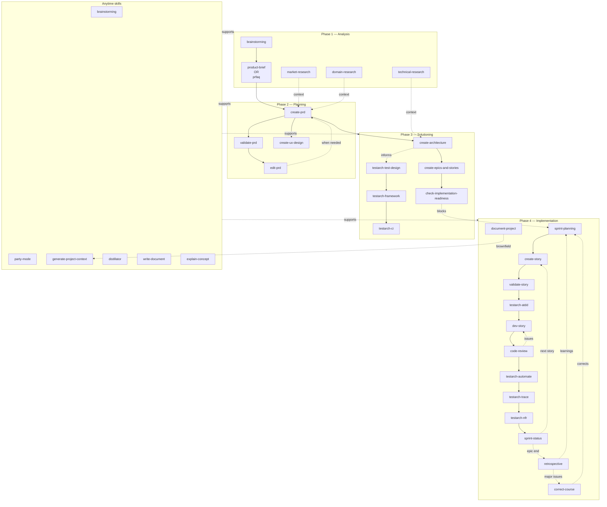

# The BMad workflow this project follows

> **Audience:** anyone who wants to understand *how* this project gets built — not just what's in it. If you're an AI agent picking up new work on this codebase, you'll move through the same workflow described here. If you're a curious developer, this is the methodology that produced the planning artifacts in [`_bmad-output/`](../_bmad-output/) and shipped Phase 1.

## What is BMad?

**BMad** is a structured software-development workflow built into a [framework of skills and agents](https://docs.bmad-method.org/) that take a project from an idea through analysis, planning, solutioning, and implementation. Each phase has clear inputs, outputs, and exit criteria; each phase ships specific artifacts that the next phase consumes.

The methodology has four "real" phases plus a learning track and a cross-cutting set of anytime skills:

| Phase | Purpose | Artifacts produced |
|---|---|---|
| **0 — Learning** *(optional)* | Test-architecture self-education ("TEA Academy") | progress notes, certificate |
| **1 — Analysis** | Surface the problem; validate the concept; gather domain & technical context | product brief or PRFAQ, market / domain / technical research |
| **2 — Planning** | Crystallize the product into a PRD; design UX if applicable | PRD, UX design |
| **3 — Solutioning** | Make architecture decisions; cut the work into epics and stories | architecture document, epics + stories list, test-design, test framework + CI scaffold |
| **4 — Implementation** | Ship the work, one story at a time, with quality gates | sprint plan, per-story implementation artifacts, code reviews, retrospectives |
| **Anytime** | Cross-cutting skills available at any phase | brainstorming, document-project, party-mode, generate-project-context, distillator, correct-course, … |

The phases are sequential **on the way down** (you can't write a PRD without a product concept, can't write architecture without a PRD, can't implement without stories) — but the **anytime skills are available throughout**, and **retrospectives + correct-course** let you loop back when the work surfaces something the earlier phase missed.

## The whole workflow as a diagram



The dotted arrows are signals (context, blocks, learnings), the solid arrows are sequencing. The implementation loop (`SP → CS → VS → AT → DS → CR → SS`) is the **innermost cycle** that runs once per story.

## Phase-by-phase: how this project moved through it

### Phase 1 — Analysis

The project began with a **product brief** ([`_bmad-output/planning-artifacts/product-brief.md`](../_bmad-output/planning-artifacts/product-brief.md)) rather than a PRFAQ, because the operator was already certain of the concept ("a self-hosted personal autonomous-development platform") and didn't need the Working-Backwards stress test.

**Skills used here:** `bmad-product-brief`. Optionally `bmad-brainstorming` (to surface ideas) or `bmad-prfaq` (Working-Backwards stress test) when the concept is less crystallized.

**Optional research tracks** (used selectively):
- `bmad-market-research` — competitive landscape, customer needs. Skipped here (no external customers).
- `bmad-domain-research` — industry domain deep-dive. Used informally for clarifying the agent-orchestration prior art.
- `bmad-technical-research` — feasibility, architecture options. Used to evaluate upstream forks (OMC, clawhip) and starter-template options.

**Exit criterion:** a written brief or PRFAQ that gives Phase 2 a clear product to plan against.

### Phase 2 — Planning

The product brief became a **Product Requirements Document** ([`_bmad-output/planning-artifacts/prd.md`](../_bmad-output/planning-artifacts/prd.md)) — 56 functional requirements across 7 capability areas plus 38 non-functional requirements across 6 categories.

**Skills used here:**
- `bmad-create-prd` — guided facilitation to author the PRD.
- `bmad-validate-prd` — quality-checks the document against the BMad standards.
- `bmad-edit-prd` — for revisions when implementation surfaces gaps.
- `bmad-create-ux-design` — skipped (no UI in Phase 1; the operator surfaces are Telegram and a console CLI, both of which use their host UIs).

**Exit criterion:** an accepted PRD that Phase 3 can ground architecture decisions in.

### Phase 3 — Solutioning

Three things happen in parallel here:

1. **Architecture decisions.** The architect agent walks through eight steps (init → context → starter eval → decisions → patterns → structure → validation → completion), producing [`_bmad-output/planning-artifacts/architecture.md`](../_bmad-output/planning-artifacts/architecture.md) — the full design rationale document. **Skills:** `bmad-create-architecture`.
2. **Cutting the work.** The PRD + architecture get decomposed into epics and stories: [`_bmad-output/planning-artifacts/epics.md`](../_bmad-output/planning-artifacts/epics.md). For this project: **10 epics across 88 stories**, with an explicit MVP Ship-Blocker Checklist. **Skills:** `bmad-create-epics-and-stories`.
3. **Test architecture (TEA).** In parallel, the test architect plans the testing strategy and the CI/CD scaffold:
   - `bmad-testarch-test-design` — risk-based test planning.
   - `bmad-testarch-framework` — initializes the test framework (pytest, hypothesis, contract-fixture recording, crash-injection harness — see [testing-guide.md](./testing-guide.md)).
   - `bmad-testarch-ci` — wires the quality pipeline ([`.github/workflows/`](../.github/workflows/)).

**Implementation-readiness gate.** Before Phase 4 begins, `bmad-check-implementation-readiness` validates that the PRD, UX (if any), architecture, and epics+stories are aligned. Output for this project: [`_bmad-output/planning-artifacts/implementation-readiness-report-2026-04-22.md`](../_bmad-output/planning-artifacts/implementation-readiness-report-2026-04-22.md). **Phase 4 cannot start until this report passes.**

**Exit criterion:** architecture accepted, epics + stories decomposed, test framework + CI scaffold in place, readiness report green.

### Phase 4 — Implementation

This is the **innermost loop**, run once per story. The flow:

```
sprint-planning
   → (for each story) →
       create-story
         → validate-story
           → testarch-atdd  (red-phase acceptance tests, optional)
             → dev-story  (implementation)
               → code-review
                  ├─ issues → back to dev-story
                  └─ approved → testarch-automate / trace / nfr
                     → sprint-status (next story or epic-end)
   → (at epic boundary) →
       retrospective
         ├─ learnings → next epic
         └─ major issues → correct-course → adjust sprint plan
```

**Skills in order:**

| Skill | Purpose | When |
|---|---|---|
| `bmad-sprint-planning` | produces `sprint-status.yaml` from epics | once per phase, at start |
| `bmad-create-story` | drafts a dedicated story file with full context | before implementation starts |
| `bmad-create-story:validate` | validates the story is ready for dev | after drafting, before dev |
| `bmad-testarch-atdd` | red-phase acceptance test scaffolds (TDD) | optional, before `dev-story` |
| `bmad-dev-story` | execute the implementation | per story |
| `bmad-code-review` | adversarial multi-layer review (Blind Hunter, Edge Case Hunter, Acceptance Auditor) | after `dev-story` |
| `bmad-testarch-automate` | expand automated coverage | after code review |
| `bmad-testarch-trace` | traceability matrix + quality-gate decision | after coverage expansion |
| `bmad-testarch-nfr` | non-functional requirement assessment | per story for NFR-touching work |
| `bmad-sprint-status` | summarize status, route to next workflow | continuous; produces sprint-status.yaml updates |
| `bmad-retrospective` | extract lessons, route deferred work | at every epic boundary |
| `bmad-correct-course` | navigate significant changes mid-sprint | only when the retrospective surfaces a problem |
| `bmad-checkpoint-preview` | guided walkthrough of a change for human review | optional, for high-risk commits/PRs |

**Per-story artifact convention.** Each completed story writes an implementation artifact to [`_bmad-output/implementation-artifacts/<story-id>.md`](../_bmad-output/implementation-artifacts/) capturing:
- Scope as-shipped vs as-planned.
- A `scope_delta:` field if the AC drifted (which automatically files a follow-up story).
- Deferred items.
- Retrospective points (if epic-end).

For this project, see e.g. [`2-1-event-envelope-schema-registry.md`](../_bmad-output/implementation-artifacts/2-1-event-envelope-schema-registry.md), [`2-7-idempotency-cache.md`](../_bmad-output/implementation-artifacts/2-7-idempotency-cache.md), or any of the 88 story files under [`_bmad-output/implementation-artifacts/`](../_bmad-output/implementation-artifacts/).

**Per-epic retrospectives.** Each of the 10 epics has a retrospective artifact:
- [`epic-1-retro-2026-05-01.md`](../_bmad-output/implementation-artifacts/epic-1-retro-2026-05-01.md) through [`epic-7-5-retro-2026-05-14.md`](../_bmad-output/implementation-artifacts/epic-7-5-retro-2026-05-14.md).

A retrospective is **useful** only if it produces three falsifiable outputs (per [`_bmad-output/project-context.md`](../_bmad-output/project-context.md) Cat 6):
1. The *wrong assumption* made at epic start.
2. The *single* specific process change for the next epic.
3. Deferred-item triage — promoted vs parked vs killed, with decider.

If those three outputs aren't there, the retrospective is incomplete; log it and schedule a re-run.

**Sprint-status as canonical state.** [`_bmad-output/implementation-artifacts/sprint-status.yaml`](../_bmad-output/implementation-artifacts/sprint-status.yaml) is the canonical record of every story's state (`pending` → `ready-for-dev` → `in-progress` → `blocked` → `review` → `done`). Skipping states is not allowed; the file is updated at every transition.

**Deferred work.** Items that can't ship within an epic land in [`_bmad-output/implementation-artifacts/deferred-work.md`](../_bmad-output/implementation-artifacts/deferred-work.md) with:
- Origin epic.
- Deferral reason (specific — never "deprioritized").
- `review_by:` date (≤2 epics out).
- One-extension cap before escalation.

If the file exceeds 15 open items, stop adding epics and triage first.

### Anytime — cross-cutting skills

Available throughout the lifecycle, used as needed:

| Skill | Use for |
|---|---|
| `bmad-brainstorming` | guided facilitation through ideation techniques |
| `bmad-party-mode` | multi-agent roundtable for cross-cutting decisions (used heavily when authoring the AI-agent rule digest) |
| `bmad-quick-dev` | unified intent-in / code-out for small changes that don't warrant a full story |
| `bmad-document-project` | brownfield project documentation scanner (used here to produce the entire `docs/` set) |
| `bmad-generate-project-context` | scan codebase to generate the lean LLM-injection rule file ([`_bmad-output/project-context.md`](../_bmad-output/project-context.md)) |
| `bmad-distillator` | lossless compression of source documents for downstream LLM consumption |
| `bmad-shard-doc` | split large markdown documents into organized sub-files |
| `bmad-index-docs` | regenerate `docs/index.md` from the current file set |
| `bmad-write-document` (tech-writer) | conversational document authoring |
| `bmad-agent-tech-writer:explain-concept` | deep-dive technical explanations (used to produce the four docs in [`docs/explanations/`](./explanations/)) |
| `bmad-agent-tech-writer:mermaid` | generate a Mermaid diagram from a description |
| `bmad-validate-doc` | review a document against documentation standards |
| `bmad-correct-course` | navigate significant changes during sprint execution |
| `bmad-help` | "where am I and what should I do next?" routing |

## How this maps to the repo

| BMad concept | Where it lives in this repo |
|---|---|
| Phase 1 artifacts (analysis) | [`_bmad-output/planning-artifacts/product-brief.md`](../_bmad-output/planning-artifacts/product-brief.md) |
| Phase 2 artifacts (PRD) | [`_bmad-output/planning-artifacts/prd.md`](../_bmad-output/planning-artifacts/prd.md) |
| Phase 3 artifacts (architecture, epics, readiness) | [`_bmad-output/planning-artifacts/architecture.md`](../_bmad-output/planning-artifacts/architecture.md) · [`epics.md`](../_bmad-output/planning-artifacts/epics.md) · [`implementation-readiness-report-2026-04-22.md`](../_bmad-output/planning-artifacts/implementation-readiness-report-2026-04-22.md) |
| Phase 4 — sprint state | [`_bmad-output/implementation-artifacts/sprint-status.yaml`](../_bmad-output/implementation-artifacts/sprint-status.yaml) |
| Phase 4 — per-story artifacts | [`_bmad-output/implementation-artifacts/<story-id>.md`](../_bmad-output/implementation-artifacts/) (88 files for Phase 1) |
| Phase 4 — per-epic retros | [`_bmad-output/implementation-artifacts/epic-<n>-retro-*.md`](../_bmad-output/implementation-artifacts/) (10 retros) |
| Deferred work | [`_bmad-output/implementation-artifacts/deferred-work.md`](../_bmad-output/implementation-artifacts/deferred-work.md) |
| AI-agent rule digest (cross-phase) | [`_bmad-output/project-context.md`](../_bmad-output/project-context.md) |
| Operator + AI-context docs (produced by `bmad-document-project`) | [`docs/`](.) (this directory) |
| Architecture decision records | [`docs/adr/`](./adr/) |
| Module / skill / agent registry | [`_bmad/_config/`](../_bmad/_config/) (manifest.yaml, agent-manifest.csv, skill-manifest.csv, bmad-help.csv) |
| BMad module installs | [`_bmad/`](../_bmad/) — `bmm` (planning), `bmb` (builder), `core`, `tea` (test architecture) |

## How a new feature enters the workflow

Suppose you want to add Phase 2 metrics + distributed tracing (a deliberate Phase-1 deferral — see [`architecture.md`](./architecture.md) §"Phase-2 hooks"). The path:

1. **Brainstorm or PRFAQ** the concept — `bmad-brainstorming` to surface options, or `bmad-prfaq` to stress-test feasibility against user need.
2. **Update or extend the product brief** to reflect the new scope — `bmad-product-brief` (re-runs against the existing brief).
3. **Edit the PRD** — `bmad-edit-prd` adds the new FRs/NFRs; `bmad-validate-prd` re-checks alignment.
4. **Architectural decision** — `bmad-create-architecture` extends the document with the new design (or files a follow-up ADR under [`docs/adr/`](./adr/) if the change is localized).
5. **Decompose into epics + stories** — `bmad-create-epics-and-stories` cuts the work.
6. **Readiness gate** — `bmad-check-implementation-readiness` must pass before any code is written.
7. **Sprint planning** — `bmad-sprint-planning` adds the new epic to `sprint-status.yaml` (with `phase: 2` to gate it from `main` until a Phase-2 gate ADR is accepted).
8. **Per-story loop** — `create-story → validate-story → atdd → dev-story → code-review → automate → trace → nfr`. Repeat 80-ish times. 🙂
9. **Retrospective** at the epic boundary.
10. **Document the new subsystem** — `bmad-document-project` updates [`docs/`](.); `bmad-agent-tech-writer:explain-concept` adds a deep-dive under [`docs/explanations/`](./explanations/).
11. **Update the AI-agent rule digest** — `bmad-generate-project-context` re-runs against the new code to surface load-bearing constraints, then a hand-pass merges them into [`_bmad-output/project-context.md`](../_bmad-output/project-context.md).

**Don't skip steps.** Phase gates exist precisely because every skipped one shows up as rework two phases later.

## How BMad relates to the other layers

| Layer | What it is | When you reach for it |
|---|---|---|
| **This file — [`docs/bmad-workflow.md`](./bmad-workflow.md)** | The methodology — the *process* the project follows | When you need to understand or extend how work moves through the project |
| **[`_bmad-output/project-context.md`](../_bmad-output/project-context.md)** | The **rules** — 386 invariants and gotchas the codebase enforces | Before writing any code — treat as injected context |
| **[`docs/architecture.md`](./architecture.md)** | The **runtime** view — how the deployed system behaves | When debugging or extending the deployed stack |
| **[`docs/explanations/`](./explanations/)** | Four **deep-dives** on load-bearing concepts | When you need to understand a specific subsystem end-to-end |
| **[`_bmad-output/planning-artifacts/`](../_bmad-output/planning-artifacts/)** | The *why* — product brief, PRD, architecture rationale, epics | When code-level rules don't answer "why was this decided?" |
| **[`_bmad-output/implementation-artifacts/`](../_bmad-output/implementation-artifacts/)** | The *how it shipped* — per-story scope deltas, retrospectives, deferred work | When tracing a specific story's history |

The workflow (this file) is what binds the layers together: rules come from architectural decisions; architectural decisions come from a PRD; a PRD comes from a product brief; a product brief comes from analysis. Reverse the direction to debug: a code rule you don't understand? Look in the rule digest. Rule reason unclear? Check the ADRs / architecture. Architectural choice surprising? Read the PRD. PRD claim feels wrong? Read the product brief.

## Discovering the right skill

When in doubt, run `bmad-help` — it inspects your current state (which artifacts exist, which phase you're in, what's left in the sprint) and recommends the next skill with a one-line reason. The skill catalog itself lives at [`_bmad/_config/bmad-help.csv`](../_bmad/_config/bmad-help.csv).

This entire project was built using exactly this workflow. The artifacts are real, the retrospectives produced real decisions, and the deferred-work file is the real backlog. Reading the artifacts in order — product brief → PRD → architecture → epics → readiness → sprint-status → retros — is a walkthrough of the whole engineering history of Phase 1.

## See also

- [`README.md`](../README.md) — top-level project overview.
- [`docs/index.md`](./index.md) — master documentation entry point.
- [`docs/architecture.md`](./architecture.md) — runtime view of the deployed system.
- [`docs/development-guide.md`](./development-guide.md) — AI-context entry into the dev workflow.
- [`_bmad-output/project-context.md`](../_bmad-output/project-context.md) — the 386-rule digest (Cats 1–7).
- [BMad Method documentation](https://docs.bmad-method.org/) — upstream methodology reference.
