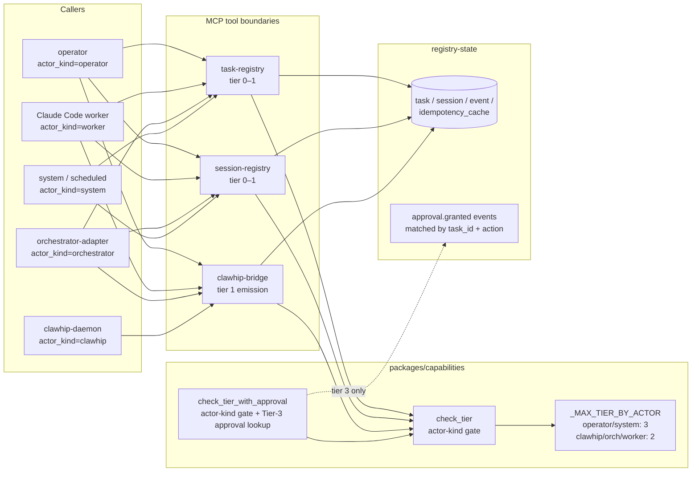

# Capability tiers and the MCP boundary contract

> **Audience:** developers who have read [`../architecture.md`](../architecture.md) and the prior explanations in this folder. This explains how authorization works at every MCP tool boundary, how it composes with Telegram's allowlist (ADR-0001), and why the deny-path test contract is non-bypassable.

## In one breath

Every meaningful action in oh-my-bmad has a **risk tier** (0 = read, 1 = bounded write, 2 = repo mutation, 3 = high-risk requiring an approval event). Every caller has an **actor kind** (operator, system, clawhip, orchestrator, worker) that caps the tier it can reach. At every MCP tool boundary — and any HTTP middleware that needs the same gate — `capabilities.check_tier` performs a single decision: *is this caller authorized for this action at this tier?* The answer is either a typed `CapabilityOk` value or a typed `CapabilityDenied` exception. There is no middle ground, no "maybe," no degraded mode. Tier-3 actions add a second layer: an `approval.granted` event must exist for the specific task and action, looked up via `check_tier_with_approval`. The deny path is **tested per boundary** (deny / default-deny / escalation) and these tests are mandatory — they cannot be skipped, even under `-k` / `--ignore-glob`.

If you remember nothing else: **the tier model is a typed function call, not a configuration file.** Every boundary that wants the gate imports it from `capabilities`; there is exactly one source of truth for what each tier means.

## The picture



The arrows from MCP boundaries into `capabilities` are all there is to authorization. No bypass paths, no middleware-only checks, no per-tool flag.

## Layer 1 — the tier model

The four tiers are defined in `packages/capabilities/src/capabilities/tiers.py` as an `IntEnum`:

```python
# From packages/capabilities/src/capabilities/tiers.py
class Tier(IntEnum):
    ZERO = 0    # read-only: workspace read, search, registry read, event read
    ONE = 1     # bounded write: write/edit in assigned worktree, run tests, artifact write
    TWO = 2     # repo mutation: git commit, branch create, PR draft (subject to approval policy)
    THREE = 3   # high-risk: requires explicit approval event (Phase 1: git push only)
```

The `IntEnum` choice is deliberate — the comparison `required_tier > max_tier` is a numeric compare that mypy can type-check. The values are an externally-documented ordering; **never** introduce a `Tier.FOUR` without coordinated changes to the actor-ceiling table and a new ADR.

## Layer 2 — the caller's identity

Every authorization check needs to know **who's asking**, expressed as a `CallerContext`:

```python
@dataclass(frozen=True)
class CallerContext:
    actor_kind: ActorKind        # "operator" | "system" | "clawhip" | "orchestrator" | "worker"
    actor_id: str                # unique within actor_kind (telegram user id, worker id, etc.)
    task_id: str | None = None   # required for Tier-3 (approval lookup is per-task)
```

`actor_kind` is a `Literal` type from `events.envelope.ActorKind`, so adding a kind requires editing the envelope's type definition *and* the `_MAX_TIER_BY_ACTOR` ceiling table — those two changes are forced to happen together, which is the point.

## Layer 3 — the actor-kind ceiling

Not every actor can reach every tier. The ceiling table is hard-coded:

```python
_MAX_TIER_BY_ACTOR: dict[ActorKind, Tier] = {
    "operator":     Tier.THREE,
    "system":       Tier.THREE,
    "clawhip":      Tier.TWO,
    "orchestrator": Tier.TWO,
    "worker":       Tier.TWO,
}
```

Read this carefully:

- **Operator and system** can reach all four tiers — humans on the bot, console, or scheduled scripts.
- **Worker, orchestrator, and clawhip** can reach Tier 2 maximum. They can write into worktrees, commit, draft PRs — but **they cannot push** without an operator's approval event. That ceiling is what keeps the autonomous loop from becoming a runaway loop.

This is **the** security boundary of the platform. Don't bump worker to Tier 3 unless you've thought very carefully about what an autonomous Claude Code instance with `git push` privileges can do unsupervised. (The answer is: a lot, and most of it irreversible.)

## Layer 4 — the check

`check_tier` is the single decision function:

```python
def check_tier(
    action: str,
    caller: CallerContext,
    required_tier: Tier,
    *,
    has_approval: bool = False,
) -> CapabilityOk:
    max_tier = _MAX_TIER_BY_ACTOR.get(caller.actor_kind)
    if max_tier is None:
        raise CapabilityDenied(...)                  # unknown actor_kind
    if required_tier > max_tier:
        raise CapabilityDenied(...)                  # escalation: claimed > granted
    if required_tier >= Tier.THREE and not has_approval:
        raise CapabilityDenied(...)                  # Tier-3 without approval evidence
    return CapabilityOk(action=action, caller=caller, tier=required_tier)
```

The function returns one of two things:

| Outcome | Returns / raises | Semantic |
|---|---|---|
| Authorized | `CapabilityOk(action, caller, tier)` | proceed with the action |
| Unknown actor_kind | `CapabilityDenied(reason="unknown actor_kind …")` | **default-deny** — no claim → reject, not routed to Tier 0 |
| Escalation | `CapabilityDenied(reason="actor_kind X allows Tier.N at most; action requires Tier.M")` | **escalation** — claimed > granted |
| Tier-3 without approval | `CapabilityDenied(reason="no_matching_approval: …")` | high-risk without evidence — deny |

Three failure modes, one success mode, all typed. No "Maybe" return, no `None`, no silent fallback.

### Why `CapabilityOk` is a *value*, not just a return type

Returning a typed `CapabilityOk` (rather than `None` or `True`) is what lets the call sites be auditable. A handler can pattern-match on the return value, log it, attach it to the emitted event for downstream traceability. If `check_tier` ever degraded to "returns nothing if OK, raises if denied," half that audit trail would vanish.

## Layer 5 — Tier-3 approval lookup

Tier-3 actions are the high-risk gate. The actor-kind ceiling alone isn't enough: the platform needs an **affirmative approval event** before Tier-3 work can run. `check_tier_with_approval` adds that second layer:

```python
async def check_tier_with_approval(
    action: str,
    caller: CallerContext,
    required_tier: Tier,
    *,
    approval_lookup: Callable[[str, str], Awaitable[bool]] | None = None,
) -> CapabilityOk:
    if required_tier >= Tier.THREE and approval_lookup is None:
        raise ValueError("approval_lookup is required for Tier-3 actions")
    check_tier(action, caller, required_tier, has_approval=True)
    if required_tier >= Tier.THREE:
        task_id = caller.task_id or ""
        approved = await approval_lookup(task_id, action)
        if not approved:
            raise CapabilityDenied(...)
    return CapabilityOk(action=action, caller=caller, tier=required_tier)
```

The flow is:

1. **Actor-kind gate** runs first via `check_tier`. Worker calling Tier-3? Rejected here, never reaches the approval lookup.
2. **Tier-0/1/2 actions skip the approval lookup entirely** — `approval_lookup` is `None` for them, which is fine.
3. **Tier-3 actions** require an `approval_lookup` callable; calling without it is a programming error (`ValueError`), not a security failure.
4. **The approval is keyed `(task_id, action)`**. Approvals are scoped — granting "git push" for task A doesn't grant it for task B.

The `approval_lookup` is injected, not imported, so MCP servers don't pull in `registry-state` (which would break service separability, Cat 2 / Cat 4). The implementation lives in whichever workspace member owns DB access for that boundary.

## Layer 6 — how each MCP server uses it

The contract is identical across `task-registry`, `session-registry`, and `clawhip-bridge`. The shape (taken from `clawhip-bridge`):

```python
# Schematic — mcp-servers/clawhip-bridge/src/clawhip_bridge_mcp/server.py
from capabilities import CallerContext, Tier, check_tier   # noqa: IMP001 — packages/

@server.tool()
async def emit_event(input: EmitEventInput) -> EmitEventOutput:
    caller = CallerContext(
        actor_kind=input.caller.actor_kind,
        actor_id=input.caller.actor_id,
        task_id=input.task_id,
    )
    check_tier(action="emit_event", caller=caller, required_tier=Tier.ONE)
    # … emit the envelope onto the spine …
```

Five things to notice:

1. **The `# noqa: IMP001` annotation.** MCP servers can import `packages/capabilities` because it's a shared library; the noqa documents this is an intentional import permitted by Cat 2. Without the annotation, `scripts/checks/check_imports.py` would reject the import.
2. **The `caller` comes from the tool input.** It's not ambient — every MCP tool takes the caller as an explicit argument so a misconfigured client can't accidentally execute as a different actor.
3. **`required_tier` is hardcoded per tool.** `emit_event` is Tier 1; `emit_summary` is Tier 1; `emit_approval_request` is Tier 1. The tier is a property of the **action**, not the caller. If you want to allow a non-worker to call `emit_event`, change the ceiling — don't lower the required tier.
4. **`check_tier` either returns or raises.** The handler doesn't if-else on the return; it just calls. If `check_tier` raises, the MCP framework's error path converts `CapabilityDenied` to a structured tool error response (see [`../api-contracts.md`](../api-contracts.md) and [`../../_bmad-output/project-context.md`](../../_bmad-output/project-context.md) Cat 3 — MCP tool errors raise `ToolError(...)`, never raw exceptions).
5. **Tier 2 + Tier 3 boundaries use `check_tier_with_approval`** — the function signature is the same except for the `approval_lookup` parameter.

## Layer 7 — how this composes with `AllowlistMiddleware`

A common point of confusion: **`AllowlistMiddleware` (ADR-0001) is not the tier system**. They run at different layers and answer different questions:

| Layer | Where it runs | What it asks | Granularity |
|---|---|---|---|
| `AllowlistMiddleware` | aiogram outer middleware, first in chain | "Is this Telegram user on the bot's allowlist at all?" | per-user (whole-bot membership) |
| `check_tier` | MCP tool boundary (and HTTP middleware that needs the same gate) | "Is this actor authorized for *this specific action* at *this tier*?" | per-action |

The composition:

- A Telegram user must be on the bot's allowlist (ADR-0001) for **any** of their commands to reach a handler.
- Once their command reaches a handler that calls into an MCP tool, the tier check fires on the **action**, not on whether they're allowlisted.
- Allowlist failure produces a `telegram.rejected` event with `reason="not_in_allowlist"`. Tier failure produces a `CapabilityDenied` exception, which the handler maps to a structured error response and emits a `secret.access_denied` or `tier3.action_attempted` event depending on context.

The two checks are independent but stacked. An attacker would need to be on the allowlist *and* clear the tier check to perform a privileged action.

## The deny-path test contract

`_bmad-output/project-context.md` Cat 4 makes three tests **mandatory per MCP tool boundary**:

```python
# Schematic — what every MCP tool boundary's test file looks like
class TestEmitEventCapabilityBoundary:
    @pytest.mark.security
    async def test_deny_path_below_required_tier_returns_capability_denied(self):
        """Caller authorized for Tier 0 calls a Tier-1 tool → CapabilityDenied."""
        # … set up caller with actor_kind that can't reach Tier.ONE …
        with pytest.raises(CapabilityDenied):
            await emit_event(caller=lower_caller, ...)

    @pytest.mark.security
    async def test_default_deny_unknown_actor_kind_returns_capability_denied(self):
        """Caller with unknown actor_kind → CapabilityDenied (not routed to Tier 0)."""
        with pytest.raises(CapabilityDenied):
            await emit_event(caller=CallerContext(actor_kind="unknown", actor_id="x"), ...)

    @pytest.mark.security
    async def test_escalation_attempt_higher_tier_than_granted_returns_capability_denied(self):
        """Caller claims Tier 3 but actor_kind is capped at Tier 2 → CapabilityDenied."""
        with pytest.raises(CapabilityDenied):
            await emit_event(caller=worker_caller, required_tier_override=Tier.THREE, ...)
```

Three properties of this contract:

1. **`@pytest.mark.security`** — security-marked tests are **never skipped** under `-k` / `--ignore-glob`. A CI configuration that would skip security tests is itself a CI failure. The marker is registered in `pyproject.toml` and gates explicit allowlist behavior in the test runner.
2. **PRs that reduce security-test count require architect sign-off.** This is a Cat 4 rule. The count is reported in the CI summary; a drop triggers a reviewer-annotation.
3. **Recorded contract fixtures pin the request/rejection shapes.** Per-tier-boundary fixtures live under `tests/contract/fixtures/<tier-boundary>/` so a middleware change that altered the deny envelope shape would fail the contract test — not silently.

These three tests answer three different questions, and all three are necessary:

| Test | Threat model |
|---|---|
| **Deny path** | A legitimate caller calls a tool they shouldn't reach. |
| **Default deny** | An unknown caller (forged or mis-typed) tries to slip through "no claim → no check." |
| **Escalation** | A legitimate caller forges a higher tier than their actor_kind permits. |

Each test eliminates a different bypass. Removing any of them creates a silent vulnerability — and the rule "never skip security tests" exists precisely because under deadline pressure someone *will* try.

## Sharp edges

A few things that bite when working in this area:

1. **Don't add per-tool authorization logic outside `capabilities`.** If you find yourself writing `if caller.actor_kind == "..."` inside a tool handler, you've reinvented the tier model badly. Use `check_tier`.
2. **Don't expand `_MAX_TIER_BY_ACTOR` casually.** Bumping any actor's ceiling is a change to the platform's security boundary; it requires an ADR, not just a one-line edit.
3. **Don't conflate "Tier 0" with "no auth needed."** Tier 0 still goes through `check_tier`. The check is fast, but it's load-bearing for the audit trail — even read actions need a typed `CapabilityOk` record.
4. **Don't catch `CapabilityDenied` and continue.** It's a typed deny, not a recoverable error. Catch it at the framework boundary (MCP error mapper, HTTP exception handler) and convert to a structured response — but never swallow it in a handler.
5. **Don't pass `caller` ambient through context variables.** Every tool takes it as an explicit input. ContextVar-based callers create subtle races and make the tier check non-auditable.
6. **Don't read the approval event with raw SQL inside a handler.** The `approval_lookup` callable is injected for a reason: it lets the lookup live in the right service (one that's allowed to query `registry-state`) without breaking separability.
7. **Don't return early from `check_tier` for "trusted" callers.** The `system` actor kind has `Tier.THREE` as its ceiling — the same as `operator`. That's deliberate. There's no special bypass class above operator/system; introducing one is a code-review reject.
8. **`@pytest.mark.security` is non-optional.** Adding a new MCP tool without all three boundary tests is a PR-block.

## When you'll be tempted to violate the design

- **"This action is internal-only; the caller can't be an attacker, so let me skip the check."** No. The whole point of *defense in depth* is that "can't be an attacker" assumptions get violated by future refactors. The check is one function call; skipping it is more work than running it.
- **"This worker needs to push to a specific repo; let me bump its tier to Tier 3."** No. Emit an `approval.granted` event for that specific task + push action and let `check_tier_with_approval` do its job. The point of Tier 3 is that human approval is *evidence in the log*, not a code-level permission.
- **"This tool is read-only, so it doesn't need a `caller`."** Read-only actions still need to be auditable — who read what, when. `check_tier(..., Tier.ZERO)` is a no-op in terms of access decisions, but it records the `CapabilityOk` value, which the handler attaches to the emitted event. Skipping it skips the audit.
- **"Let me write a quick 'check_admin' helper for this one endpoint."** No. There's exactly one source of truth for who-can-do-what; introducing a parallel decision function silently fragments the security boundary. Add a new tier to the model if the existing four don't cover your case (and file an ADR for it).

The pattern across all of these: the tier model's tax is *one function call per boundary*. That's the cheapest authorization gate imaginable. Anything you save by skipping it, you pay back tenfold in a future bypass investigation.

## See also

- [`event-spine.md`](./event-spine.md) — the event spine that capability-check results flow onto as `CapabilityOk` records and `secret.access_denied` / `tier3.action_*` audit events.
- [`idempotency-flow.md`](./idempotency-flow.md) — the retry semantics that make capability-checked tools safe under client retries.
- [`recovery-and-crash-injection.md`](./recovery-and-crash-injection.md) — how `approval.granted` events survive crashes (they're just events; the recovery contract preserves them).
- [`../adr/0001-allowlist-middleware-auth.md`](../adr/0001-allowlist-middleware-auth.md) — the Telegram-allowlist decision (a different layer).
- [`../api-contracts.md`](../api-contracts.md) — the MCP tool catalog with tier assignments.
- [`../../_bmad-output/project-context.md`](../../_bmad-output/project-context.md) Cat 3 (MCP tool boundary rules) + Cat 4 (deny-path test contract — CRITICAL) + Cat 7 (the load-bearing invariants in digest form).

— Paige 📚
