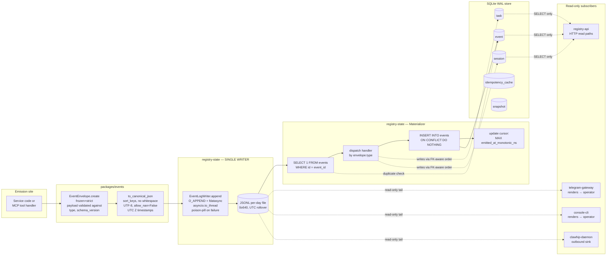

# The event spine, end to end

> **Audience:** developers new to oh-my-bmad who have already read [`../architecture.md`](../architecture.md) and want to understand *how* the event spine actually works in code — not just *that* it exists.

## In one breath

Every meaningful state change in oh-my-bmad becomes a **typed immutable envelope** that gets appended to a **per-day JSONL file**, and then a **single materializer** dispatches each envelope into the SQLite store so the system has a queryable view of state it can rebuild from the log alone. Everything else — Telegram messages, console output, registry-API responses, MCP tool returns — is a *projection* over that log. The log is the source of truth; SQLite is a derived index for fast lookup.

If you remember nothing else: **only one writer, only ever append, and the bytes on disk are byte-stable.** Those three properties are what make recovery, idempotency, and replay-determinism possible — and almost every rule in `_bmad-output/project-context.md` exists to protect one of them.

## The flow as a picture



Read it left-to-right. The dotted arrows are *reads only* — that's how subscribers consume without becoming writers.

## Layer 1 — the envelope (`packages/events`)

The envelope is the unit of currency for the whole platform. Every event has the same shape, regardless of what it represents.

```python
# Schematic — the real model is in packages/events/src/events/envelope.py

class EventEnvelope(BaseModel):
    model_config = ConfigDict(frozen=True, strict=True)

    event_id: str            # 'e-<uuidv7>'   — from events.new_uuid7()
    type: str                # 'task.created' — must be registered
    schema_version: str      # '1.0.0'        — semver; per-type
    emitted_at: datetime     # UTC, ms-precision, aware
    emitted_at_monotonic_ns: int   # for cross-clock ordering
    actor: Actor             # who emitted (operator id, worker, system)
    payload: dict[str, Any]  # _FrozenDict — see below
    parent_event_id: str | None = None   # trace context
```

Three things make this envelope load-bearing.

### 1. It's frozen, twice

`ConfigDict(frozen=True, strict=True)` blocks two failure modes at once:

- `frozen=True` rejects post-construction mutation (`env.event_id = ...` raises `ValidationError`).
- `strict=True` rejects silent type coercion (passing `"42"` to an `int` field doesn't get coerced to `42`).

And there's a third frozenness you can't see in the schema: the `payload` field is a custom `_FrozenDict`. Pydantic accepts it as `dict[str, Any]` (so the model spec is honest), but the dict itself blocks every mutation method — `__setitem__`, `update`, `pop`, `clear`, `setdefault`. So `env.payload["new_field"] = "boom"` fails fast.

This matters because the **atomic-visibility guarantee** (the S-2 separability test) only holds if envelopes really are immutable between the writer and every subscriber. A mutable payload field would silently break the contract in a way that doesn't show up until production.

### 2. `(type, schema_version)` is registered, not free-form

The schema registry (`packages/events/src/events/schema_registry.py`) holds a `dict[tuple[str, str], type[BaseModel]]` mapping `(event_type, schema_version)` to a Pydantic payload model. At envelope construction, the registry is consulted to validate the payload shape.

```python
# Schematic
from events import schema_registry

schema_registry.register(
    event_type="task.created",
    schema_version="1.0.0",
    payload_model=TaskCreatedPayload,
)
```

`register()` validates that the event type matches a strict regex (`^[a-z][a-z0-9_]*(\.[a-z][a-z0-9_]*)+$`) and the version is semver. So typos at registration sites fail loudly at import time, not at the first emission.

**Adding a new event type means registering a new `(type, version)` pair, never reusing an existing one.** Backwards-compatible field additions get a new patch version (`1.0.0` → `1.0.1`); the migrator handles the rest (see [`../schema-evolution.md`](../schema-evolution.md)).

### 3. Canonical JSON is byte-stable

The bytes on disk for two identical envelopes are *byte-identical*. Same hash. That's the replay-determinism guarantee — and it's not a happy accident, it's engineered:

- Sorted keys (`json.dumps(..., sort_keys=True)`).
- No whitespace (`separators=(",", ":")`).
- UTF-8, no BOM.
- `allow_nan=False`.
- UTC timestamps in ISO 8601 with **millisecond** precision and a `Z` suffix (never `+00:00`, never microseconds).

The canonical encoder is `events.canonical.to_canonical_json` — it's the only sanctioned path from envelope to bytes. `model_dump_json()` would silently break it (no `sort_keys` parameter in Pydantic v2). Don't reach for the shortcut.

## Layer 2 — the writer (`registry-state/adapters/event_log.py`)

Only one piece of code in the entire codebase opens the JSONL log for write: `EventLogWriter`. This is enforced by `scripts/checks/check_single_writer.py` on PR. Everyone else uses `EventLogReader`.

The writer makes five design choices worth understanding:

### Canonical-JSON-first

`append(envelope)` calls `to_canonical_json(envelope)` and writes those bytes plus a single `\n`. No `model_dump_json()`, no string formatting in between. If the writer ever serialized differently, byte-equality across a replay would collapse and the FR20 determinism guarantee would silently break.

### `O_APPEND` + `fdatasync` (not `fsync`)

```python
# Schematic
fd = os.open(path, os.O_WRONLY | os.O_APPEND | os.O_CREAT, mode=0o640)
os.write(fd, canonical_bytes + b"\n")
os.fdatasync(fd)
```

`O_APPEND` on Linux ext4/XFS holds the inode lock for the duration of `write()`, so concurrent writes don't interleave at byte boundaries. Combined with the single-writer invariant, that's enough atomicity — no temp-file-and-rename dance needed.

`fdatasync` (not `fsync`) flushes the data bytes to disk but skips the inode-metadata flush. The audit log doesn't care about `mtime`; it cares about durability of the line. That swap is 10–30% faster on real workloads.

### `asyncio.to_thread` to keep the loop unblocked

`append()` is `async def`, but `os.write` + `os.fdatasync` are blocking syscalls. The writer offloads them to the default thread pool via `await asyncio.to_thread(_sync_append_impl, ...)`. The sync impl is the *only* place that touches a file descriptor, which keeps the threading model trivial.

### Poison-pill on partial writes

If a `write()` returns short, ENOSPC fires, EIO fires, or a `KeyboardInterrupt` interrupts the syscall sequence, the file may be left with a half-line. The writer marks itself **poisoned** — the next `append()` raises immediately rather than silently appending more bytes on top of a corrupt tail. Recovery is explicit (`recover()` trims the partial tail; reopen the writer). This is what makes the crash-injection tests (NFR-R2) actually mean something: a partial write doesn't become a quietly-corrupt event later in the day.

### UTC-midnight rollover

The path is computed from `clock.now().date()` at each `append()` call. The new fd is opened *before* the old one is closed, so an `os.open()` failure leaves the writer functional on the previous day's file. No background task, no scheduler — just one `datetime.date` comparison per append. Days are bounded so log files are bounded too.

## Layer 3 — the materializer (`registry-state/domain/materializer.py`)

The materializer is the bridge from "bytes on disk" to "rows in SQLite". It runs as part of `registry-state`'s subscriber loop. Each event flows through `Materializer.apply` inside its own transaction (`async with session.begin()`).

The ordering inside that transaction is *not* an accident:

```
1. SELECT 1 FROM events WHERE id = envelope.event_id
       └─ if found, return — already applied
2. Dispatch the handler registered for envelope.type
       └─ handler creates/updates upstream rows (tasks, sessions)
3. INSERT INTO events (...) ON CONFLICT DO NOTHING
       └─ idempotency guard
4. Update cursor: MAX(events.emitted_at_monotonic_ns)
       └─ subscriber resumes from here after restart
```

### Why SELECT first?

If you put the INSERT first, you can read `rowcount` and dispatch only on the new-row path. Clean idea, but there's a foreign-key catch: `events.task_id` references `tasks.id`. For `task.created`, the `tasks` row doesn't exist yet — it's the *handler* that creates it. INSERT-first would fail the FK check before the handler even ran.

Hence: SELECT first (cheap, idempotent), then run the handler (which creates the FK target), then INSERT the event row. The `ON CONFLICT DO NOTHING` is belt-and-braces for the theoretical case where two appliers race past the SELECT — single-writer enforcement makes that impossible, but the safety net is essentially free.

### Handlers are state-transition functions

Each handler matches one event type. They're small, focused, and idempotent.

```python
# Schematic — real handlers in registry-state/domain/handlers.py

async def handle_task_created(session: AsyncSession, env: EventEnvelope) -> None:
    payload = TaskCreatedPayload.model_validate(env.payload, strict=True)
    stmt = sqlite_insert(Task).values(
        id=payload.task_id,
        status="pending",
        last_event_id=env.event_id,
        updated_at=env.emitted_at,
        ...
    ).on_conflict_do_update(
        index_elements=["id"],
        set_={"last_event_id": env.event_id, "updated_at": env.emitted_at},
    )
    await session.execute(stmt)
```

`ON CONFLICT DO UPDATE` makes re-runs safe: if the row already exists, the status doesn't get reset, only the trailing pointers refresh. Update-style handlers (`handle_task_execution_started`, etc.) raise `MaterializerError` when the parent row is missing — that's a deliberate out-of-order replay guard, because production replay processes events in `emitted_at_monotonic_ns` order, so the parent must already exist.

### The cursor is just `MAX(emitted_at_monotonic_ns)`

Recovery doesn't need an external offset store. On restart, the subscriber asks SQLite for the max monotonic timestamp it has applied, and starts reading the JSONL log from that point forward. The log is the source of truth; SQLite tells you how much of it you've already absorbed.

## Layer 4 — the subscribers

Everyone else is a reader. Subscribers fall into two camps:

### Tail-readers (operator surfaces, outbound sinks)

`telegram-gateway`, `console-cli`, and (Phase 1-pending) `clawhip-daemon` read the JSONL log directly via `EventLogReader`. They never open the file for write. Their job is to project events into something the operator can see — Telegram messages, console output, future browser surfaces.

These projections are stateless in the strict sense: a tail-reader can be restarted at any time and resume from the cursor it knows about (or from the start of the day if it doesn't). The renderers are deterministic — same input event sequence, same output text — which is part of how the integration tests assert parity between Telegram and console (FR12).

### SQLite consumers (HTTP read paths)

`registry-api` doesn't read the JSONL log at all. It queries the SQLite store via `AsyncSession`. The `/v1/tasks/{id}` handler does a `SELECT` against the `task` table. The `/v1/tasks/{id}/events` handler reads from the `event` table. The store is *already* the materialized projection — there's no further work to do.

This is why the single-writer invariant matters so much for queries: the `registry-api` reader is trusting that the materializer is the *only* code that wrote into those tables. If anything else wrote, the table would carry rows the event log doesn't, and replay-from-log wouldn't reproduce state.

## Why the whole thing hangs together

Three properties bootstrap each other:

| Property | What it depends on | What breaks if you violate it |
|---|---|---|
| **Replay-determinism** | byte-stable canonical JSON + frozen envelopes + ordered handlers | recovery produces a different DB than steady-state — silent data divergence |
| **Crash-safety** (NFR-R2) | `fdatasync` + `O_APPEND` + poison-pill + monotonic cursor | a crashed write becomes a quietly-corrupt event the next day |
| **Single-writer**  (FR26) | `EventLogWriter` is the only opener-for-write + only `registry-state` holds an `AsyncSession` | another writer can race the FK ordering, double-insert, or skip the idempotency cache |

Each property protects the others, and the `tests/crash-injection/` and `tests/replay/` trees are the executable specifications for all three. You can read the contracts in code, not just in docs.

## Where developers usually trip

A few sharp edges, in order of how often they bite new contributors:

1. **Don't reach for `model_dump_json()` when you want bytes on disk.** Use `events.canonical.to_canonical_json`. Pydantic's JSON doesn't sort keys; that breaks determinism in a way unit tests won't catch but replay tests will.
2. **`emitted_at` is millisecond precision, not microsecond.** ISO 8601 with a `Z`. Don't pretty-print to `+00:00`; the canonical encoder will reject the datetime and the envelope will fail to serialize.
3. **`emitted_at_monotonic_ns` is non-optional.** It's the cross-clock ordering field for the subscriber cursor. Use `time.monotonic_ns()` at emit time. Reaching for `time.time_ns()` is wrong — wall-clock isn't monotonic across NTP corrections.
4. **Payloads with `set` fields are a trap.** Pydantic accepts them, canonical-JSON rejects them at serialize time. Use `tuple` or `frozenset` (see `_bmad-output/project-context.md` Cat 2).
5. **Don't try to mutate `env.payload`** — the `_FrozenDict` will raise `TypeError`. The same goes for `env.event_id = ...`. If you want a "modified" envelope, you're really emitting a new event with a `parent_event_id` pointing at the original.
6. **Subscribers must never open the log for write.** If you need a new mutation pathway, route it through `clawhip-bridge` MCP's `emit_*` tools — that's the sole event-emission surface for worker-originated events. Service code emits via the `EventLogWriter` injected at startup; nothing else.

## When you'll be tempted to violate the design

Three temptations worth naming so you can recognize and resist them:

- **"This single value shouldn't need an event — let me just `UPDATE` the row."** No. The DB is a projection. The next replay won't replay your UPDATE; it'll re-derive state from the log and your change vanishes. If state changes, an event was emitted.
- **"I'll just append straight to the JSONL file from this service."** No. That's a second writer. Race conditions, partial-write contamination, FK ordering violations — every contract the design relies on breaks at once. Route through `registry-state` or `clawhip-bridge` MCP.
- **"`schema_version` is annoying; let me reuse `1.0.0` and just add the field."** No. The schema registry treats `(type, version)` as an identity; consumers at vN must be able to read events emitted at vN+1 without corrupting known fields. That contract is what makes rolling upgrades possible. Bump the version; ship the migrator.

If you find yourself reaching for any of these, the fix is upstream: a new event type, a new schema version, or a routing change — not a workaround at the call site.

## See also

- [`../architecture.md`](../architecture.md) — the wider runtime view (you've read this already).
- [`../data-models.md`](../data-models.md) — the catalog of 32+ event types + the DB schema they materialize into.
- [`../schema-evolution.md`](../schema-evolution.md) — how to add an event type and ship a migrator.
- [`../testing-guide.md`](../testing-guide.md) — where `tests/replay/`, `tests/crash-injection/`, and the contract fixtures live.
- [`../../_bmad-output/project-context.md`](../../_bmad-output/project-context.md) Cat 7 — the load-bearing invariants in digest form.

— Paige 📚
