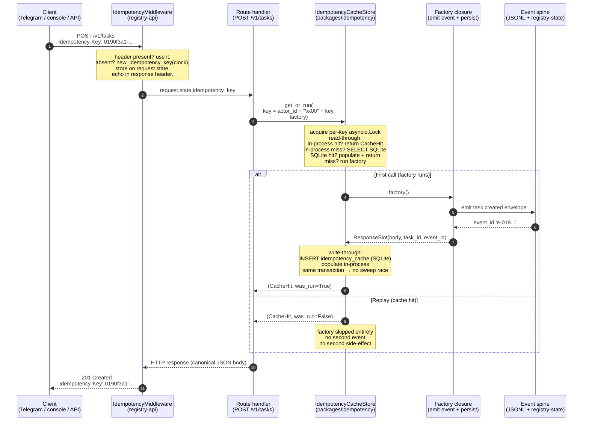

# Idempotency and the UUIDv7 flow, end to end

> **Audience:** developers new to oh-my-bmad who have read [`../architecture.md`](../architecture.md) and [`event-spine.md`](./event-spine.md). You know what an `EventEnvelope` is; you know `registry-state` is the single writer. This explains how the platform guarantees that re-sending the same request twice never produces two outcomes.

## In one breath

Every command that mutates state carries a **UUIDv7 idempotency key**. The first time a key arrives, the request runs and its result is cached for **seven days** in a two-layer store (cachetools TTLCache + SQLite). Every subsequent call with the same key — whether one millisecond later or six days later, whether from a network retry or an operator double-tap — gets back the cached result instead of re-running. The factory function that produces the result is serialized by a per-key `asyncio.Lock`, so 100 concurrent retries for the same key invoke the factory **exactly once**.

If you remember nothing else: **the key is the contract**. Same key = same outcome, forever (or at least for seven days). Re-running is not just wasteful — it would corrupt the event spine, because each run would emit a second event with a fresh `event_id` for what is logically the same change.

## The flow as a sequence



The two `alt` branches are the entire idempotency contract in one picture: the factory runs on the first call, and **never** on subsequent calls with the same key. The `was_run` boolean is a *defensive belt-and-braces signal* — the per-key lock already proves uniqueness, but the boolean lets the handler assert it explicitly.

## Why UUIDv7 specifically?

A UUIDv4 would be unique, so why bother with v7? Because **v7 is sortable by emission time**. The first 48 bits of a v7 UUID are the Unix-epoch milliseconds when the UUID was minted. Same byte layout you can read at a glance:

```
RFC 9562 v7 bit layout:

  bits  0–47:   unix_ts_ms     (big-endian, 48 bits)
  bits 48–51:   version        (4 bits, value 0b0111 = 7)
  bits 52–63:   rand_a         (12 bits)
  bits 64–65:   variant        (2 bits, value 0b10)
  bits 66–127:  rand_b         (62 bits)

Total random entropy = 74 bits.
```

That `unix_ts_ms` prefix buys three properties this platform leans on:

1. **Sortable by time without a separate timestamp.** SQLite ascending-index scans over `idempotency_cache` return entries in approximately-chronological order. Same for `events.event_id`. No need for a covering index on `created_at`.
2. **Cheap chronological diagnostics.** Looking at a UUIDv7, you can read "this was minted around 2026-05-15" by squinting at the prefix. UUIDv4 is opaque.
3. **No reordering surprises under concurrency.** Two events emitted milliseconds apart sort the same way as their `emitted_at_monotonic_ns`. The 74 bits of random suffix avoid collisions when two UUIDs are minted in the same millisecond.

The generator (`events.ids.new_uuid7`) accepts an injectable `Clock` and `Random` so tests get deterministic UUIDs:

```python
# Schematic — real generator in packages/events/src/events/ids.py

def new_uuid7(*, clock: Clock | None = None, rng: Random | None = None) -> str:
    """RFC 9562 v7. UTC-only clock; ms precision; canonical lowercase hex."""
    ts_ms = ... # from clock or time.time()
    rand_a = rng.randbytes(2) or os.urandom(2)
    rand_b = rng.randbytes(8) or os.urandom(8)
    return f"{ts_ms:012x}-{...}-7{...}-{variant}{...}-{...}"
```

When you see a UUIDv7 in a log line, you can paste the first 8 hex chars into a Unix-ms decoder and read the emission time. That's a real diagnostic superpower under incident pressure.

There are three convenience wrappers in `events.ids` worth knowing:

| Wrapper | Use for | Output shape |
|---|---|---|
| `new_uuid7()` | bare UUIDv7 — generic | `'0190f3a1-...'` (36 chars) |
| `new_idempotency_key(clock=…)` | the idempotency key | bare UUIDv7 (36 chars) |
| `new_request_id(clock=…)` | per-request trace correlation | bare UUIDv7 (36 chars) |
| (in the envelope: `'e-' + new_uuid7()`) | event IDs | prefixed (38 chars) |

The prefix convention (`'e-'`, `'t-'`, `'s-'`) is what `String(38)` columns in `services/registry-state/src/registry_state/schema.py` enforce — a glance at any ID tells you what kind of thing it identifies.

## The journey of one key

Let's walk a single command through the system, the slow way, so the layers are concrete.

### Step 1 — minting at the source

The client (Telegram update, console invocation, or direct API caller) is responsible for the key:

- **Telegram:** the gateway derives `f"tg:{update_id}"` and uses it as the inbound key (yes, this is *not* a UUIDv7 — it's a Telegram-domain identifier that maps 1:1 to a single inbound update; the platform respects the upstream guarantee that `update_id` is unique per bot).
- **Console CLI:** mints `new_idempotency_key(clock=...)` at command entry and stores it in the request envelope.
- **Direct HTTP caller:** sends `Idempotency-Key: 0190f3a1-...` header. Per the HTTP-API convention, callers SHOULD provide the key explicitly so retries are deduped.

### Step 2 — the middleware accepts or fills in

The first thing every `registry-api` request hits is `IdempotencyMiddleware` (`services/registry-api/src/registry_api/adapters/middleware.py`). Its job is small and load-bearing:

```python
# Schematic
async def dispatch(self, request, call_next):
    incoming = request.headers.get("Idempotency-Key")
    if incoming and _BARE_UUIDV7_RE.fullmatch(incoming):
        idempotency_key = incoming
        generated = False
    else:
        idempotency_key = new_idempotency_key(clock=self._clock)
        generated = True

    request.state.idempotency_key = idempotency_key
    request.state.idempotency_key_generated = generated

    response = await call_next(request)
    response.headers["Idempotency-Key"] = idempotency_key
    return response
```

Two subtle things to notice:

- **The middleware echoes the key back in the response.** Clients can confirm "the server saw `0190f3a1-...` and used it as the dedupe key" — useful when debugging "why didn't my retry land?"
- **The origin flag** (`generated: bool`) is recorded on `request.state`. Error envelopes include `"idempotency_key_origin": "server-generated"` or `"client-provided"` so postmortem analysis can tell apart real retries (client-provided) from one-shot calls that didn't carry a key (server-generated).

### Step 3 — the route handler scopes the key

The handler doesn't pass the raw idempotency key to the cache. It scopes it by *actor* so two different operators using the same key (which would be a coincidence, but possible) don't collide:

```python
# Schematic — registry-api/src/registry_api/routes/tasks.py

@router.post("/v1/tasks", status_code=201)
async def post_tasks(
    request: Request,
    payload: TaskRequest,
    idempotency_cache: IdempotencyCacheStore = Depends(...),
):
    idempotency_key: str = request.state.idempotency_key
    actor_id: str = request.state.actor.id
    cache_key = f"{actor_id}\x00{idempotency_key}"   # NUL-separated

    async def factory() -> ResponseSlot:
        # … emit task.created envelope onto the spine …
        # … return the canonical response body + task_id + event_id …

    cache_hit, was_run = await idempotency_cache.get_or_run(cache_key, factory)
    return JSONResponse(cache_hit.result_event_id, ...)
```

The `\x00` NUL-byte separator is deliberate — no legal actor ID or UUIDv7 can contain it, so concatenation can't produce ambiguous keys. (`"alice" + "\x00" + key` and `"alice\x00" + key` would only collide on the server-side encoding if both actor IDs and keys could contain `\x00`, which they can't.)

### Step 4 — the cache decides

`IdempotencyCacheStore.get_or_run` is the heart of the contract. It does five things in order:

1. **Acquire the per-key lock.** A separate `asyncio.Lock` per cache key, with explicit refcount tracking. Only one coroutine inside this block per key at a time.
2. **Read-through:** check the in-process `cachetools.TTLCache` first. Hit? Return `(CacheHit, was_run=False)`. Sub-microsecond.
3. **In-process miss:** `SELECT * FROM idempotency_cache WHERE idempotency_key = ?` against SQLite. Hit? Populate the in-process cache, return `(CacheHit, was_run=False)`.
4. **SQLite miss:** call `factory()` — the closure that does the real work (emits the event, builds the response body, returns a `ResponseSlot`).
5. **Write-through:** `INSERT INTO idempotency_cache (...) ON CONFLICT DO NOTHING` AND `SELECT` in the **same transaction**, then populate the in-process cache. Same-transaction is crucial — see below. Return `(CacheHit, was_run=True)`.

### Step 5 — the result becomes the cached row

The `CacheHit` is a frozen dataclass:

```python
@dataclass(frozen=True)
class CacheHit:
    result_event_id: str            # the event the original call emitted
    request_id_on_first_hit: str    # which request "won"
    created_at: datetime            # UTC, ms-precision
    expires_at: datetime            # created_at + 7 days
```

Every subsequent caller with the same key gets back this exact tuple — same `result_event_id` they would have produced themselves, plus a witness (`request_id_on_first_hit`) telling them whose request "won the race."

## Two layers, one contract

The cache is two layers stacked, not two independent caches:

```
┌─────────────────────────────────────┐
│  cachetools.TTLCache (in-process)   │  ← sub-microsecond reads
│  - LRU + TTL eviction               │
│  - timer = injected Clock           │
│  - NOT thread-safe → _global_lock   │
└──────────────┬──────────────────────┘
               │  (write-through: SQLite FIRST, in-process second)
               ▼
┌─────────────────────────────────────┐
│  SQLite idempotency_cache table      │  ← durable, survives restart
│  - PK: idempotency_key VARCHAR(36)  │
│  - expires_at (indexed for sweep)   │
│  - 7-day TTL by default (FR28)      │
└─────────────────────────────────────┘
```

Why the asymmetry?

- **In-process is fast but volatile.** Restart the service and it's gone.
- **SQLite is durable but expensive.** Every call would be a DB roundtrip if the in-process layer didn't exist.
- **Write-through means SQLite wins on contention.** If the in-process write succeeded but the SQLite write failed, a restart would lose the cached result and the second caller would re-run the factory — emitting a duplicate event. So the order is hardcoded: SQLite first, in-process only if SQLite succeeded.

The 7-day TTL (`604800` seconds, default) comes from **FR28 / PRD line 85**. Configurable for tests, but in production it's seven days. The boundary is `expires_at <= now()` — exactly-at-expiry counts as expired. The lazy-eviction code path in `get()` AND the explicit `sweep_expired()` both use this same boundary so the two layers agree.

### Schema duplication is intentional

The `idempotency_cache` table is defined **twice**: once in `services/registry-state/src/registry_state/schema.py` (the authoritative ORM model), and once in `packages/idempotency/src/idempotency/cache.py` (a SQLAlchemy Core `Table` mirror).

This is not a bug — it's the **service-separability rule** in action. `packages/` can't import from `services/` (a Cat 2 / Cat 4 invariant; see [`../../_bmad-output/project-context.md`](../../_bmad-output/project-context.md)). So `packages/idempotency` mirrors the columns it needs.

The drift risk is contained by `TestColumnConsistency` in `test_cache.py`, which reflects both definitions and asserts column names + nullability match. If anyone bumps the ORM without updating the Core mirror, the test fails loudly.

When you're tempted to delete the duplication: don't. The duplication is the boundary.

## CacheHit vs IdempotencyConflict

Two outcomes worth distinguishing:

### `CacheHit` — the happy path

Returned from every `get()`, `get_or_run()` (both branches), and is the canonical "this key already produced this result" payload. Immutable. The handler reads `result_event_id` and the response is identical to whatever the first call produced.

### `IdempotencyConflict` — the defensive postcondition

Raised by `IdempotencyCacheStore.store()` on a primary-key collision that survives the SQLite `ON CONFLICT DO NOTHING` UPSERT.

Under FR26 (single-writer) **this is essentially unreachable.** The per-key `asyncio.Lock` in `get_or_run` serializes all callers for the same key, so two distinct `store()` calls for the same key cannot happen. The same-transaction INSERT+SELECT (Story 2.7's fix) closes the race against `sweep_expired()` removing the row between INSERT and the immediately-following SELECT.

So why does the exception exist?

Because the alternative — "this can't happen, no need to model it" — is exactly how silent invariant violations metastasize. By raising a typed exception with a specific message, the code documents the (sub-)invariant in a way mypy + code review can audit. If `IdempotencyConflict` ever *does* fire in production, it means one of:

- The per-key lock was bypassed (bug in `get_or_run`).
- Two processes are writing the same DB (FR26 violation — an extra `registry-state` instance somehow).
- The same-transaction guarantee was broken by a future refactor.

All three are emergencies. The exception's docstring explicitly says so. Reach for it as a tripwire, not as a normal error path.

## Why MCP tools must be idempotent by design

The MCP layer adds a twist: **MCP clients retry on timeout.** If a tool call takes longer than the client's timeout budget, the client may send the same call again. The server cannot tell the retry apart from a genuine new call — the framing layer doesn't have built-in deduplication.

This means **every MCP tool with side effects must be idempotent by design**, not by hope. The platform enforces this two ways:

1. **The tool's input model must carry a key** (the triggering event's UUIDv7) so the handler can dedupe.
2. **The handler routes through `IdempotencyCacheStore.get_or_run`** internally (or its equivalent semantic check), so a retry produces the same `result_event_id` rather than emitting a second event.

This is why `clawhip-bridge`'s `emit_*` tools (which are the platform's sole event-emission surface) take `event_id` as part of the input contract: the worker generates a UUIDv7 client-side and threads it through, so a retry of `emit_event` with the same `event_id` is a no-op, not a duplicate emission.

If you're building a new MCP tool and the question "what happens if the client retries?" doesn't have a one-sentence answer, the tool isn't done.

## The test contract

The proof that the contract holds lives in `tests/idempotency/test_100x_replay.py`. The shape:

```python
# Schematic
async def test_100x_concurrent_retry_storm_invokes_factory_exactly_once(
    idempotency_cache_store: IdempotencyCacheStore,
):
    factory_calls = 0
    key = f"actor-1\x00{new_uuid7()}"

    async def factory() -> ResponseSlot:
        nonlocal factory_calls
        factory_calls += 1
        return ResponseSlot(...)

    results = await asyncio.gather(*[
        idempotency_cache_store.get_or_run(key, factory)
        for _ in range(100)
    ])

    assert factory_calls == 1
    assert len({r.result_event_id for r, _ in results}) == 1   # all 100 see same event
    assert sum(was_run for _, was_run in results) == 1         # exactly one ran the factory
```

This is **NFR-R4 in code**: 100 concurrent callers for the same key, factory runs exactly once, all 100 receive an identical `CacheHit`. It's not a benchmark — it's the executable contract.

Every command handler should have a paired test in `tests/idempotency/` that drives the same `(idempotency_key, payload)` twice (sequentially is enough — the 100× concurrent test is the platform-level proof) and asserts:

1. **Exactly one side-effect** (one event emitted, one DB row written, one Telegram message sent).
2. **Identical response** to both calls.

Replay tests parametrize the `update_id` / `command_id` explicitly — never rely on auto-increment in the test setup. Otherwise a flake in test-ordering would silently break the assertion.

## Sharp edges

A few things that trip new contributors:

1. **The key is the *whole* contract.** If you find yourself reaching for a side-channel "was this already done?" check (a DB lookup, a flag column, a memoization cache by-payload), stop. The platform already has the answer; route through `IdempotencyCacheStore`.
2. **Don't put the idempotency check inside the factory.** The factory should assume "I am the first runner; do the work." The cache decides whether to invoke it; the factory doesn't second-guess the cache.
3. **`was_run=False` is normal, not an error.** It's the success state for retries. Don't log it at WARNING level; it'll flood structured logs.
4. **The cache key includes the actor.** A change of actor changes the key. Two operators sending the same idempotency-key value don't collide — they're operating on different cache keys.
5. **The 7-day TTL is FR28**, not a config knob to tune. Changing it requires an ADR — it affects how long retries are deduped, which affects the operator-visible retry semantics.
6. **`Idempotency-Key` is echoed in the response.** When a caller debugs "did the server see my key?", the response header is the answer.
7. **Server-generated keys are a fallback, not a feature.** If you find a callsite that depends on server-generated keys, you've found a missing client-side `new_idempotency_key()` call — fix it upstream.
8. **`IdempotencyConflict` firing in production is a P0.** It means an invariant violation, not a normal error. Don't catch and continue; alert and investigate.

## When you'll be tempted to violate the design

- **"This GET handler doesn't mutate, so it doesn't need an idempotency key."** Correct — only mutating operations need keys. But if you find yourself adding mutations to a GET handler, fix the verb first.
- **"This MCP tool is read-only, so it doesn't need idempotency."** Mostly correct — but if the read has *cache priming* side effects (it warms a cache, refreshes a session heartbeat), it's not actually read-only. Audit honestly.
- **"This worker emits dozens of events per task; one key per event is overhead."** Each emission already carries an `event_id` (the UUIDv7 on the envelope), which *is* the idempotency key for that specific emission. There's no extra overhead — you're already producing the key.
- **"Let me cache the response in the handler instead of in `IdempotencyCacheStore`."** No. That cache wouldn't survive restart, wouldn't share across processes, and wouldn't dedupe across the per-key lock. Use the canonical store.

The pattern across all of these: the idempotency machinery is already as cheap as it gets. Reaching around it is always more work *and* more risk.

## See also

- [`event-spine.md`](./event-spine.md) — the envelope and emission pipeline this all runs on top of.
- [`../data-models.md`](../data-models.md) — the `idempotency_cache` table schema (the durable layer).
- [`../api-contracts.md`](../api-contracts.md) — the HTTP surface where the `Idempotency-Key` header is consumed.
- [`../testing-guide.md`](../testing-guide.md) — `tests/idempotency/` layout and harness usage.
- [`../../_bmad-output/project-context.md`](../../_bmad-output/project-context.md) Cat 2 (Time & IDs) + Cat 4 (Idempotency test contract) + Cat 7 (the invariants in digest form).

— Paige 📚
