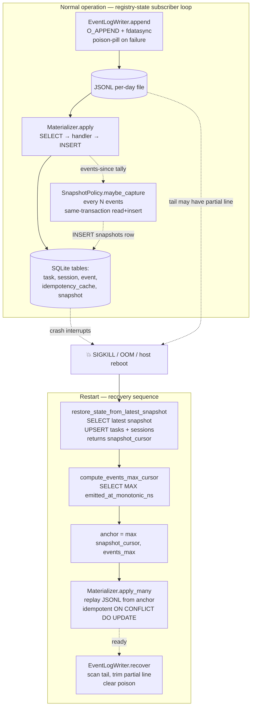

# Recovery and crash-injection, end to end

> **Audience:** developers who have read [`../architecture.md`](../architecture.md), [`event-spine.md`](./event-spine.md), and [`idempotency-flow.md`](./idempotency-flow.md). You already know the event log is the source of truth and SQLite is a derived projection. This explains how that projection gets rebuilt after a process death.

## In one breath

`registry-state` can be killed at any instant — `SIGKILL`, `kill -9`, host reboot, container OOM — and on the next start it reconstructs its materialized state from the **JSONL event log plus the most recent snapshot row** with byte-for-byte equivalence to a clean replay. The event log is the source of truth; **snapshots are checkpoints, not data**. If a write was in flight when the crash happened, the partial line on disk is detected by recovery, trimmed, and the writer marked poisoned until an operator (or the next startup) explicitly clears it. The whole contract is asserted by `tests/crash-injection/`, which spins a real Docker stack and shoots processes at deterministic event-emission points.

If you remember nothing else: **the JSONL log is authoritative, snapshots are advisory, and partial writes never become quietly-corrupt events.**

## The flow as a picture



Two flows, one contract. Steady-state writes events and snapshots; recovery uses both to reconstruct state. The dotted "events-since tally" arrow is the only coupling between the writer and the snapshot policy — `maybe_capture` is a passive observer of the apply rate, not an active trigger.

## Layer 1 — snapshot capture (`services/registry-state/src/registry_state/domain/snapshots.py`)

A snapshot is a single row in the `snapshots` table containing a versioned canonical-JSON payload with **all** `task` + `session` rows plus the `events` row count and a cursor (`cursor_emitted_at_monotonic_ns`). It's a complete, point-in-time picture of the materialized state.

### When does capture run?

The `SnapshotPolicy` class accumulates an `_events_since_snapshot` tally driven by `Materializer.apply_many` callers passing the count of newly-applied events. Once the tally meets or exceeds `interval` (default: 1000 events), the next `maybe_capture` call writes a snapshot.

There's no background scheduler, no separate thread, no cron — just an integer counter advanced by the apply loop. Capture happens *during* normal subscriber operation, not as a side-channel.

### The atomicity contract

A single transaction covers the whole capture:

```python
# Schematic — registry-state/src/registry_state/domain/snapshots.py
async def maybe_capture(self, applied: int, session_maker) -> bool:
    self._events_since_snapshot += applied
    if self._events_since_snapshot < self._interval:
        return False

    async with session_maker() as session, session.begin():
        tasks = (await session.execute(select(Task))).scalars().all()
        sessions = (await session.execute(select(SessionRow))).scalars().all()
        event_count = await session.scalar(select(func.count()).select_from(Event))
        cursor = await session.scalar(select(func.max(Event.emitted_at_monotonic_ns)))
        payload = _serialize_v1(tasks, sessions, event_count, cursor)
        await session.execute(insert(Snapshot).values(
            id=f"sn-{new_uuid7()}",
            payload_json=payload,
            cursor_emitted_at_monotonic_ns=cursor,
            event_count=event_count,
            created_at=self._clock.now(),
        ))
    self._events_since_snapshot = 0
    return True
```

The whole `async with session.begin():` block is the snapshot's consistency boundary. If any step raises — `SELECT` fails, `INSERT` fails, OOM in the middle — the transaction rolls back and no partial snapshot row reaches the DB. The next attempt starts clean.

### Snapshots aren't keyed on cursor

Each capture writes a new row with a fresh UUIDv7 ID. Replaying the subscriber loop produces fresh snapshots — that's fine, snapshots are checkpoints, not part of the event log's source-of-truth contract. Multiple snapshots with the same cursor coexist peacefully; recovery picks the latest by `created_at`.

### Retention is "keep forever" for now

The `snapshots` table accumulates indefinitely in Phase 1. At a 1000-event interval and a 10-events/s steady state that's roughly **1.5 GB/year of snapshot rows**. Acceptable for now; operator-driven `DELETE` is fine in the meantime. Pruning + diff-based snapshots are a Phase-4 optimization (see [`../architecture.md`](../architecture.md) §"Phase-2 hooks" for related deferrals).

## Layer 2 — partial-write detection (`services/registry-state/src/registry_state/adapters/event_log.py`)

The most subtle invariant on the write side is what happens when `os.write()` returns a byte count smaller than the bytes you asked it to write — or when `ENOSPC`, `EIO`, or `KeyboardInterrupt` interrupts the syscall sequence mid-line.

The `EventLogWriter` handles this with a **poison-pill**:

```python
# Schematic — adapters/event_log.py
class EventLogWriter:
    def __init__(self, ...):
        self._poisoned = False
        self._lock = asyncio.Lock()

    async def append(self, envelope: EventEnvelope) -> None:
        if self._poisoned:
            raise EventLogPoisonedError(
                "Writer is poisoned; previous append left a partial line. "
                "Call recover() and reopen before further writes."
            )
        async with self._lock:
            try:
                await asyncio.to_thread(self._sync_append_impl, canonical_bytes + b"\n")
            except (OSError, KeyboardInterrupt):
                self._poisoned = True
                raise
```

The poison flag stays set across `await` boundaries — every subsequent `append()` raises immediately, refusing to write more bytes on top of a corrupt tail. The only way out is explicit recovery: call `EventLogWriter.recover()`, which scans the tail, trims the partial line, and clears the poison.

This is what makes crash-injection tests actually mean something. Without the poison-pill, a half-written line + a subsequent `append()` would produce a JSONL file with a corrupt event in the middle and good events on either side. With the poison-pill, you get a clean truncation point and a hard refusal until an operator intervenes.

## Layer 3 — recovery on startup (`services/registry-state/src/registry_state/domain/recovery.py`)

This module's docstring labels it **HIGH-RISK** in actual giant block-letter banners. That's not theatre — it's the file that decides where the next replay begins. A bug here can silently desync the materialized state from the event log forever.

Recovery is **three free functions, called sequentially at subscriber startup**:

### 1. `restore_state_from_latest_snapshot(session_maker) -> int`

```python
# Schematic — domain/recovery.py
async def restore_state_from_latest_snapshot(session_maker) -> int:
    async with session_maker() as session, session.begin():
        row = (await session.execute(
            select(Snapshot).order_by(Snapshot.created_at.desc()).limit(1)
        )).scalar_one_or_none()
        if row is None:
            return 0   # no snapshot yet → full replay from zero
        payload = json.loads(row.payload_json)
        if payload["schema_version"] != 1:
            raise ValueError(f"Unknown snapshot schema {payload['schema_version']}")
        for task_dict in payload["tasks"]:
            await session.execute(
                sqlite_insert(Task)
                .values(**task_dict)
                .on_conflict_do_update(
                    index_elements=["id"],
                    set_={k: task_dict[k] for k in task_dict if k not in ("id", "created_at")},
                )
            )
        # … same for sessions …
    return int(row.cursor_emitted_at_monotonic_ns)
```

Three things to notice:

- **No snapshot → return 0.** A fresh database with an intact event log replays from the very first event. Slow, but always correct.
- **UPSERT, not INSERT.** Restore is idempotent by construction. Even if the events table contains rows past the snapshot's cursor (the "stale snapshot + newer events" case), the post-snapshot replay's `ON CONFLICT DO UPDATE` handlers re-overwrite anything the snapshot stamped with stale state. The final state matches a full replay-from-zero exactly — that's the byte-for-byte equivalence test in `tests/crash-injection/`.
- **`created_at` is excluded from the `DO UPDATE SET` clause.** A stale snapshot can never overwrite the original insertion timestamp on rows the live DB has already updated past the snapshot's view. Snapshots are checkpoints; `created_at` is history.

### 2. `compute_events_max_cursor(session_maker) -> int`

```python
async def compute_events_max_cursor(session_maker) -> int:
    async with session_maker() as session:
        result = await session.scalar(
            select(func.max(Event.emitted_at_monotonic_ns))
        )
        return int(result or 0)
```

Returns the highest monotonic timestamp currently in the `events` table, or 0 if empty. This is the events-side cursor — the answer to "how far has the materializer already gotten?"

### 3. `compute_replay_cursor(...)` — the anchor

The replay anchor is `max(snapshot_cursor, events_max)`. Why the max?

- If the snapshot is newer than any event in `events` (e.g., a snapshot was written but the apply loop hadn't yet inserted those events into the table — possible during weird ordering edge cases), the snapshot's cursor wins and replay skips events the snapshot already covered.
- If `events` has rows past the snapshot's cursor (the stale-snapshot case from above), the events-table cursor wins and replay continues from there.

Either way: **`anchor = max(...)` produces the correct resume point**, the materializer's idempotent handlers absorb any overlap, and the final state matches a clean replay.

### Putting it together: subscriber bootstrap

```python
# Schematic — registry-state/src/registry_state/app/main.py
async def run_subscriber():
    snapshot_cursor = await restore_state_from_latest_snapshot(session_maker)
    events_max = await compute_events_max_cursor(session_maker)
    anchor = max(snapshot_cursor, events_max)

    writer.recover()                    # trim any partial tail; clear poison
    async for envelope in log_reader.tail_from(anchor):
        await materializer.apply(envelope)
        await snapshot_policy.maybe_capture(applied=1, session_maker=session_maker)
```

That's the whole recovery flow. Three function calls, one tail-recovery, one apply loop.

## Layer 4 — clean shutdown

Recovery is half the contract; clean shutdown is the other half. The whole point of clean shutdown is to make the next recovery faster (and to leave the database in a known-good state):

```
SIGTERM received
  ↓
Stop accepting new envelopes (drain inbound queue, bounded ≤5s)
  ↓
Finish in-flight apply transactions
  ↓
Capture a final snapshot (forces a checkpoint regardless of tally)
  ↓
PRAGMA wal_checkpoint(FULL)
  ↓
await engine.dispose()
  ↓
exit 0
```

The full budget is **8 seconds**. If the service takes longer, `docker stop` escalates to `SIGKILL` and the platform falls back to crash recovery on the next start. That's a slower recovery path (longer JSONL replay), but it's still correct — the design degrades gracefully.

**Don't catch `SIGTERM` and turn it into work indefinitely.** The platform's safety net is "if shutdown gets stuck, the next start will recover." Defeating that net by hanging in a shutdown handler is worse than crashing.

## NFR-R2 — what we actually promise

The platform-level reliability contract (NFR-R2, "100% restart recoverability, zero tasks lost") decomposes into three assertions that `tests/crash-injection/` makes executable:

| Assertion | What's tested | How |
|---|---|---|
| **Recovery completes within RTO** | startup time after `SIGKILL` | a Docker test harness kills the process, restarts, measures time until `/readyz` returns 200 |
| **No duplicate side-effect** | re-driving the same event twice | the idempotency cache from [`idempotency-flow.md`](./idempotency-flow.md) wins — handlers re-run safely with `ON CONFLICT DO UPDATE` |
| **Partial writes are detected and rejected** | the half-written JSONL line | `_atomic_edit_runner` simulates short-writes, then asserts the next `append()` raises `EventLogPoisonedError` |

All three are deterministic — recovery assertions use the **injected clock** (`fixed_clock` fixture from `tests/conftest.py`), never `asyncio.sleep`. A test that asserts "recovery completed within X seconds" is a benchmark, not a contract; the real contract is "recovery completed in N envelope-replays."

## The crash-injection test tree

`tests/crash-injection/` is a special tree because it spins a real Docker Compose stack to test cross-process behavior. The relevant files:

| File | Purpose |
|---|---|
| `conftest.py` | `skip_if_no_docker` autouse fixture (so `just test` stays green without Docker), summary collector, phase ordering |
| `docker-compose.test.yml` | minimal stack: registry-state + a fake event source + a kill harness |
| `_crash_compose.py` | helpers to bring the stack up, shoot a service, bring it back |
| `_crash_events.py` | event-emission fixtures (deterministic envelopes) |
| `_atomic_edit_runner.py` | simulates `os.write` short-write + ENOSPC + signal-interrupt patterns |
| `test_restart_recovery.py` | 4 phase tests: warmup → kill mid-write → restart → assert equivalence |
| `test_write_interrupt.py` | poison-pill behavior under partial writes |

A phase test looks roughly like this:

```python
# Schematic — test_restart_recovery.py
async def test_phase_2_kill_mid_apply_then_restart(crash_compose):
    """SIGKILL during materializer apply leaves the events table consistent."""
    await crash_compose.emit_envelopes(N=500)
    pre_state = await crash_compose.snapshot_db_state()

    await crash_compose.kill_at_event(target_event_n=250, signal="SIGKILL")
    await crash_compose.restart_service("registry-state")
    await crash_compose.wait_until_ready(timeout=8.0)

    post_state = await crash_compose.snapshot_db_state()
    assert post_state == pre_state, "byte-for-byte equivalence after crash recovery"
    crash_summary.append({"phase": 2, "events": 500, "kill_at": 250, ...})
```

The test asserts **byte-for-byte equivalence between the pre-crash state and the post-recovery state**. That's the highest bar this kind of test can hit — it doesn't just say "the system came back up," it says "the system came back up to the exact same state, modulo events that hadn't been emitted yet."

The phase-test ordering is pinned in `conftest.py`'s `pytest_collection_modifyitems` even under `pytest-randomly` — not because correctness depends on order (it doesn't; the clock anchoring eliminates that), but because the **canonical artifact narrative** (the JSON summary written to `_bmad-output/test-artifacts/`) needs to be stable for failure debugging.

## What recovery does NOT do

Three things to be clear about:

1. **Recovery doesn't compensate for a corrupted log.** If a hardware fault, manual file edit, or filesystem corruption produces a JSONL file with bytes that don't parse as a valid envelope, recovery raises `EventLogCorruptError`. There's no auto-repair — the operator has to intervene (typically by restoring from backup; see [`../backup-restore.md`](../backup-restore.md)).
2. **Recovery doesn't dedupe events that crossed the trust boundary.** If a buggy emitter wrote the same event twice with two different `event_id` values, recovery treats them as two events and the materializer applies both. The idempotency contract assumes correct emitters; corrupt emitters are a different failure mode.
3. **Recovery doesn't change schema versions.** If the latest snapshot is `schema_version=1` and the code now expects `schema_version=2`, recovery raises `ValueError` and refuses to start. The schema migrator (see [`../schema-evolution.md`](../schema-evolution.md)) is the sanctioned upgrade path; recovery is the **same-version** restoration path.

These boundaries are deliberate. Recovery is one component of the durability story, not the whole story.

## Sharp edges

A few things that bite when you work in this area:

1. **Don't add a "skip recovery for performance" flag.** Every restart should run recovery, even if it's a clean shutdown. The clean-shutdown case finds no partial tail and no missing events, so it's cheap — but the codepath is exercised. The day you need it under crash conditions is not the day to discover an environmental difference.
2. **Don't add side effects to handler functions during replay.** The handlers in `domain/handlers.py` mutate SQLite and nothing else. If a handler also (say) sent a Telegram message, replay would re-send every Telegram message in history on every restart. The rule: handlers are **state-transition functions**, not side-effect functions.
3. **Don't `DROP TABLE snapshots` casually.** It's correct in the operator-recovery sense (a full replay-from-zero rebuilds state from the event log alone), but on a year-old log that replay could take minutes. Try a snapshot row deletion (keep the table, just drop the rows) before nuking the table.
4. **`fdatasync` is a contract, not a tuning knob.** Don't "optimize" it out for a benchmark. The whole crash-safety story depends on bytes being durable before `append()` returns.
5. **Snapshots are checkpoints, not history.** Don't read the `snapshots` table to answer "what was the state at time T?" — the event log is the answer to that. Snapshots are an optimization for the materializer's resume cursor; that's their only contract.
6. **`pytest-randomly` doesn't break crash-injection tests** (the clock anchoring fixes that), but the test artifacts will look chaotic if order isn't pinned. The pinned order is for human readers.

## When you'll be tempted to violate the design

- **"This event is unimportant; let me skip emitting it to save IO."** No. The materialized state diverges from the event log. Replay produces a different DB than steady-state. The whole determinism guarantee collapses for *all* events, not just the one you skipped.
- **"This snapshot is huge; let me trim some columns."** No. The `tasks` and `sessions` rows on disk must be reproducible from the snapshot alone — recovery's UPSERT relies on it. Trimming columns means the missing columns get rebuilt by event replay, which works *only if* every snapshot also triggers a from-scratch replay. That's not what snapshots are for.
- **"Recovery is slow; let me parallelize the replay."** Maybe — but the materializer's per-event transaction ordering is load-bearing. Two parallel appliers race the FK-ordered handler dispatch (see [`event-spine.md`](./event-spine.md) §"Layer 3 — the materializer"). The single-writer invariant (FR26) explicitly forbids this. If recovery is slow, take more frequent snapshots; don't add a second writer.
- **"Let me cache `compute_replay_cursor` across restarts."** The cursor is fast — one SELECT MAX. The day you cache it incorrectly, the system silently drops events from replay and quietly desyncs. Don't.

## See also

- [`event-spine.md`](./event-spine.md) — the emission and materialization pipeline that recovery rebuilds.
- [`idempotency-flow.md`](./idempotency-flow.md) — why re-applying an event during replay is safe (handlers are idempotent by construction).
- [`../schema-evolution.md`](../schema-evolution.md) — the sanctioned path for `schema_version` upgrades (recovery handles same-version restoration only).
- [`../backup-restore.md`](../backup-restore.md) — what to do when the JSONL log itself is corrupt.
- [`../operator-runbook.md`](../operator-runbook.md) — paging conditions and per-service recovery playbooks.
- [`../testing-guide.md`](../testing-guide.md) — `tests/crash-injection/` layout and harness usage.
- [`../../_bmad-output/project-context.md`](../../_bmad-output/project-context.md) Cat 4 §"Crash-injection (NFR-R2)" + Cat 7 §"Rollback & Recovery contract".

— Paige 📚
